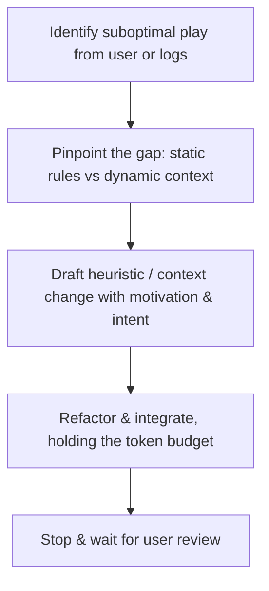

## Overview

The **Prompt Refinement** skill provides a rigorous, disciplined workflow for improving the strategic decision-making of Shengji (Tractor) AI bots by editing their LLM prompt. Use it when an LLM bot makes a suboptimal play and the cause is the prompt rather than the game engine.

### The LLM prompt has TWO parts

Both live in [src/ai/llm/llmPromptTemplates.ts](file:src/ai/llm/llmPromptTemplates.ts):

1. **System prompt — `STATIC_LLM_GAME_RULES`**: the static, game-wide strategic rules (card hierarchy, combos, following/ruffing, leading, position play). This is the bot's standing "how to play" knowledge.
2. **User prompt — `buildUserPromptTemplate`**: the per-decision template, filled in by `buildLLMUserPrompt` and its helpers in [src/ai/llm/llmGamePrompt.ts](file:src/ai/llm/llmGamePrompt.ts) with the dynamic context for THIS decision: the hand grouped by suit (strongest→weakest, with `[pts]`/`(Trump)` tags), recent trick history, confirmed player voids, a **Points still live** readout (unseen point cards per off-suit, via `localFormatLiveOffSuitPoints`), the active trick status, the **Trick Win Security** verdict (SECURED / LIKELY WIN / UNCERTAIN), and either **candidate lead options each with a Rule Score** (when leading) or a **suit-following analysis** plus a **Guidance for this seat** bullet (when following — see below).

A prompt fix may belong in EITHER part. Before editing, decide which:
- **Static gap** (the bot doesn't understand a general principle) → refine `STATIC_LLM_GAME_RULES`.
- **Dynamic gap** (the bot lacks, or misreads, a per-decision signal) → improve what `buildUserPromptTemplate` / `llmGamePrompt.ts` surface (including the seat-guidance decision table, below), or how the static rules tell the bot to interpret those signals.

### The dynamic seat-guidance layer

When following, `localBuildSeatGuidance` (in `llmGamePrompt.ts`) injects a single **GUIDANCE FOR THIS SEAT** bullet — the engine's situation-specific *application* of the static following rules. It branches on facts the engine has already computed (seat, who's still to act, teammate-winning + whether safe, points on table, trump-vs-off-suit lead, void scenario) and spells out the inference a small model otherwise has to derive itself (e.g. *"a regular trump K/10 loses to active ranks/jokers, so don't pour a point card in"*). The system prompt tells the model to treat this block as its primary instruction.

This is a deliberate split: the static rules (§5 following order, §6 ruffing, §9 position cues) are the **general framework and reference**; the seat-guidance bullet is the **focused, named-player application** for THIS decision. The point is to move the rule-selection-and-application step out of the small model and into code — so prefer fixing the decision table when a following misplay is really "the right rule existed but the model didn't apply it here".

**Consistency requirement:** the seat-guidance branches mirror static §5/§6/§9, and `localFormatLiveOffSuitPoints` must match how the static rules talk about points. When you change one side, check the other — they must not diverge or contradict, and the guidance must stay *scaffolding for the LLM's judgement among legal options*, never a re-implementation of the rule-based AI's card choice.

### Key context

The LLM is consulted ONLY at genuinely ambiguous lead/follow decisions — forced and obvious plays (single legal combo, forced follow, unbeatable lead, round-start boss lead) are short-circuited in code before the LLM is called, and the engine validates the result with one corrective retry. So refine for **judgement among viable options**, not basic legality. The target model is small and fast (e.g. `gemini-2.5-flash-lite`), so keep the prompt dense.

---

## 🛠️ Three Golden Rules of Prompt Refinement

### 1. Maintain a Strict Token Budget (Anti-Bloat)
- Keep instructions dense, concise, and lightweight; never bloat with wordy descriptions or long single-case card examples.
- When adding a heuristic, search the existing rules for wordy or redundant text and compress it to offset the increase. Aim for net-neutral length.

### 2. Harmonious Integration & Structured Refactoring
- Do not append arbitrary isolated rules (e.g. *"Rule 7: Never play 5♣ on trick 2"*). Instead, integrate the logic by one of:
  1. **Incorporate** it into an existing section.
  2. **Create a new dedicated section** only when introducing a genuinely new strategic dimension.
  3. **Rewrite or refactor** a section when its current phrasing is limiting or confusing.
- Align additions with the existing section structure of `STATIC_LLM_GAME_RULES`. The current sections are: Setup; Card strength; Combos & tractors; Following — fixed rules; Following — decision order; Ruffing when void; Multi-combo; Leading — decision order; Position cues; plus a closing Conservation through-line. Read the file first — this structure evolves.

### 3. Build Knowledge Context, Not Constraints
- The LLM is a reasoning agent, not a state-machine parser. Build **context and domain heuristics** so the model makes intelligent trade-offs, rather than hard-coded constraints that limit flexibility.
- Use strategic, motivation-oriented language (*"conserve resources", "feed teammate", "apply pressure", "bleed opponent trump"*) rather than mechanical commands (*"must play", "never select"*) — except where a hard rule is genuinely correct.
- Default to softening: a "Never X / Always Y" phrasing is usually a heuristic in disguise. Lead with the *reason*, then frame the action as a preference the model weighs (*"lean toward", "prefer", "usually the better trade"*). Reserve all-caps imperatives (NEVER/ALWAYS) for true invariants — a play that is literally illegal or that always loses (e.g. over-trumping your own winning card). Edge cases almost always exist (a low trump can be spent to save an off-suit pair or a live boss A), so phrasing that admits trade-offs plays better than an absolute.
  - *Hard rule (avoid)*: `Never match a boss already winning — your A onto a led A wins nothing.`
  - *Heuristic (prefer)*: `Your A onto a led A wins nothing, so prefer to duck low and save your boss for a trick you can actually take.`

---

## 🔄 The Prompt Refinement Workflow

> [!IMPORTANT]
> **Non-Blocking Execution**: Prompt refinement only alters prompt strings. Do NOT create pre-execution implementation plans or block on approval loops. Apply the edits directly to the relevant file (`llmPromptTemplates.ts`, and `llmGamePrompt.ts` if the dynamic context is involved), then stop and wait for the user to review the diff.



### Step 1: Identify and Diagnose the Suboptimal Play
- Which player had the turn? Team roles, trick state (points on table, current winner)?
- What cards did the bot hold, and what suboptimal choice did it make?
- What strategic intent did it fail to grasp?

### Step 2: Pinpoint the Gap
Decide whether the gap is in the **static rules** (`STATIC_LLM_GAME_RULES`) or the **dynamic user prompt** (`buildUserPromptTemplate` / `llmGamePrompt.ts`):
- Was a strategic heuristic missing, confusing, ambiguous, or conflicting? → static.
- Did the model lack a signal, or was a provided signal (Rule Score, Win Security, voids, suit analysis, Points-still-live, the seat-guidance bullet) unclear, unused, or wrong? → dynamic: fix what the helpers surface or the `localBuildSeatGuidance` table (keeping it aligned with static §5/§6/§9), or add a static instruction on how to read the signal.

### Step 3: Draft the Contextual Heuristic
Formulate the lesson as a clear, context-aware principle explaining **why** and **when**, in motivational language.
- *Poor*: "If you have a 10 and King, play King."
- *Better*: "When your teammate's win is secured, feed your highest sparable point card but keep the stronger one — give the 10, keep the King."

### Step 4: Compress and Integrate
Edit the correct file. Do not just append a bullet — compress, rewrite, or tighten adjacent text to hold the token budget. Keep the system prompt and user prompt consistent (e.g. if the static rules reference a "Rule Score" or "Trick Win Security" verdict, ensure the user prompt still emits those exact labels). If you touch the `localBuildSeatGuidance` decision table, keep its branches aligned with static §5/§6/§9 — a divergence here reads to the model as a contradiction.

### Step 5: Stop & Wait for User Review
Once changes are applied:
- **Stop and wait for the user to review the file changes directly.**
- **DO NOT build** the project.
- **DO NOT run qualitycheck** (`npm run qualitycheck` or similar).
- **DO NOT commit** any changes.

---

## 💡 Example: Integrating a Heuristic Harmoniously

### Scenario
An AI bot led a single low trump on trick 1 when it held off-suit Aces.

### Suboptimal Addition (Do NOT do this)
```diff
 ## 8. Leading — decision order
+ - Rule: Do not lead a single low trump on the first trick if you hold off-suit Aces.
```
*Why this is bad*: a redundant, overly specific hard rule that doesn't build understanding.

### Professional Integration (DO this)
```diff
 ## 8. Leading — decision order
- 1. Lead off-suit boss A/K to seize control safely.
+ 1. Lead off-suit boss A/K to seize control safely; avoid leading single trumps, which bleeds your own trump strength for no control.
```
*Why this is good*: it folds the lesson into the existing leading heuristic, explains the *why*, and adds zero lines.
