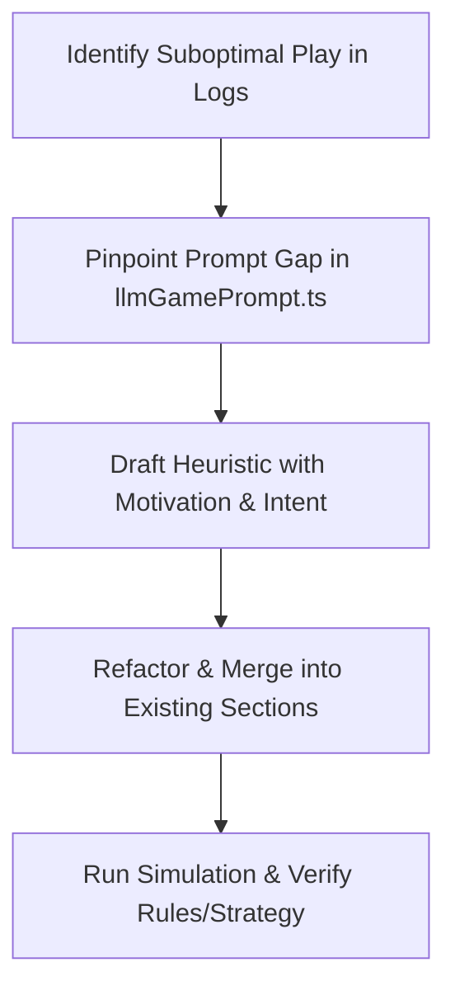

## Overview

The **Prompt Refinement** skill provides a rigorous, highly disciplined workflow for improving the strategic decision-making context of Shengji (Tractor) AI bots. 

When you find a game scenario where the LLM makes a suboptimal tactical choice, use this skill to diagnose, draft, and cleanly merge strategic context into the system prompt (`STATIC_LLM_GAME_RULES` in [llmGamePrompt.ts](file:///home/eric/repos/Tractor/src/ai/llm/llmGamePrompt.ts)).

---

## 🛠️ Three Golden Rules of Prompt Refinement

### 1. Maintain a Strict Token Budget (Anti-Bloat)
* **Rule**: Keep system instructions dense, concise, and lightweight. Never bloat the prompt with wordy descriptions or long single-case card examples.
* **Tactic**: When adding a new heuristic, actively search the existing rules for wordy sentences and compress/refactor them to offset any size increase.

### 2. Harmonious Integration & Structured Refactoring
* **Rule**: Do not append arbitrary, isolated rules (e.g., *"Rule 7: Never play 5♣ on trick 2"*). Instead, integrate the logic seamlessly. You can:
  1. **Merge** it into an existing section (Hierarchy, Ruffing, or Heuristics).
  2. **Create a new dedicated section** if the topic introduces a completely new strategic dimension (e.g., `## 7. Kitty Discarding Strategy`).
  3. **Rewrite or refactor** existing sections entirely if the current phrasing is too limiting or confusing.
* **Tactic**: Align additions with the core structural sections:
  * `## 2. Card Values & Trump Hierarchy`
  * `## 3. Combinations & Tractors`
  * `## 4. Following & Ruffing Priorities`
  * `## 5. Multi-Combo Rules`
  * `## 6. Strategic Heuristics`

### 3. Build Knowledge Context, Not Constraints
* **Rule**: The LLM is a reasoning strategic agent, not a state-machine parser. We build **context and domain heuristics** so the model makes intelligent trade-offs, rather than hard-coded constraints that limit strategic flexibility.
* **Tactic**: Use strategic and motivation-oriented language (e.g., *“conserve resources,” “feed teammate,” “apply pressure,” “bleeding opponent trump”*) rather than mechanical commands (*“must play,” “never select”*).

---

## 🔄 The Prompt Refinement Workflow



### Step 1: Diagnose the Log
Examine the game log (e.g., under `logs/`). Note:
* Who was the leader? Who was currently winning?
* What cards did the LLM have, and what suboptimal choice did it make?
* What was the strategic intent that the LLM failed to understand?

### Step 2: Pinpoint the Prompt Gap
Open [llmGamePrompt.ts](file:///home/eric/repos/Tractor/src/ai/llm/llmGamePrompt.ts) and locate the relevant section of `STATIC_LLM_GAME_RULES`. Ask yourself:
* Why did the model make this choice?
* Was a heuristic missing?
* Was an existing rule confusing or ambiguous?

### Step 3: Draft the Contextual Heuristic
Formulate the lesson as a clear, context-aware principle that explains **why** and **when** a player should make this choice.
* *Poor: "If you have a 10 and King, play King."*
* *Better: "Prioritize feeding high-value point cards (King, 10) to secure the trick when your teammate is winning, or conserve them when opponents have won the trick."*

### Step 4: Compress and Merge
* Locate the exact lines in `STATIC_LLM_GAME_RULES` where this fits (usually `## 6. Strategic Heuristics`).
* Merge it into the existing bullet points. If needed, re-write or tighten the adjacent rules to save space.

### Step 5: Test and Validate
Verify your changes by running typechecks and simulations to make sure the AI still functions perfectly and exhibits the improved strategic capability:
```bash
# Run simulation to check strategy change
npm run test:simulation
```

---

## 💡 Example: Merging Heuristics Harmoniously

### Scenario
An AI bot led a low trump card on trick 1 when it had high non-trump Aces. 

### Suboptimal Addition (Do NOT do this)
```diff
 ## 6. Strategic Heuristics
 - - Leader (1st): Lead non-trump Aces/Kings early; lead trump pairs early (avoid single trumps).
+ - Leader (1st) Rule: Do not lead single low trumps on the very first trick if you have off-suit Aces.
```
*Why this is bad*: It creates a redundant, overly specific hard rule that doesn't build understanding.

### Professional Merge (DO this)
```diff
 ## 6. Strategic Heuristics
- - Leader (1st): Lead non-trump Aces/Kings early; lead trump pairs early (avoid single trumps). Setup void teammate...
+ - Leader (1st): Lead off-suit Aces/Kings to establish control early; avoid leading single trumps which bleeds teammate's strength. Setup void teammate...
```
*Why this is good*: It beautifully integrates the concept into the existing Leader heuristic, explains the *why* (bleeding partner's strength), and uses zero additional lines!
