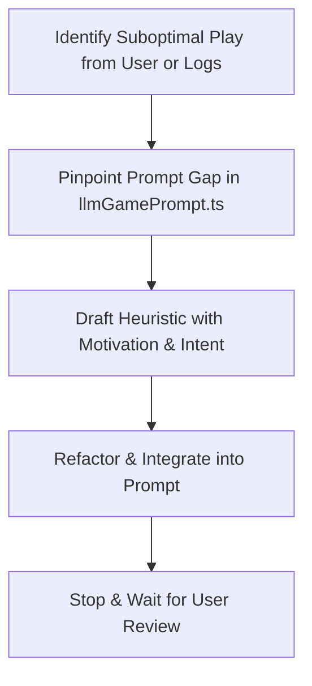

## Overview

The **Prompt Refinement** skill provides a rigorous, highly disciplined workflow for improving the strategic decision-making context of Shengji (Tractor) AI bots. 

When you find a game scenario where the LLM makes a suboptimal tactical choice, use this skill to diagnose, draft, and cleanly integrate strategic context into the system prompt (`STATIC_LLM_GAME_RULES` in [llmGamePrompt.ts](file:///home/eric/repos/Tractor/src/ai/llm/llmGamePrompt.ts)).

---

## 🛠️ Three Golden Rules of Prompt Refinement

### 1. Maintain a Strict Token Budget (Anti-Bloat)
* **Rule**: Keep system instructions dense, concise, and lightweight. Never bloat the prompt with wordy descriptions or long single-case card examples.
* **Tactic**: When adding a new heuristic, actively search the existing rules for wordy sentences and compress/refactor them to offset any size increase.

### 2. Harmonious Integration & Structured Refactoring
* **Rule**: Do not append arbitrary, isolated rules (e.g., *"Rule 7: Never play 5♣ on trick 2"*). Instead, integrate the logic seamlessly. You can:
  1. **Incorporate** it into an existing section (Hierarchy, Ruffing, or Heuristics).
  2. **Create a new dedicated section** if the topic introduces a completely new strategic dimension (e.g., `## 7. Kitty Discarding Strategy`).
  3. **Rewrite or refactor** existing sections entirely if the current phrasing is too limiting or confusing.
* **Tactic**: Align additions with the core structural sections:
  * `## 2. Card Values & Trump Hierarchy`
  * `## 3. Combinations & Tractors`
  * `## 4. Following & Ruffing Priorities`
  * `## 5. Multi-Combo Rules`
  * `## 6. Strategic Heuristics`

### 3. Build Knowledge Context, Not Constraints
* **Rule**: The LLM is a reasoning strategic agent, not a state-machine parser. We build **context and domain heuristics** so the model makes intelligent trade-offs, rather than hard-coded constraints that limit strategic flexibility.
* **Tactic**: Use strategic and motivation-oriented language (e.g., *“conserve resources,” “feed teammate,” “apply pressure,” “bleeding opponent trump”*) rather than mechanical commands (*“must play,” “never select”*).

---

## 🔄 The Prompt Refinement Workflow

> [!IMPORTANT]
> **Non-Blocking Execution**: Prompt refinement only alters system prompt strings. Do NOT create pre-execution implementation plans or block on approval loops. Instead, apply the prompt edits directly to `llmGamePrompt.ts` first, and then stop to wait for the user to review the file changes.



### Step 1: Identify and Diagnose the Suboptimal Play
Determine the details of the suboptimal play based on the user's report or game logs:
* Which player had the turn? What were the team roles and the current trick state (e.g., points on the table, winning player)?
* What cards did the bot have, and what suboptimal card choice did it make?
* What was the strategic intent that the bot failed to understand?

### Step 2: Pinpoint the Prompt Gap
Locate the relevant section of `STATIC_LLM_GAME_RULES` in `llmGamePrompt.ts`. Diagnose why the prompt allowed or caused the bad play:
* Was the strategic heuristic completely missing?
* Was an existing rule confusing, ambiguous, or too generic?
* Were there conflicting rules?

### Step 3: Draft the Contextual Heuristic
Formulate the lesson as a clear, context-aware strategic principle that explains **why** and **when** a player should make the correct choice (using motivational language, not hard state-machine rules).
* *Poor*: "If you have a 10 and King, play King."
* *Better*: "Prioritize feeding high-value point cards (King, 10) to secure the trick when your teammate is winning, or conserve them when opponents have won the trick."

### Step 4: Compress and Integrate
Update `llmGamePrompt.ts` to integrate the new heuristic:
* Locate the appropriate section (usually `## 6. Strategic Heuristics` or the relevant following priorities).
* Do not just append a new bullet point (to avoid prompt bloat). Instead, compress, rewrite, or tighten the adjacent rules to maintain a strict token budget.
* **Also check `engagementContext` strings** (see below) — if the new heuristic affects a scenario they cover, update those strings too.

### Step 5: Stop & Wait for User Review
Once the changes are applied:
- **Stop and wait for the user to review the file changes directly.**
- **DO NOT build** the project.
- **DO NOT run qualitycheck** (`npm run qualitycheck` or similar).
- **DO NOT commit** any changes.

---

## 🎯 Engagement Context (`engagementContext`)

The `engagementContext` is a **per-decision-point supplement** that augments the static system prompt with live situational awareness at the moment of each LLM call. It is defined in two files:

- **[followingStrategy.ts](file:///home/eric/repos/Tractor/src/ai/following/followingStrategy.ts)** — Three scenarios triggered at decision time:
  1. **Void with trumps**: Player is void in led suit and holds trumps — trump vs. discard dilemma.
  2. **Must discard**: Player is void with no trumps, or card count is insufficient — point feeding vs. denial.
  3. **Multiple same-suit options**: Player can follow suit with multiple cards — play high vs. preserve strength.

- **[leadingStrategy.ts](file:///home/eric/repos/Tractor/src/ai/leading/leadingStrategy.ts)** — One scenario:
  1. **Ambiguous lead**: Multiple candidates scored by the rule engine — LLM picks the best option with reasoning.

### Consistency Rules
When refining `STATIC_LLM_GAME_RULES`, **always check `engagementContext` strings** for consistency:
* Use the same terminology (e.g., `Trump Group`, `Active Ranks`, `Off-Suit <Suit>`) that matches the hand sections shown in the user prompt.
* Maintain consistent point priority order (e.g., `10 > King > 5`).
* If you introduce a new concept (e.g., a new discard rule), ensure the relevant `engagementContext` string references or reinforces it, not contradicts it.

---

## 💡 Example: Integrating Heuristics Harmoniously

### Scenario
An AI bot led a low trump card on trick 1 when it had high non-trump Aces. 

### Suboptimal Addition (Do NOT do this)
```diff
 ## 6. Strategic Heuristics
 - - Leader (1st): Lead non-trump Aces/Kings early; lead trump pairs early (avoid single trumps).
+ - Leader (1st) Rule: Do not lead single low trumps on the very first trick if you have off-suit Aces.
```
*Why this is bad*: It creates a redundant, overly specific hard rule that doesn't build understanding.

### Professional Integration (DO this)
```diff
 ## 6. Strategic Heuristics
- - Leader (1st): Lead non-trump Aces/Kings early; lead trump pairs early (avoid single trumps). Setup void teammate...
+ - Leader (1st): Lead off-suit Aces/Kings to establish control early; avoid leading single trumps which bleeds teammate's strength. Setup void teammate...
```
*Why this is good*: It beautifully integrates the concept into the existing Leader heuristic, explains the *why* (bleeding partner's strength), and uses zero additional lines!
