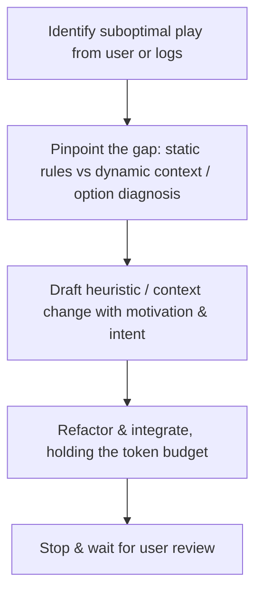

## Overview

The **Prompt Refinement** skill provides a rigorous, disciplined workflow for improving the strategic decision-making of Shengji (Tractor) AI bots by editing their LLM prompt. Use it when an LLM bot makes a suboptimal play and the cause is the prompt rather than the game engine.

### The 4-Layer LLM Architecture

1. **Perception Engine (`src/ai/llm/llmPerception.ts`)**: Pure objective ground truth (Hand decomposition by suit, combos, boss status, points; table state; confirmed voids; points race).
2. **Legal Action Space (`src/ai/llm/llmActionSpace.ts`)**: Enumerates verified legal actions with points and pair-breaking flags.
3. **Strategic Reasoner (`src/ai/llm/llmPromptTemplates.ts`)**: Ultra-compact prompt (<350 tokens) pairing the perception block with the enumerated actions, querying JSON `{ "thought": string, "actionIndex": number }`.
4. **Execution & Guard (`src/ai/llm/llmAIStrategy.ts`)**: Maps `actionIndex` to verified legal cards with automatic safety fallback.
5. **Kitty Swap Phase (`src/ai/llm/llmKittySwapPrompt.ts`)**: Dedicated prompt for 8-card kitty swap selection.

---

## 🛠️ Three Golden Rules of Prompt Refinement

### 1. Maintain a Strict Token Budget (Anti-Bloat)
- Keep instructions dense, concise, and lightweight; never bloat with wordy descriptions or long single-case card examples.
- When adding a heuristic, search the existing rules for wordy or redundant text and compress it to offset the increase. Aim for net-neutral length.

### 2. Harmonious Integration & Structured Refactoring
- Do not append arbitrary isolated rules (e.g. *"Rule 7: Never play 5♣ on trick 2"*). Instead, integrate the logic by one of:
  1. **Incorporate** it into an existing section.
  2. **Create a new dedicated section** only when introducing a genuinely new strategic dimension.
  3. **Rewrite or refactor** a section when its current phrasing is limiting or confusing.
- Align additions with the existing section structure of `STATIC_LLM_GAME_RULES`. The current sections are:
  - `## 1. Objective (points win the round, not tricks)`
  - `## 2. Card Strength (High -> Low)`
  - `## 3. Combos & Tractors`
  - `## 4. Following — the Absolute Laws (legality, not strategy)`
  - `## 5. Reading the Options & Strategy`
  - `## 6. Leading — strategy order`

### 3. Build Knowledge Context, Not Constraints
- The LLM is a reasoning agent, not a state-machine parser. Build **context and domain heuristics** so the model makes intelligent trade-offs, rather than hard-coded constraints that limit flexibility.
- Use strategic, motivation-oriented language (*"conserve resources", "feed teammate", "apply pressure", "bleed opponent trump"*) rather than mechanical commands (*"must play", "never select"*) — except where a hard rule is genuinely correct.
- Default to softening: a "Never X / Always Y" phrasing is usually a heuristic in disguise. Lead with the *reason*, then frame the action as a preference the model weighs (*"lean toward", "prefer", "usually the better trade"*). Reserve all-caps imperatives (NEVER/ALWAYS) for true invariants — a play that is literally illegal or that always loses (e.g. over-trumping your own winning card). Edge cases almost always exist (a low trump can be spent to save an off-suit pair or a live boss A), so phrasing that admits trade-offs plays better than an absolute.
  - *Hard rule (avoid)*: `Never match a boss already winning — your A onto a led A wins nothing.`
  - *Heuristic (prefer)*: `Your A onto a led A wins nothing, so prefer to duck low and save your boss for a trick you can actually take.`

---

## 🔄 The Prompt Refinement Workflow

> [!IMPORTANT]
> **Non-Blocking Execution**: Prompt refinement only alters prompt strings. Do NOT create pre-execution implementation plans or block on approval loops. Apply the edits directly to the relevant file (`llmPromptTemplates.ts`, `llmPositionDiagnosis.ts`, and `llmGamePrompt.ts` if the dynamic context is involved), then stop and wait for the user to review the diff.


```mermaid
graph TD
    A[Identify suboptimal play from user or logs] --> B[Pinpoint the gap: static rules vs dynamic context / option diagnosis]
    B --> C[Draft heuristic / context change with motivation & intent]
    C --> D[Refactor & integrate, holding the token budget]
    D --> E[Stop & wait for user review]
```

### Step 1: Identify and Diagnose the Suboptimal Play
- Which player had the turn? Team roles, trick state (points on table, current winner)?
- What cards did the bot hold, and what suboptimal choice did it make?
- What strategic intent did it fail to grasp?

### Step 2: Pinpoint the Gap
Decide whether the gap is in the **static rules** (`STATIC_LLM_GAME_RULES`), the **dynamic user prompt** (`buildUserPromptTemplate` / `llmGamePrompt.ts`), or **option diagnosis** (`llmPositionDiagnosis.ts`):
- Was a strategic heuristic missing, confusing, ambiguous, or conflicting? → static rules.
- Did the model lack a key signal (declarer ID, score pressure, round progress, live suit points, confirmed voids, active trick status)? → dynamic prompt template (`llmGamePrompt.ts`).
- Was an option consequence misleading, missing a cost signal, or anchored non-neutrally? → option diagnosis (`llmPositionDiagnosis.ts`).

### Step 3: Draft the Contextual Heuristic
Formulate the lesson as a clear, context-aware principle explaining **why** and **when**, in motivational language.
- *Poor*: "If you have a 10 and King, play King."
- *Better*: "When your teammate's win is secured, feed your highest sparable point card but keep the stronger one — give the 10, keep the King."

### Step 4: Compress and Integrate
Edit the correct file. Do not just append a bullet — compress, rewrite, or tighten adjacent text to hold the token budget. Keep the system prompt and user prompt consistent. Ensure option descriptions in `llmPositionDiagnosis.ts` remain factual and neutral.

### Step 5: Stop & Wait for User Review
Once changes are applied:
- **Stop and wait for the user to review the file changes directly.**
- **DO NOT build** the project.
- **DO NOT run qualitycheck** (`npm run qualitycheck` or similar).
- **DO NOT commit** any changes.

---

## 💡 Example: Integrating a Heuristic Harmoniously

### Scenario
An AI bot led a single low trump on trick 1 when it held off-suit Aces.

### Suboptimal Addition (Do NOT do this)
```diff
 ## 6. Leading — strategy order
+ - Rule: Do not lead a single low trump on the first trick if you hold off-suit Aces.
```
*Why this is bad*: a redundant, overly specific hard rule that doesn't build understanding.

### Professional Integration (DO this)
```diff
 ## 6. Leading — strategy order
- 1. Off-suit boss A/K: seize control safely.
+ 1. Off-suit boss A/K: seize control safely; avoid leading single trumps, which bleeds your own trump strength for no control.
```
*Why this is good*: it folds the lesson into the existing leading heuristic, explains the *why*, and adds zero lines.
