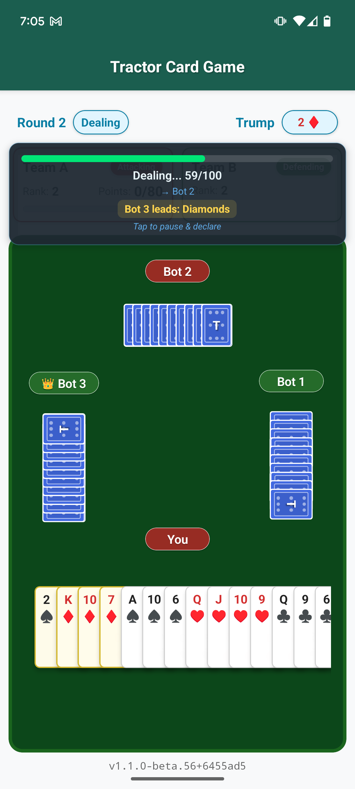
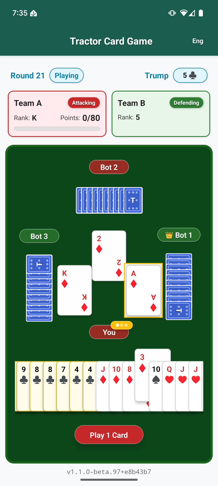
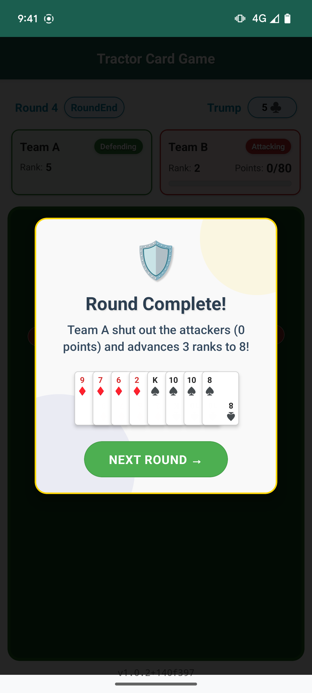
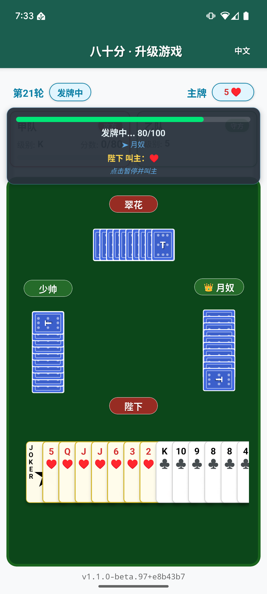
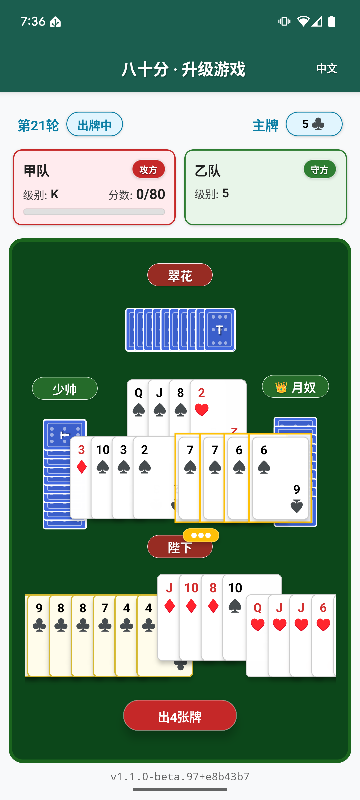
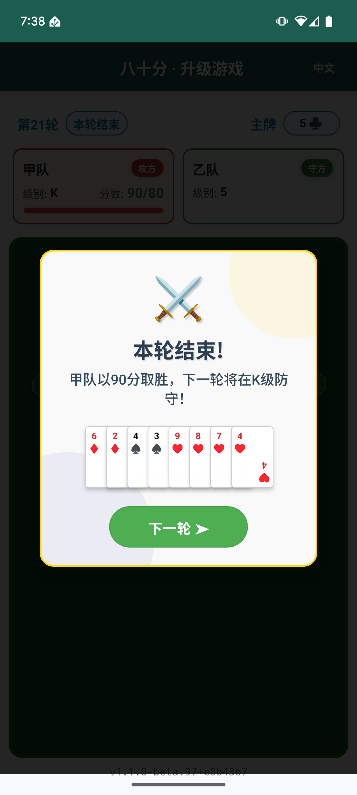

# Tractor (升级)

A React Native implementation of the classic Chinese card game **Tractor** (also known as Shengji/升级), featuring intelligent AI opponents and authentic gameplay mechanics.

## Screenshots

## What is Tractor?

**Tractor** (升级/Shengji) is a challenging Chinese trick-taking card game where strategy and teamwork are essential. You partner with an AI teammate to collect points and advance through card ranks from 2 to Ace.

**Core Gameplay:**

- **Team-based**: You + Bot 2 vs Bot 1 + Bot 3 in strategic cooperation
- **Rank Progression**: Start at rank 2, advance through ranks by collecting 80+ points per round
- **Trump Declaration**: Players can declare trump during progressive dealing using pairs or jokers
- **Card Combinations**: Play singles, pairs, or tractors (consecutive pairs) with complex following rules
- **Victory Condition**: First team to advance to Ace rank wins the game

**Unique Features:**

- **Progressive Dealing**: Cards dealt one-by-one with real-time trump declaration opportunities
- **Kitty Management**: Winner receives 8 hidden cards that can provide massive endgame bonuses
- **Complex Trump Hierarchy**: Big Joker > Small Joker > Trump rank cards > Trump suit cards

*Complete rules and quick start guide in **[Game Rules](docs/GAME_RULES.md)***

## Key Features

- **🧠 4-Phase AI Intelligence**: Memory-enhanced decision trees with strategic point management and trump conservation
- **🃏 Smart Card Auto-Selection**: Intelligent pair/tractor detection with tap-to-toggle controls
- **⚡ Progressive Dealing System**: Real-time trump declarations with sophisticated AI strategy
- **🎯 Advanced Kitty Management**: Strategic suit elimination and endgame bonus multipliers
- **💾 Automatic Game Persistence**: Seamless save/restore with auto-recovery on app restart
- **📊 BigQuery Analysis System**: Enterprise-scale game data analysis with Google Cloud BigQuery for massive datasets
- **🌍 Multilingual Support**: Full English and Chinese localization with automatic language detection
- **📱 Touch-Optimized UI**: Smooth animations, team color coding, and dark theme support
- **🏆 Authentic Gameplay**: Complete Shengji/Tractor rules with proper combination following

## Technology & Architecture

**Built with React Native + Expo** for cross-platform mobile development:

- **React Native 0.81+** - Cross-platform mobile framework
- **Expo SDK 54** - Development tools and native API access
- **TypeScript 5.9+** - Strict type safety and enhanced developer experience
- **React i18next** - Type-safe internationalization with automatic language detection
- **Jest** - Comprehensive tests with React Testing Library
- **ESLint** - Code quality with React Native specific rules
- **React Native Reanimated** - High-performance card animations

**Architectural Highlights:**

- **Modular Game System**: Focused game modules with direct imports (no re-export hub)
- **Modular AI System**: 20 focused modules with memory-enhanced intelligence organized by functional domain
- **Unified Trick Structure**: Streamlined game state with plays array for consistent data flow
- **Consolidated Hook Architecture**: Single-responsibility hooks with minimal interdependencies
- **Progressive Dealing System**: Unified dealing and trump declaration management
- **RoundResult System**: Pure computation approach for consistent UI timing
- **Type-Safe Development**: Enum usage eliminates magic strings throughout codebase

*Mobile-only support for Android and iOS. Architecture details in **[AGENTS.md](AGENTS.md)***

## AI Intelligence

**Sophisticated Memory-Enhanced AI system** with comprehensive card tracking, strategic point management, and intelligent trump conservation.

**Core AI Capabilities:**

- **🧠 Memory-Enhanced Strategy**: Card tracking with guaranteed winner identification
- **🎯 4-Priority Decision Chain**: Team coordination → Opponent blocking → Trick contention → Strategic disposal
- **🃏 Streamlined Kitty Management**: Rule-based exclusion strategy with intelligent suit elimination
- **⚡ Real-Time Trump Declarations**: Hand quality analysis with timing optimization
- **🛡️ Strategic Conservation**: Trump hierarchy preservation and point card management

**Complete Memory-Enhanced Intelligence:**

- **Foundation Layer** - Perfect rule compliance and basic strategic logic
- **Strategy Layer** - Point optimization, team coordination, position-based play
- **Memory Layer** - Card tracking, probability analysis, guaranteed winner detection
- **Advanced Features** - Void exploitation, point timing optimization, trump conservation

**Memory System Highlights:**

- **Guaranteed Winner Detection**: Uses card tracking to identify cards certain to win
- **Smart Void Exploitation**: Differentiates teammate vs opponent void strategies for optimal point collection
- **Trump Exhaustion Tracking**: Dynamic trump conservation based on opponent depletion analysis
- **Context-Aware Memory**: Unified memory analysis integrated across all trick positions
- **Point Timing Optimization**: Memory-enhanced analysis for optimal point card collection timing

*Complete AI documentation in **[AI System Guide](docs/AI_SYSTEM.md)***

## Reporting & Analysis

**Unified BigQuery Analysis System** for comprehensive game data insights:

- **🌐 BigQuery Analysis**: Enterprise-scale processing for datasets from small tests to 50GB+ production data
- **📈 KPI Reports**: Comprehensive reports with AI decision analysis, performance metrics, and gameplay statistics
- **🎨 Data Visualizations**: Rich charts and graphs showing AI behavior, game patterns, and strategic insights
- **⚡ Automated Workflows**: Complete BigQuery pipeline with Data Transfer jobs and automated uploads

## Documentation

- **[Game Rules](docs/GAME_RULES.md)** - Complete rules, quick start, and strategy reference
- **[AI System](docs/AI_SYSTEM.md)** - Comprehensive AI intelligence documentation
- **[AGENTS.md](AGENTS.md)** - Agent development guidelines and project architecture

## Built with AI

This project is developed with assistance from AI coding partners.

- **Claude** ([claude.ai](https://claude.ai/code)) - Initial project scaffolding and early feature development.
- **Gemini** ([gemini.google.com](https://gemini.google.com)) - Primary development assistant for new features, refactoring, and test generation.

Development guidelines are documented in [AGENTS.md](AGENTS.md).

## Future Enhancements

- **Multi-game Learning** - Cross-game strategy improvement
- **Difficulty Scaling** - Adaptive challenge based on player skill
- **Advanced Psychology** - Deep behavioral modeling
- **iOS Testing** - Comprehensive iOS platform validation

## More Screenshots

## License

All rights reserved. No part of this project may be reproduced, distributed, or transmitted in any form or by any means without the prior written permission of the owner.

## Inquiries

For commercial licensing, partnerships, or other inquiries, please contact the repository owner via GitHub.

---

**Enjoy playing Tractor!** 🃏✨
