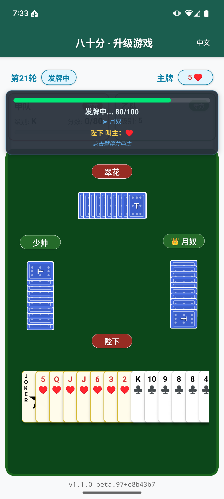
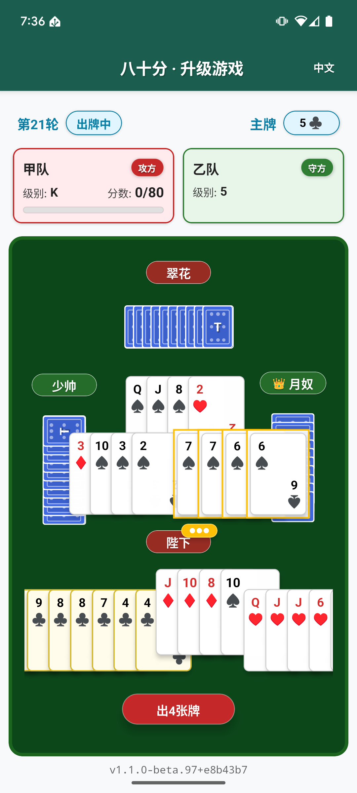
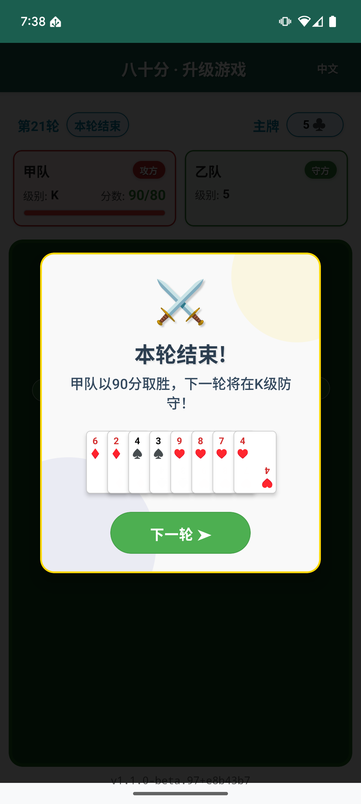

# Tractor (升级)

A React Native implementation of the classic Chinese card game **Tractor** (also known as Shengji/升级), featuring algorithm-based AI players (with an optional LLM mode) and authentic gameplay mechanics.

## Screenshots

## What is Tractor?

**Tractor** (升级/Shengji) is a challenging Chinese trick-taking card game where strategy and teamwork are essential. You partner with an AI teammate to collect points and advance through card ranks from 2 to Ace.

**Core Gameplay:**

- **Team-based**: You + Bot 2 vs Bot 1 + Bot 3 in strategic cooperation
- **Rank Progression**: Start at rank 2; the attacking team advances by capturing 80+ points, the defenders by holding them under 80
- **Trump Declaration**: Players can declare trump during progressive dealing using pairs or jokers
- **Card Combinations**: Play singles, pairs, or tractors (consecutive pairs) with complex following rules
- **Victory Condition**: First team to advance to Ace rank wins the game

**Unique Features:**

- **Progressive Dealing**: Cards dealt one-by-one with real-time trump declaration opportunities
- **Kitty Management**: The round starter picks up and swaps 8 hidden cards at the deal; winning the final trick turns the kitty into a bonus point swing
- **Complex Trump Hierarchy**: Big Joker > Small Joker > Trump rank cards > Trump suit cards

*Complete rules and quick start guide in **[Game Rules](docs/game_rules.md)***

## Key Features

- **🧠 Algorithm-Based AI Engine**: Memory-enhanced decision modules — scoring-based leading, scenario-based following, strategic point management and trump conservation
- **🤖 Optional LLM Players**: OpenRouter-backed language-model play — for your AI teammate and opponents alike — layered on the rule-based engine for ambiguous trick decisions (off by default; bring your own API key)
- **🃏 Card Auto-Selection**: Pair/tractor detection with tap-to-toggle controls
- **💾 Automatic Game Persistence**: Save/restore with auto-recovery on app restart
- **📊 BigQuery Analysis Pipeline**: Game-log analysis on Google Cloud BigQuery for large simulation datasets
- **🌍 Multilingual Support**: Full English and Chinese localization with automatic language detection
- **📱 Touch-Optimized UI**: Smooth animations, team color coding, and dark theme support
- **🏆 Authentic Gameplay**: Complete Shengji/Tractor rules with proper combination following

## Technology & Architecture

**Built with React Native + Expo** for cross-platform mobile development:

- **React Native** - Cross-platform mobile framework
- **Expo** - Development tooling and native API access
- **TypeScript** (strict) - Type safety and enhanced developer experience
- **React i18next** - Type-safe internationalization with automatic language detection
- **Jest** - Comprehensive tests with React Testing Library
- **ESLint** - Code quality with React Native specific rules
- **React Native Reanimated** - High-performance card animations

**Architectural Highlights:**

- **Modular Game System**: Focused game modules with direct imports (no re-export hub)
- **Modular AI System**: Memory-enhanced decision modules organized by functional domain, plus an optional LLM layer
- **Unified Trick Structure**: Streamlined game state with plays array for consistent data flow
- **Consolidated Hook Architecture**: Single-responsibility hooks with minimal interdependencies
- **Progressive Dealing System**: Unified dealing and trump declaration management
- **RoundResult System**: Pure computation approach for consistent UI timing
- **Type-Safe Development**: Enum usage eliminates magic strings throughout codebase

*Mobile-only support for Android and iOS. Architecture details in **[AGENTS.md](AGENTS.md)***

## AI Intelligence

The AI runs on an always-on **algorithm-based engine** — modular, memory-enhanced decision logic — with an **optional LLM layer** on top.

**Algorithm-based engine:**

- **Memory & card tracking** — played-card memory identifies guaranteed winners and confirmed voids, and drives void exploitation (teammate vs opponent)
- **Scoring-based leading** — every candidate lead scored for control, points, and trump conservation
- **Scenario-based following** — a priority chain (team coordination → opponent blocking → trick contention → disposal), position-aware for all four seats
- **Trump conservation** — hierarchical values protect jokers, trump-rank cards, and high pairs
- **Declaration & kitty strategy** — hand-quality-driven trump declaration timing and rule-based kitty swaps

**Optional LLM trick-play layer:**

Beyond the always-on engine, an optional LLM layer (via OpenRouter, disabled by default) can make the trick-play decision at genuinely ambiguous lead/follow moments. It does not replace the engine: the rule-based AI still generates the candidate plays, scores, seat guidance, and win-security signals fed into the prompt, short-circuits forced or obvious plays before any API call, and serves as the fallback whenever the model's output is invalid or the API is unavailable. Configure it in-app with your own API key.

*Complete AI documentation in **[AI System Guide](docs/ai_system.md)***

## Reporting & Analysis

**BigQuery analysis pipeline** for game-log insights:

- **🌐 BigQuery Analysis**: Scales from small test runs to large simulation datasets
- **📈 KPI Reports**: AI decision analysis, performance metrics, and gameplay statistics
- **🎨 Data Visualizations**: Rich charts and graphs showing AI behavior, game patterns, and strategic insights
- **⚡ Automated Workflows**: Complete BigQuery pipeline with Data Transfer jobs and automated uploads

## Documentation

- **[Game Rules](docs/game_rules.md)** - Complete rules, quick start, and strategy reference
- **[AI System](docs/ai_system.md)** - Comprehensive AI intelligence documentation
- **[AGENTS.md](AGENTS.md)** - Agent development guidelines and project architecture

## Built with AI

This project is developed with the assistance of various AI coding tools and models.

Development guidelines are documented in [AGENTS.md](AGENTS.md).

## More Screenshots

## License

All rights reserved. No part of this project may be reproduced, distributed, or transmitted in any form or by any means without the prior written permission of the owner.

## Inquiries

For commercial licensing, partnerships, or other inquiries, please contact the repository owner via GitHub.

---

**Enjoy playing Tractor!** 🃏✨
