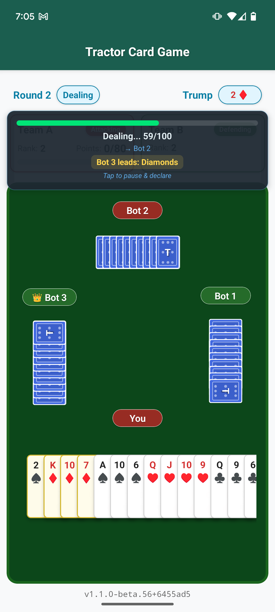
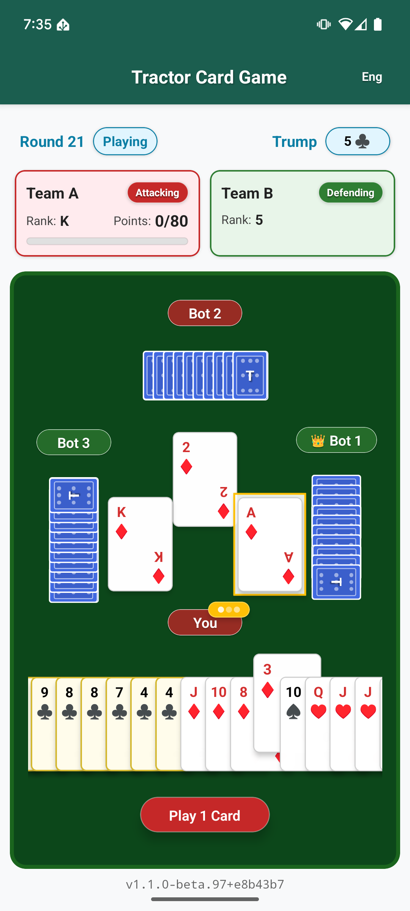
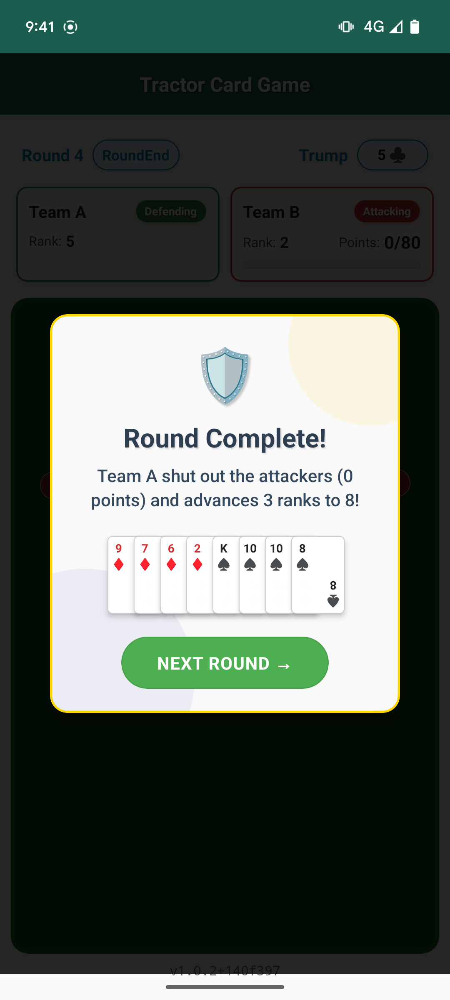

# Tractor (升级)

A React Native mobile implementation of the classic Chinese card game **Tractor** (also known as Shengji/升级), featuring a hybrid AI engine (always-on rule-based algorithms with an optional LLM layer) and authentic trick-taking gameplay.


## Screenshots

<p align="center">



</p>

---

## What is Tractor?

**Tractor** (升级/Shengji) is a trick-taking card game played with two standard decks (including jokers). You partner with an AI teammate to collect point cards (5s, 10s, and Kings) and advance through ranks from 2 to Ace.

*   **Team Cooperation**: Partner with an AI teammate against two AI opponents.
*   **Thematic Names**: Bot names are dynamically assigned from thematic pools (Lord of the Rings in English, Three Kingdoms in Chinese).
*   **Trump Declaration**: Players can declare trump during progressive dealing.
*   **Card Combinations**: Play singles, pairs, or "tractors" (consecutive pairs) with complex following rules.

*Complete details in the **[Game Rules Guide](docs/game_rules.md)***.

---

## Key Features

*   **🧠 Hybrid AI Engine**: Always-on deterministic engine featuring memory-enhanced card tracking, scenario-based following, and scoring-based leading.
*   **🤖 Optional LLM Players**: Layered on top of the deterministic engine for ambiguous trick play. Bring your own OpenRouter API key to activate.
*   **🔌 Enhanced LLM Config**: Features in-app model autocomplete (via OpenRouter search), persistent settings, and an auto-disable safeguard that reverts to the rule-based engine on consecutive API failures.
*   **💾 Auto-Persistence**: Complete game state auto-saves and restores seamlessly upon app restart.
*   **📊 BigQuery Analytics**: An analysis pipeline for running large-scale simulation game logs on Google Cloud.
*   **🌍 Multi-lingual**: Fully localized in English and Chinese with automatic language detection.

---

## How to Enable LLM Players

The LLM-based player decision layer is completely optional and disabled by default. When enabled, it allows bot players (including your teammate) to consult a language model for trick-play decisions during ambiguous moments.

To enable LLM players:
1. **Open Settings**: Tap on any AI player's name/label on the game board screen to open the **AI Config** modal.
2. **Switch to LLM Tab**: Select the **LLM (🧠)** tab in the segmented control at the top of the modal.
3. **Provide OpenRouter API Key**: Paste your OpenRouter API key in the API key input field.
4. **Choose a Model**: Keep the recommended default model (`google/gemini-3.1-flash-lite`) or select "Custom" and enter a custom OpenRouter model identifier (using the autocomplete search helper).
5. **Verify & Save**: Tap the **Verify & Save** button. The app will first run a quick connectivity test to verify your key and model. Upon successful verification, settings will be saved/persisted and LLM mode will be activated (AI players will display a purple indicator during their turn when querying the API).

---

## Technology Stack

Built with a modern cross-platform mobile stack:

*   **React Native & Expo**: Powered by React Native and Expo for cross-platform mobile development.
*   **TypeScript**: Strict type safety and clear enums eliminating magic strings.
*   **Performance**: High-performance UI rendering and card animations via React Native Reanimated.
*   **Internationalization**: Type-safe translations with React i18next.
*   **Testing**: Unit and integration tests using Jest and React Testing Library.

---

## Developer Setup

To install and run the app locally:

```bash
# Install dependencies
npm install

# Start the Expo development server
npm run start

# Run quality checks (typecheck, lint, and test)
npm run qualitycheck

# Run tests directly
npm test
```

For more details on coding standards and git workflows, see **[AGENTS.md](AGENTS.md)**.

---

## Documentation

*   **[Game Rules](docs/game_rules.md)** - Game rules and strategy reference.
*   **[AI System](docs/ai_system.md)** - Rule-based engine architecture and LLM prompting strategy.
*   **[Versioning Strategy](docs/versioning.md)** - OTA update compatibility and runtime versions.

---

## License & Inquiries

All rights reserved. For commercial licensing, partnerships, or other inquiries, please contact the repository owner via GitHub.

**Enjoy playing Tractor!** 🃏✨
