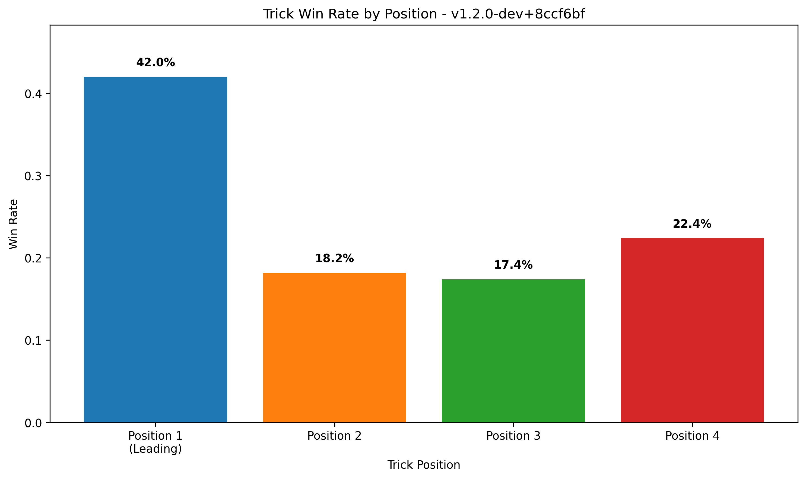
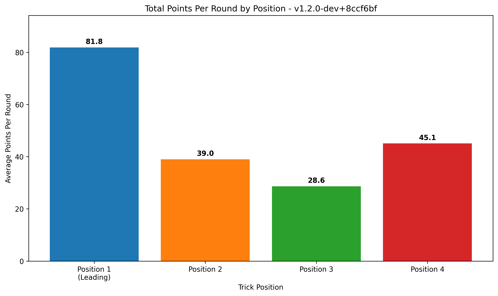

# 🎮 Tractor AI Performance Report
**Generated:** 2025-07-04 20:36:16
**App Versions:** 1
**Total Games:** 10

## 📊 App Version: `v1.2.0-dev+8ccf6bf`
### 🏆 Game Performance
- **Total Games:** 10
- **Team A Win Rate:** 20.0%
- **Team B Win Rate:** 80.0%
- **Total Rounds:** 294
- **Avg Rounds per Game:** 29.4
- **Attacking Round Win Rate:** 54.4%

### 🎯 Position Performance (Win Rates)
- **Leading Player (Pos 1):** 42.0% win rate
- **2nd Player:** 18.2% win rate
- **3rd Player:** 17.4% win rate
- **4th Player:** 22.4% win rate

### 🎯 Total Points Collected Per Round (By Position)
- **Leading Player:** 81.8 points per round (42.1% of total)
- **2nd Player:** 39.0 points per round (20.0% of total)
- **3rd Player:** 28.6 points per round (14.7% of total)
- **4th Player:** 45.1 points per round (23.2% of total)
- **Total Round Points:** 194.5 per round (out of ~200 available)

## 📊 Performance Visualizations

### Position Win Rates

### Total Points Per Round by Position

### 🎮 Player Performance
- **Average Player Win Rate:** 25.0%
- **Average Points per Trick:** 2.6

### 📈 Efficiency Metrics
- **Avg Final Points per Round:** 81.9
- **Avg Kitty Points:** 14.3

### 🧠 Most Used AI Strategies
**🎯 Leading Strategies:**
- `lead_historical_insights`: 2,054 uses
- `lead_early_game_ace`: 1,552 uses
- `lead_multi_combo`: 258 uses
**🤝 Following Strategies:**
- `analysis_start`: 15,402 uses
- `follow_opponent_blocking`: 8,819 uses
- `follow_teammate_winning`: 4,405 uses
- `teammate_winning_third_player`: 3,287 uses
- `follow_suit_establishment`: 2,178 uses

---

