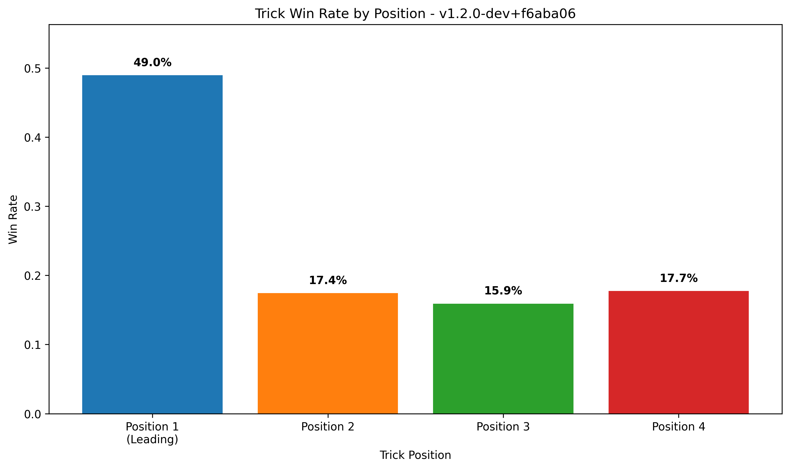

# 🎮 Tractor AI Performance Report (Local Analysis)
**Generated:** 2025-07-12 23:41:10
**App Versions:** 1
**Total Games:** 20

## 📊 App Version: `v1.2.0-dev+acf3ae1`
### 🏆 Game Performance
- **Total Games:** 20
- **Attacking Team Win Rate:** 50.0%
- **Defending Team Win Rate:** 50.0%
- **Total Rounds:** 495
- **Avg Rounds per Game:** 24.8
- **Attacking Round Win Rate:** 50.5%

### 🎯 Position Performance (Win Rates)
- **Leading Player (Pos 1):** 45.7% win rate
- **2nd Player:** 16.6% win rate
- **3rd Player:** 15.0% win rate
- **4th Player:** 22.7% win rate

### 🎯 Total Points Collected Per Round (By Position)
- **Leading Player:** 5.8 points per round (50.6% of total)
- **2nd Player:** 2.2 points per round (18.9% of total)
- **3rd Player:** 1.4 points per round (11.7% of total)
- **4th Player:** 2.2 points per round (18.8% of total)
- **Total Round Points:** 11.6 per round (out of ~200 available)

## 📊 Performance Visualizations

### Team Performance: Attacking vs Defending

### Position Win Rates

### Total Points Per Round by Position

### 📈 Efficiency Metrics
- **Avg Final Points per Round:** 79.4
- **Avg Final Points per Attacking Winning Round:** 108.0
- **Avg Final Points per Defending Winning Round:** 50.1
- **Avg Kitty Points:** 15.5

### 🧠 AI Strategic Effectiveness
- **Avg Decision Quality Score:** 9.8
- **Strategic Reasoning Rate:** 20.0%
- **Attacking Team Decision Rate:** 40.0%

---

