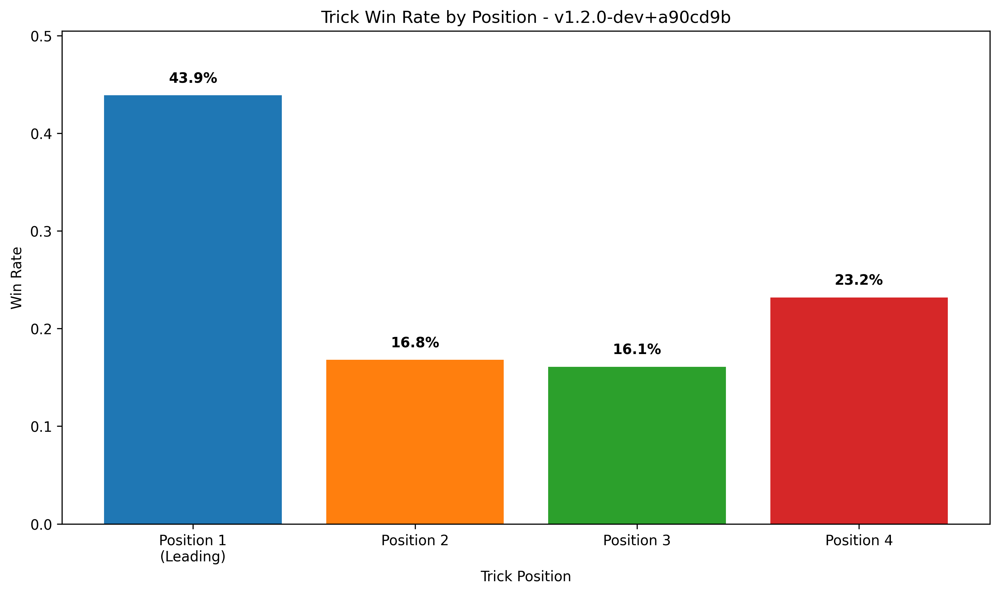

# 🎮 Tractor AI Performance Report (Local Analysis)
**Generated:** 2025-07-09 21:01:44
**App Versions:** 1
**Total Games:** 10

## 📊 App Version: `v1.2.0-dev+a90cd9b`
### 🏆 Game Performance
- **Total Games:** 10
- **Attacking Team Win Rate:** 60.0%
- **Defending Team Win Rate:** 40.0%
- **Total Rounds:** 268
- **Avg Rounds per Game:** 26.8
- **Attacking Round Win Rate:** 0.0%

### 🎯 Position Performance (Win Rates)
- **Leading Player (Pos 1):** 43.9% win rate
- **2nd Player:** 16.8% win rate
- **3rd Player:** 16.1% win rate
- **4th Player:** 23.2% win rate

### 🎯 Total Points Collected Per Round (By Position)
- **Leading Player:** 5.7 points per round (48.3% of total)
- **2nd Player:** 2.3 points per round (19.7% of total)
- **3rd Player:** 1.5 points per round (13.0% of total)
- **4th Player:** 2.2 points per round (19.1% of total)
- **Total Round Points:** 11.8 per round (out of ~200 available)

## 📊 Performance Visualizations

### Team Performance: Attacking vs Defending

### Position Win Rates

### Total Points Per Round by Position

### 🎮 Player Performance
- **Average Player Win Rate:** 25.0%
- **Average Points per Trick:** 3.0

### 📈 Efficiency Metrics
- **Avg Final Points per Round:** 0.0
- **Avg Kitty Points:** 15.7

### 🧠 Most Used AI Strategies
**🎯 Leading Strategies:**
- `scoring_based_leading`: 4,239 uses

---

