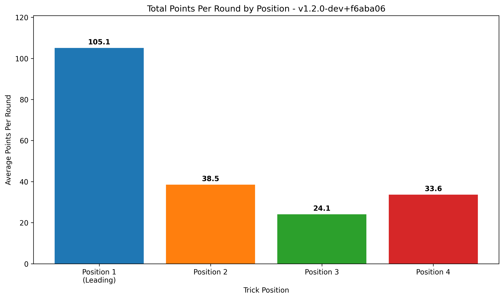

# 🎮 Tractor AI Performance Report (BigQuery Analysis)
**Generated:** 2025-07-25 21:46:53
**App Versions:** 1
**Total Games:** 1000

## 📊 App Version: `v1.2.0-dev+f6aba06`
### 🏆 Game Performance
- **Total Games:** 1000
- **Attacking Team Win Rate:** 59.7%
- **Defending Team Win Rate:** 40.3%
- **Total Rounds:** 26675
- **Avg Rounds per Game:** 26.7
- **Attacking Round Win Rate:** 54.4%

### 🎯 Position Performance (Win Rates)
- **Leading Player (Pos 1):** 49.0% win rate
- **2nd Player:** 17.4% win rate
- **3rd Player:** 15.9% win rate
- **4th Player:** 17.7% win rate

### 🎯 Total Points Collected Per Round (By Position)
- **Leading Player:** 105.1 points per round (52.2% of total)
- **2nd Player:** 38.5 points per round (19.1% of total)
- **3rd Player:** 24.1 points per round (12.0% of total)
- **4th Player:** 33.6 points per round (16.7% of total)
- **Total Round Points:** 201.3 per round (out of ~200 available)

## 📊 Performance Visualizations

### Team Performance: Attacking vs Defending

### Position Win Rates

### Total Points Per Round by Position

### 📈 Efficiency Metrics
- **Avg Final Points per Round:** 108.9
- **Avg Final Points per Attacking Winning Round:** 108.9
- **Avg Final Points per Defending Winning Round:** 51.0
- **Avg Kitty Points:** 14.9

### 🧠 AI Strategic Effectiveness
- **Avg Decision Quality Score:** 49.3
- **Strategic Reasoning Rate:** 0.0%
- **Attacking Team Decision Rate:** 0.0%

---

