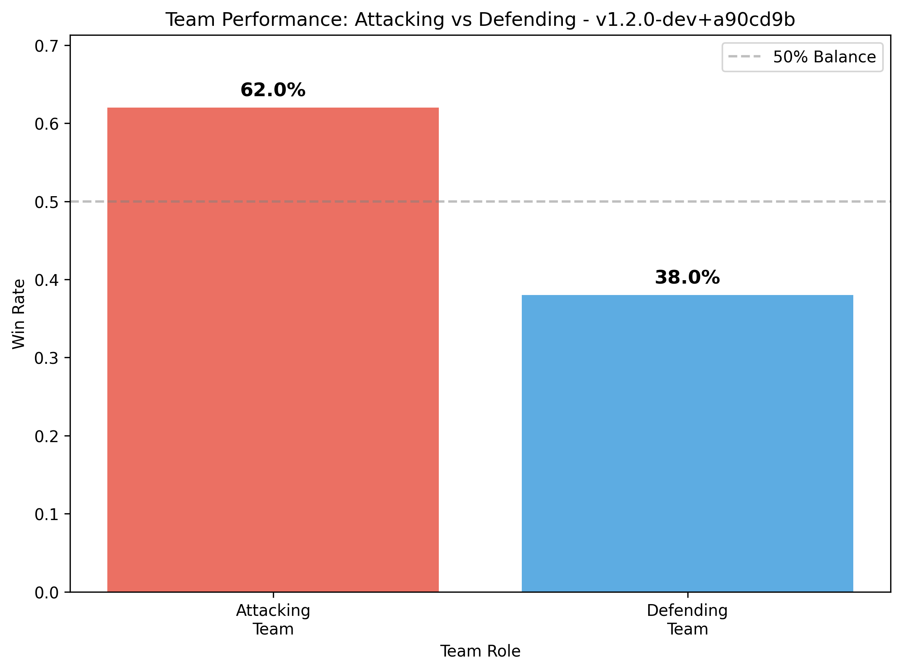
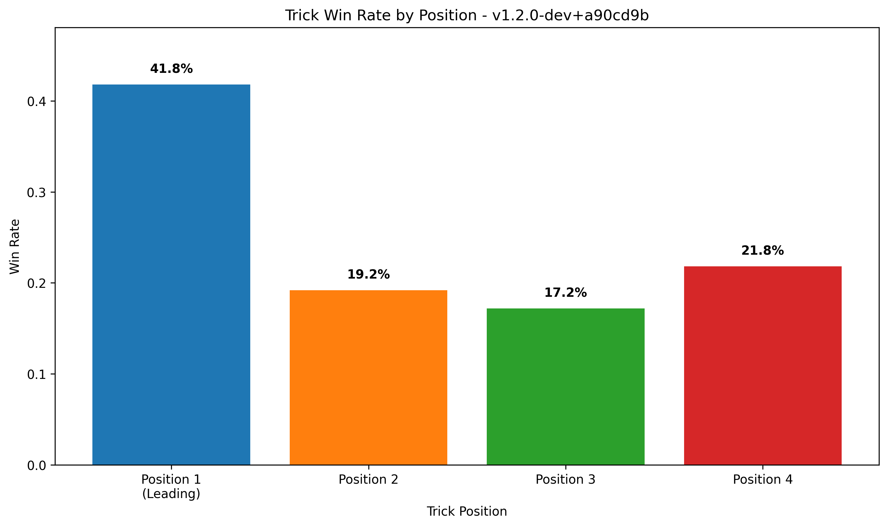
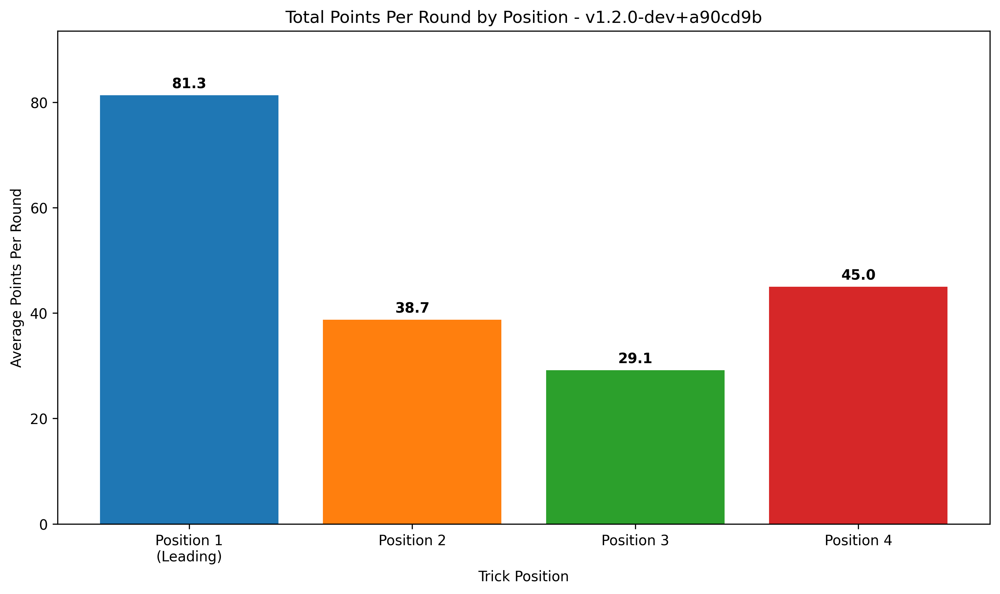

# 🎮 Tractor AI Performance Report
**Generated:** 2025-07-04 21:32:54
**App Versions:** 1
**Total Games:** 100

## 📊 App Version: `v1.2.0-dev+a90cd9b`
### 🏆 Game Performance
- **Total Games:** 100
- **Attacking Team Win Rate:** 62.0%
- **Defending Team Win Rate:** 38.0%
- **Total Rounds:** 9309
- **Avg Rounds per Game:** 93.1
- **Attacking Round Win Rate:** 54.6%

### 🎯 Position Performance (Win Rates)
- **Leading Player (Pos 1):** 41.8% win rate
- **2nd Player:** 19.2% win rate
- **3rd Player:** 17.2% win rate
- **4th Player:** 21.8% win rate

### 🎯 Total Points Collected Per Round (By Position)
- **Leading Player:** 81.3 points per round (41.9% of total)
- **2nd Player:** 38.7 points per round (19.9% of total)
- **3rd Player:** 29.1 points per round (15.0% of total)
- **4th Player:** 45.0 points per round (23.2% of total)
- **Total Round Points:** 194.2 per round (out of ~200 available)

## 📊 Performance Visualizations

### Team Performance: Attacking vs Defending

### Position Win Rates

### Total Points Per Round by Position

### 🎮 Player Performance
- **Average Player Win Rate:** 25.0%
- **Average Points per Trick:** 2.7

### 📈 Efficiency Metrics
- **Avg Final Points per Round:** 82.1
- **Avg Kitty Points:** 14.9

### 🧠 Most Used AI Strategies
**🎯 Leading Strategies:**
- `lead_historical_insights`: 62,814 uses
- `lead_early_game_ace`: 49,050 uses
- `lead_multi_combo`: 8,616 uses

**🤝 Following Strategies:**
- `analysis_start`: 480,384 uses
- `follow_opponent_blocking`: 275,448 uses
- `follow_teammate_winning`: 137,556 uses
- `teammate_winning_third_player`: 101,967 uses
- `follow_suit_establishment`: 67,380 uses

---

