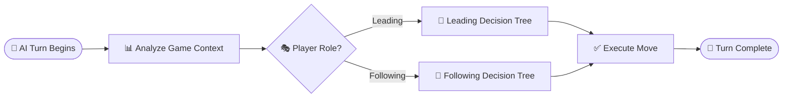
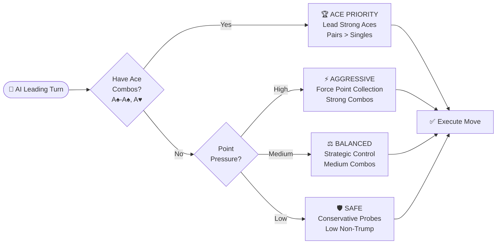
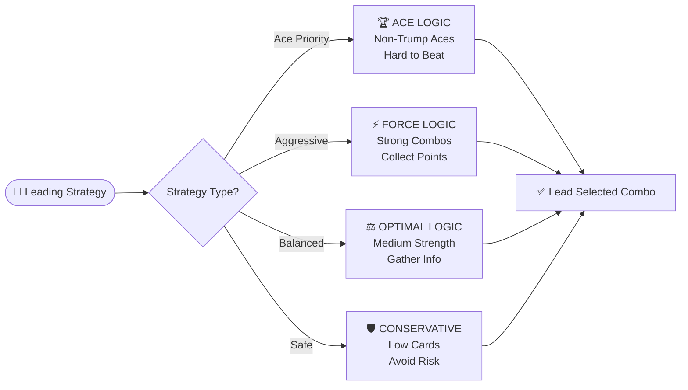
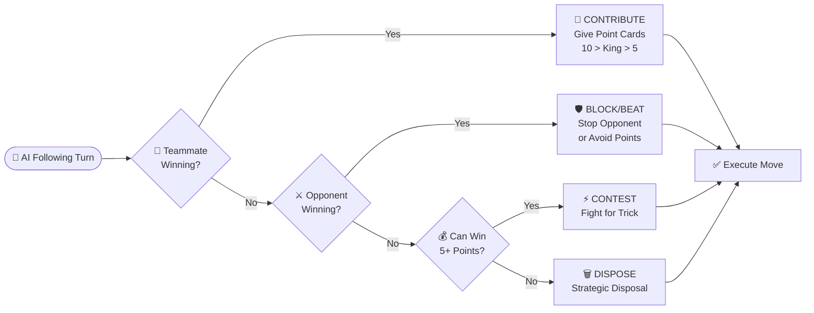
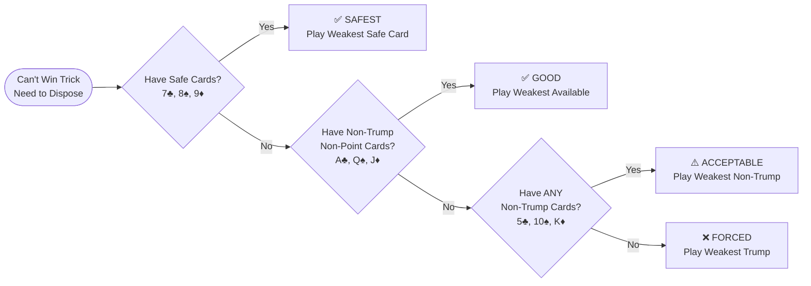

# AI Decision Tree & Strategic Logic

> *Comprehensive decision trees mapping AI strategic logic for all player roles and game situations*

## Overview

The AI system uses sophisticated decision trees that adapt based on player role, game context, and strategic priorities. This document provides detailed flowcharts and logic trees for understanding how the AI makes strategic decisions in different scenarios.

## Core Decision Framework

## Leading Player Decision Tree

When the AI is leading a trick, it follows this strategic decision process:

### Leading Strategy Types

## Restructured Following Player Decision Tree

The AI uses a clean 4-priority decision chain that eliminates conflicts and ensures predictable strategic behavior:

### Strategic Disposal Hierarchy

When the AI cannot win a trick, it asks these questions **in order** to find the safest card to throw away:

**Key Examples:**
- **Safe Cards**: 7♣, 8♠, 9♦ *(no trump, no Ace, no points)*
- **Good Cards**: A♣, Q♠, J♦ *(lose an Ace but no points given)*  
- **Acceptable Cards**: 5♣, 10♠, K♦ *(gives away points but saves trump)*
- **Forced Cards**: 3♦, 4♦ *(trump cards - only when no choice)*

### Priority Chain Benefits

1. **Eliminates Logic Conflicts**: Clear priority order prevents contradictory decisions
2. **Predictable Behavior**: Consistent AI responses across all scenarios
3. **Enhanced Point Card Management**: Strategic avoidance when opponent winning
4. **Multi-Level Strategic Disposal**: Sophisticated card conservation hierarchy
5. **Trump Hierarchy Conservation**: Proper weak trump vs valuable trump selection
6. **Enhanced Ace Conservation**: Smart high-card preservation
7. **Sophisticated Opponent Response**: Strategic blocking based on trick value and card conservation
8. **Team Coordination**: Improved cooperation with human teammates

## Enhanced Strategic Disposal Logic

The AI's strategic disposal system uses a sophisticated multi-level filtering approach when it cannot win a trick:

### Disposal Priority Hierarchy

1. **Non-Valuable Cards**: Cards that are non-trump, non-Ace, and non-point (safest to dispose)
2. **Non-Trump Non-Point**: Non-trump cards without points (preserves Aces but avoids point loss)
3. **Non-Trump Only**: Any non-trump cards (last resort before using trump)
4. **Trump Cards**: Only used when no other options available (most valuable to preserve)

### Point Card Management

- **When Opponent Winning**: AI always tries to avoid playing point cards (5s, 10s, Kings)
- **When Teammate Winning**: AI may contribute point cards strategically with hierarchy (10 > King > 5)
- **When Conservative**: Even with winning teammate, AI may choose to preserve point cards

### Trump Conservation Hierarchy

When forced to play trump cards, the AI follows proper trump value hierarchy:

**Example (Trump rank 2, Trump suit Diamonds):**
- **Weakest**: 3♦, 4♦ (weak trump suit cards) ← **Preferred disposal**
- **Valuable**: 2♣, 2♥ (trump rank off-suits) ← **Preserve these**
- **Most Valuable**: 2♦, Small Joker, Big Joker ← **Never waste**

---

## Summary

The AI decision tree system provides a sophisticated yet maintainable strategic framework:

### Core Strengths

1. **Clean Priority Chain**: Eliminates logic conflicts with clear decision order
2. **Enhanced Point Management**: Strategic conservation and contribution based on context
3. **Multi-Level Strategic Disposal**: Sophisticated card preservation hierarchy
4. **Trump Conservation**: Proper weak trump vs valuable trump selection
5. **Real-Time Adaptation**: Dynamic strategy based on current trick winner
6. **Team Coordination**: Optimal cooperation with human teammates

### Implementation Benefits

- **Predictable Behavior**: Consistent AI responses across all scenarios
- **Easy Debugging**: Clear logic flow for troubleshooting
- **Maintainable Code**: Simple priority chain vs complex branching trees
- **Test Coverage**: Each priority level can be tested independently
- **Performance**: Efficient decision-making without redundant calculations

The restructured AI strategy successfully balances strategic sophistication with code maintainability, resulting in challenging yet fair gameplay.

---

**See Also:**
- **[AI System Documentation](AI_SYSTEM.md)** - Complete AI implementation details
- **[Game Rules](GAME_RULES.md)** - Full game rules and strategy guide
