# AI Decision Tree & Strategic Logic

> *Comprehensive decision trees mapping AI strategic logic for all player roles and game situations*

## Overview

The AI system uses sophisticated decision trees that adapt based on player role, game context, and strategic priorities. This document provides detailed flowcharts and logic trees for understanding how the AI makes strategic decisions in different scenarios.

## Core Decision Framework

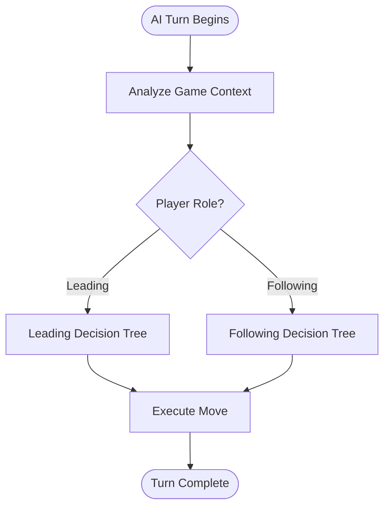

## Leading Player Decision Tree

When the AI is leading a trick, it follows this comprehensive decision tree:

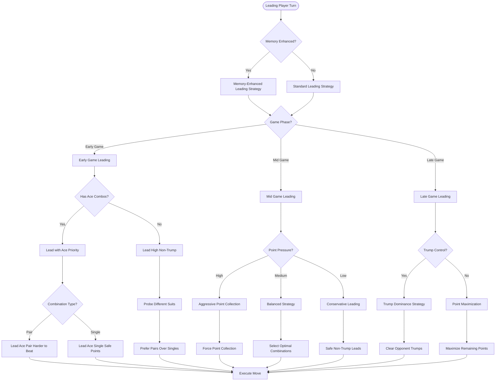

### Leading Strategy Priority Matrix

| Game Phase | Point Pressure | Trump Status | Primary Strategy | Secondary Strategy |
|------------|---------------|--------------|------------------|-------------------|
| **Early** | Low | Weak | High Non-Trump | Suit Probing |
| **Early** | Medium | Strong | Ace Priority | Trump Conservation |
| **Early** | High | Any | Aggressive Points | Force Collection |
| **Mid** | Low | Weak | Balanced Leading | Point Opportunities |
| **Mid** | Medium | Strong | Optimal Combos | Strategic Control |
| **Mid** | High | Any | Force Points | Trump Investment |
| **Late** | Low | Strong | Trump Dominance | Clear Opposition |
| **Late** | Medium | Weak | Point Maximization | Endgame Efficiency |
| **Late** | High | Any | Desperate Points | All Resources |

## Restructured Following Player Decision Tree

The AI uses a clean 4-priority decision chain that eliminates conflicts and ensures predictable strategic behavior:

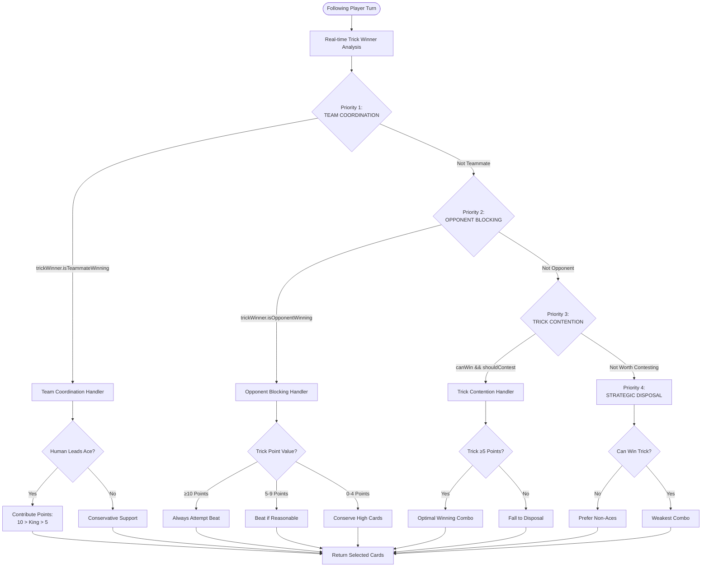

### Priority Chain Benefits

1. **Eliminates Logic Conflicts**: Clear priority order prevents contradictory decisions
2. **Predictable Behavior**: Consistent AI responses across all scenarios
3. **Enhanced Ace Conservation**: Smart high-card preservation
4. **Sophisticated Opponent Response**: Strategic blocking based on trick value
5. **Team Coordination**: Improved cooperation with human teammates

## Legacy Following Player Decision Tree

The previous complex decision tree (shown below) has been replaced by the above priority chain for better maintainability:

When following, the AI uses position-aware strategy with real-time trick winner tracking:

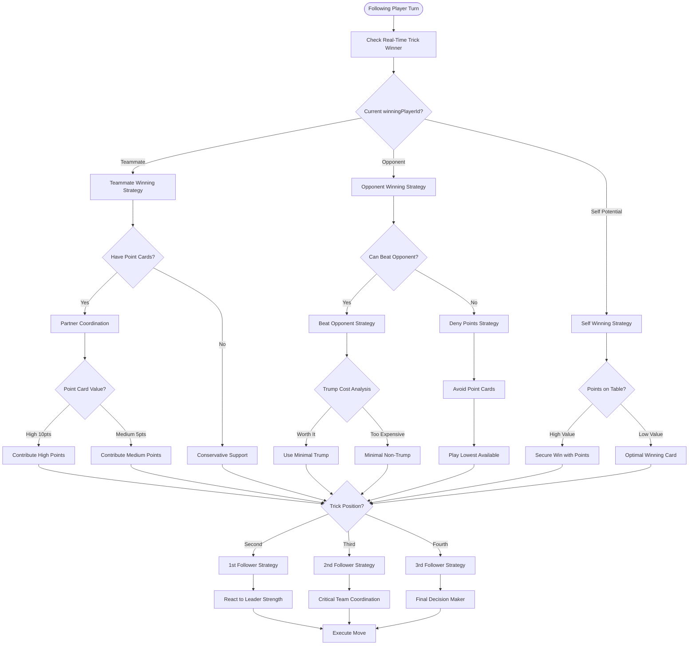

### Following Strategy by Position

#### **First Follower (Second Position)**
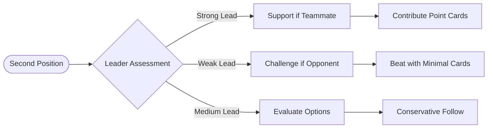

#### **Second Follower (Third Position)**
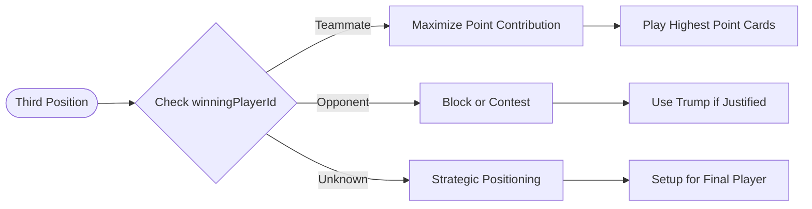

#### **Third Follower (Fourth Position)**
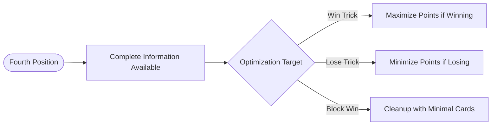

## Strategic Context Decision Trees

### Trump Management Decision Tree

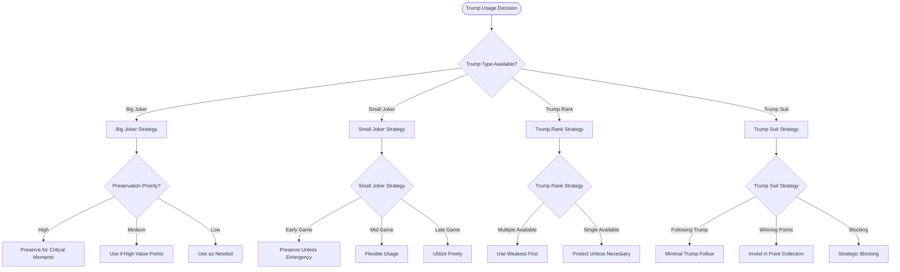

### Point Card Management Decision Tree

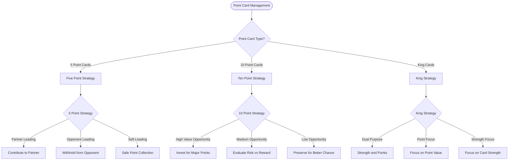

## Memory-Enhanced Decision Trees

### Card Tracking Integration

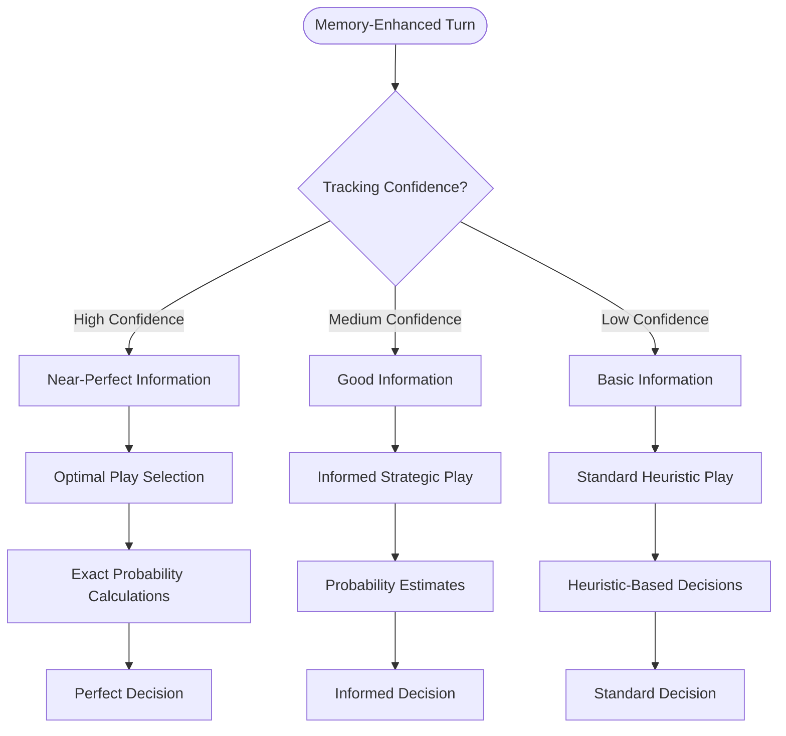

### Opponent Modeling Decision Tree

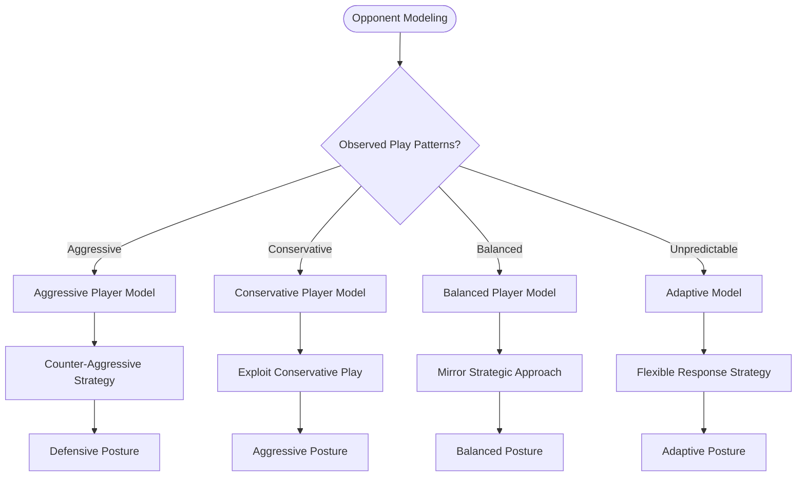

## Integration with Game Phases

### Phase-Specific Decision Modifications

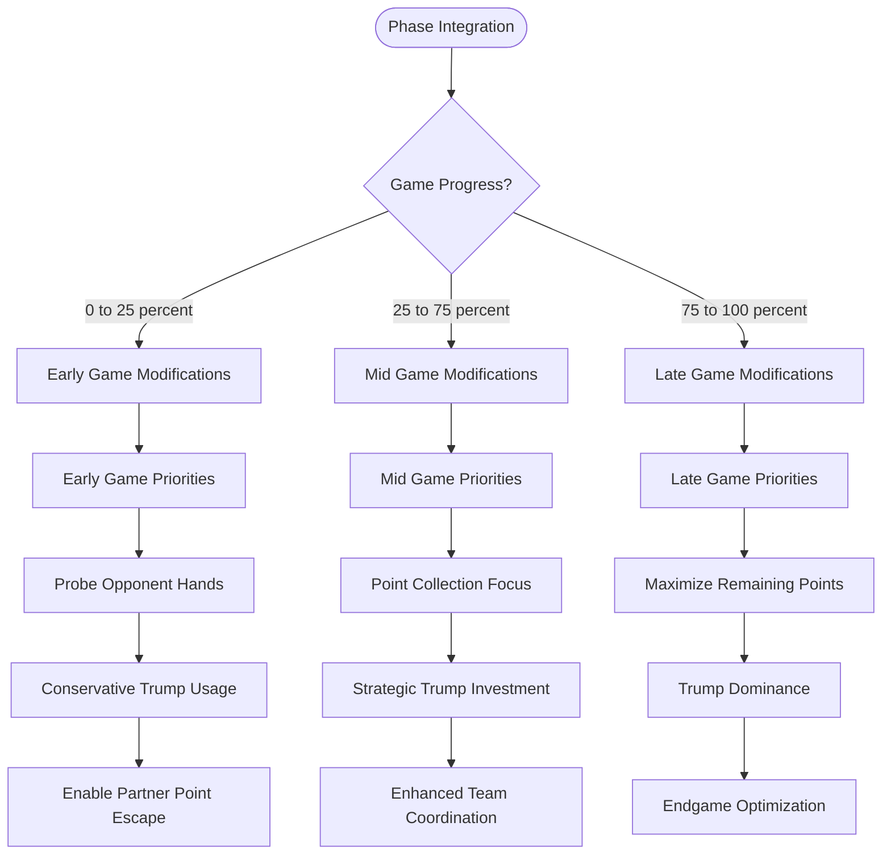

## Error Handling and Fallback Strategies

### Decision Tree Fallback Logic

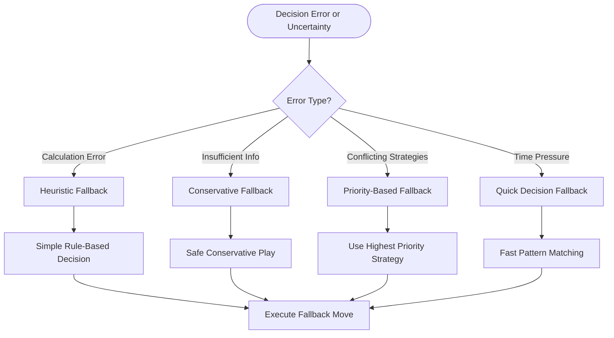

## Implementation Notes

### Decision Tree Traversal

The AI system traverses these decision trees in real-time during gameplay:

1. **Context Analysis**: Determine game state, player role, and strategic priorities
2. **Tree Selection**: Choose appropriate decision tree based on role and situation
3. **Branch Navigation**: Follow decision branches based on analyzed conditions
4. **Strategy Refinement**: Apply position-specific and memory-enhanced modifications
5. **Move Execution**: Convert strategic decision into specific card play

### Performance Considerations

- **Real-time Processing**: All decision trees execute within 100-200ms for responsive gameplay
- **Memory Integration**: Card tracking and pattern recognition enhance decision quality without performance impact
- **Adaptive Complexity**: Decision tree depth adapts based on game importance and available processing time
- **Fallback Systems**: Multiple fallback strategies ensure robust decision-making under all conditions
- **Real-time Winner Tracking**: Direct access to `trick.winningPlayerId` eliminates redundant calculations
- **Restructured Priority Chain**: Clean 4-priority system eliminates conflicts and improves maintainability

### Priority Chain Restructure

The AI decision system was restructured to eliminate overlapping logic and rabbit holes:

```
OLD SYSTEM: 7+ conflicting priorities with early exits and bypasses
NEW SYSTEM: 4 clear priorities with dedicated handlers

PRIORITY 1: Team Coordination (handleTeammateWinning)
PRIORITY 2: Opponent Blocking (handleOpponentWinning)  
PRIORITY 3: Trick Contention (selectOptimalWinningCombo)
PRIORITY 4: Strategic Disposal (selectStrategicDisposal)
```

This restructure ensures that partner coordination (playing point cards when teammate leads Ace) works reliably without breaking other AI behaviors.

### Current Implementation Status

- ✅ **Fully Implemented**: All 4 phases of AI intelligence are complete and operational
- ✅ **Priority Chain**: Restructured decision chain eliminates conflicts and ensures predictable behavior  
- ✅ **Real-time Analysis**: Trick winner tracking provides immediate strategic responses
- ✅ **Comprehensive Testing**: 315+ tests validate AI behavior across all scenarios
- ✅ **Production Ready**: Sophisticated strategic decision-making with smooth gameplay

### Future Strategic Evolution

The decision trees represent the current implementation and will evolve as the AI system advances:

- **Enhanced Pattern Recognition**: Deeper opponent modeling and prediction
- **Meta-Strategy Adaptation**: Long-term strategic adaptation based on gameplay outcomes
- **Difficulty Scaling**: Decision tree complexity can be adjusted for different skill levels
- **Performance Optimization**: Further refinements to decision-making efficiency

---

*For implementation details, see [AI System Documentation](AI_SYSTEM.md)*
*For complete game rules, see [Game Rules](GAME_RULES.md)*