# AI Decision Tree & Strategic Logic

> *Comprehensive decision trees mapping AI strategic logic for all player roles and game situations*

## Overview

The AI system uses sophisticated decision trees that adapt based on player role, game context, and strategic priorities. This document provides detailed flowcharts and logic trees for understanding how the AI makes strategic decisions in different scenarios.

## Core Decision Framework

```mermaid
flowchart LR
    Start([🤖 AI Turn Begins]) --> Context[📊 Analyze Game Context] --> Role{🎭 Player Role?}
    Role -->|Leading| LeadTree[🎯 Leading Decision Tree]
    Role -->|Following| FollowTree[🎯 Following Decision Tree]
    LeadTree --> Execute[✅ Execute Move]
    FollowTree --> Execute
    Execute --> End([🏁 Turn Complete])
```

## Leading Player Decision Tree

When the AI is leading a trick, it follows this strategic decision process:

```mermaid
flowchart LR
    Start([🎯 AI Leading Turn]) --> Memory{Memory-Enhanced<br/>Biggest Remaining?}
    Memory -->|Yes| Guaranteed[🧠 GUARANTEED WINNERS<br/>Aces > Kings > Tractors<br/>Point Collection Priority]
    Memory -->|No| Early{Early Game<br/>Phase?}
    Early -->|Yes| EarlyGame[🌅 EARLY GAME STRATEGY<br/>Integrated Ace Priority<br/>High Non-Trump Leading]
    Early -->|No| Pressure{Point<br/>Pressure?}
    Pressure -->|High| Aggressive[⚡ AGGRESSIVE<br/>Force Point Collection<br/>Strong Combos]
    Pressure -->|Medium| Balanced[⚖️ BALANCED<br/>Strategic Control<br/>Medium Combos]
    Pressure -->|Low| Safe[🛡️ SAFE<br/>Conservative Probes<br/>Low Non-Trump]
    
    Guaranteed --> Execute[✅ Execute Move]
    EarlyGame --> Execute
    Aggressive --> Execute
    Balanced --> Execute
    Safe --> Execute
    
```

### Memory-Enhanced Biggest Remaining Strategy

The AI now uses sophisticated card memory to identify guaranteed winners:

```mermaid
flowchart LR
    Start([🧠 Memory Analysis]) --> Singles{Singles Logic<br/>Both copies ALL<br/>higher ranks played?}
    Singles -->|Yes| SingleWin[✅ Single Guaranteed<br/>K♥ wins if both A♥ played]
    Singles -->|No| Pairs{Pairs Logic<br/>ANY higher rank<br/>card played?}
    Pairs -->|Yes| PairWin[✅ Pair Guaranteed<br/>Q♥-Q♥ wins if ANY A♥ or K♥ played]
    Pairs -->|No| NotGuaranteed[❌ Not Guaranteed<br/>Use regular strategy]
    
    SingleWin --> Priority[🎯 STRATEGIC PRIORITY<br/>Aces 6 Kings 5 Tractors 3<br/>Point Collection First]
    PairWin --> Priority
    NotGuaranteed --> Regular[⚖️ Regular Strategy]
```

**Key Strategic Insights:**
- **Point Collection Priority**: Aces and Kings before tractors (opponent might run out)
- **Memory Intelligence**: Uses card tracking to identify guaranteed winners
- **Strategic Timing**: Collect points while opponent still has cards in suit

### Leading Strategy Types

```mermaid
flowchart LR
    Strategy([🎲 Leading Strategy]) --> Type{Strategy Type?}
    Type -->|Memory Enhanced| MemoryLogic[🧠 BIGGEST REMAINING<br/>Guaranteed Winners<br/>Strategic Priority]
    Type -->|Early Game| EarlyLogic[🌅 EARLY GAME LOGIC<br/>Integrated Ace Priority<br/>High Non-Trump Leading]
    Type -->|Aggressive| ForceLogic[⚡ FORCE LOGIC<br/>Strong Combos<br/>Collect Points]
    Type -->|Balanced| OptimalLogic[⚖️ OPTIMAL LOGIC<br/>Medium Strength<br/>Gather Info]
    Type -->|Safe| ConservativeLogic[🛡️ CONSERVATIVE<br/>Low Cards<br/>Avoid Risk]
    
    MemoryLogic --> Result[✅ Lead Selected Combo]
    EarlyLogic --> Result
    ForceLogic --> Result
    OptimalLogic --> Result
    ConservativeLogic --> Result
```

### Early Game Leading Strategy (Integrated Ace Priority)

The early game strategy now includes integrated Ace priority logic in a single streamlined function:

```mermaid
flowchart LR
    Start([🌅 Early Game Leading]) --> Trump{Trump Suit<br/>Declared?}
    Trump -->|Yes| Defer[🚫 DEFER TO TRUMP<br/>Let trump strategies<br/>handle trump scenarios]
    Trump -->|No| NonTrump[🎯 NON-TRUMP STRATEGY]
    NonTrump --> Step1{🏆 STEP 1<br/>Have Ace Combos?}
    Step1 -->|Yes| AcePairs{Ace Pairs<br/>Available?}
    AcePairs -->|Yes| LeadAcePair[👑 LEAD ACE PAIR<br/>A♠-A♠ > A♥<br/>Harder to beat]
    AcePairs -->|No| LeadAceSingle[👑 LEAD ACE SINGLE<br/>Guaranteed winner<br/>Early game safety]
    Step1 -->|No| Step2[🎯 STEP 2: HIGH CARDS<br/>Tractors > Pairs > Singles<br/>Sorted by strength]
    
    Defer --> End[❌ Return null]
    LeadAcePair --> End2[✅ Execute Ace Pair]
    LeadAceSingle --> End2
    Step2 --> End2
```

**Key Integration Benefits:**
- **Single Function**: `selectEarlyGameLeadingPlay()` handles both Ace priority and general early game strategy
- **Trump Protection**: Automatically defers to trump strategies when trump suit is declared
- **Strategic Progression**: Ace priority first, then fallback to general high-card strategy
- **Cleaner Architecture**: Eliminates redundant function calls and potential conflicts

## Restructured Following Player Decision Tree

The AI uses a clean 4-priority decision chain that eliminates conflicts and ensures predictable strategic behavior:

```mermaid
flowchart LR
    Start([🎯 AI Following Turn]) --> P1{🤝 Teammate<br/>Winning?}
    P1 -->|Yes| Memory{🧠 Have Guaranteed<br/>Point Cards?}
    Memory -->|Yes| SmartContribute[🎁 SMART CONTRIBUTE<br/>Guaranteed Winners First<br/>K♥-K♥ if A♥ played]
    Memory -->|No| Contribute[🎁 CONTRIBUTE<br/>Traditional Hierarchy<br/>10 > King > 5]
    P1 -->|No| P2{⚔️ Opponent<br/>Winning?}
    P2 -->|Yes| Block[🛡️ BLOCK/BEAT<br/>Stop Opponent<br/>or Avoid Points]
    P2 -->|No| P3{💰 Can Win<br/>5+ Points?}
    P3 -->|Yes| Contest[⚡ CONTEST<br/>Fight for Trick]
    P3 -->|No| Dispose[🗑️ DISPOSE<br/>Strategic Disposal]
    
    SmartContribute --> Return[✅ Execute Move]
    Contribute --> Return
    Block --> Return
    Contest --> Return
    Dispose --> Return
```

### Strategic Disposal Hierarchy

When the AI cannot win a trick, it asks these questions **in order** to find the safest card to throw away:

```mermaid
flowchart LR
    Start([Can't Win Trick<br/>Need to Dispose]) --> Q1{Have Safe Cards?<br/>7♣, 8♠, 9♦}
    Q1 -->|Yes| Best[✅ SAFEST<br/>Play Weakest Safe Card]
    Q1 -->|No| Q2{Have Non-Trump<br/>Non-Point Cards?<br/>A♣, Q♠, J♦}
    Q2 -->|Yes| Good[✅ GOOD<br/>Play Weakest Available]
    Q2 -->|No| Q3{Have ANY<br/>Non-Trump Cards?<br/>5♣, 10♠, K♦}
    Q3 -->|Yes| Okay[⚠️ ACCEPTABLE<br/>Play Weakest Non-Trump]
    Q3 -->|No| Last[❌ FORCED<br/>Play Weakest Trump]
```

**Key Examples:**
- **Safe Cards**: 7♣, 8♠, 9♦ *(no trump, no Ace, no points)*
- **Good Cards**: A♣, Q♠, J♦ *(lose an Ace but no points given)*  
- **Acceptable Cards**: 5♣, 10♠, K♦ *(gives away points but saves trump)*
- **Forced Cards**: 3♦, 4♦ *(trump cards - only when no choice)*

### Priority Chain Benefits

1. **Eliminates Logic Conflicts**: Clear priority order prevents contradictory decisions
2. **Predictable Behavior**: Consistent AI responses across all scenarios
3. **Enhanced Point Card Management**: Strategic avoidance when opponent winning
4. **Multi-Level Strategic Disposal**: Sophisticated card conservation hierarchy
5. **Trump Hierarchy Conservation**: Proper weak trump vs valuable trump selection
6. **Enhanced Ace Conservation**: Smart high-card preservation
7. **Sophisticated Opponent Response**: Strategic blocking based on trick value and card conservation
8. **Team Coordination**: Improved cooperation with human teammates
9. **🧠 Memory-Enhanced Intelligence**: Uses card tracking to identify guaranteed winners
10. **🎯 Strategic Point Timing**: Prioritizes point collection before opponent runs out

## Enhanced Strategic Disposal Logic

The AI's strategic disposal system uses a sophisticated multi-level filtering approach when it cannot win a trick:

### Disposal Priority Hierarchy

1. **Non-Valuable Cards**: Cards that are non-trump, non-Ace, and non-point (safest to dispose)
2. **Non-Trump Non-Point**: Non-trump cards without points (preserves Aces but avoids point loss)
3. **Non-Trump Only**: Any non-trump cards (last resort before using trump)
4. **Trump Cards**: Only used when no other options available (most valuable to preserve)

### Point Card Management

- **When Opponent Winning**: AI always tries to avoid playing point cards (5s, 10s, Kings)
- **When Teammate Winning**: AI may contribute point cards strategically with hierarchy (10 > King > 5)
- **When Conservative**: Even with winning teammate, AI may choose to preserve point cards

### Trump Conservation Hierarchy

When forced to play trump cards, the AI follows proper trump value hierarchy:

**Example (Trump rank 2, Trump suit Diamonds):**
- **Weakest**: 3♦, 4♦ (weak trump suit cards) ← **Preferred disposal**
- **Valuable**: 2♣, 2♥ (trump rank off-suits) ← **Preserve these**
- **Most Valuable**: 2♦, Small Joker, Big Joker ← **Never waste**

---

## AI Kitty Swap Strategy Decision Tree

When the AI must select 8 cards to put back into the kitty during the KittySwap phase:

```mermaid
flowchart LR
    Start([🎲 AI Kitty Swap<br/>Phase]) --> Analyze[🔍 Comprehensive<br/>Hand Analysis]
    
    Analyze --> Strategy{Strategic<br/>Recommendation?}
    
    Strategy -->|Suit Elimination| Elimination[🎯 SUIT ELIMINATION<br/>Eliminate weak suits<br/>completely]
    
    Strategy -->|Conservative| Conservative[🛡️ CONSERVATIVE<br/>Select weakest<br/>non-trump cards]
    
    Strategy -->|Exceptional Trump| ExceptionalTrump[⚡ EXCEPTIONAL TRUMP<br/>Include strategic<br/>trump cards]
    
    Elimination --> Validate[✅ Validation &<br/>Execution]
    Conservative --> Validate
    ExceptionalTrump --> Validate
    
    Validate --> End([🏁 Kitty Swap<br/>Complete])
```

**Strategy Details:**

- **Suit Elimination**: Eliminate 1-2 weak suits completely while preserving Aces, Kings, tractors, and pairs
- **Conservative**: Select 8 weakest non-trump cards, preserve all trump cards for standard play
- **Exceptional Trump**: Include weak trump cards when hand has very long trump suit (10+ cards) or strong non-trump combinations

### Suit Elimination Analysis

The AI uses sophisticated suit analysis to determine elimination candidates:

```mermaid
flowchart LR
    Start([🔍 Suit Analysis]) --> Length{Suit Length?}
    
    Length -->|≤3 cards| Short[+50 Score<br/>Short Suit]
    Length -->|4-5 cards| Medium[+30 Score<br/>Medium Suit]
    Length -->|6-7 cards| Long[+10 Score<br/>Long Suit]
    Length -->|≥8 cards| VeryLong[No Bonus<br/>Very Long]
    
    Short --> Valuable{Has Valuable<br/>Cards?}
    Medium --> Valuable
    Long --> Valuable
    VeryLong --> Valuable
    
    Valuable -->|Ace| AcePenalty[-40 Score<br/>Ace Penalty]
    Valuable -->|King| KingPenalty[-25 Score<br/>King Penalty]
    Valuable -->|Pairs| PairPenalty[-20 per pair<br/>Pair Penalty]
    Valuable -->|Tractors| TractorPenalty[-35 per tractor<br/>Tractor Penalty]
    Valuable -->|Only Weak| WeakBonus[+40 Score<br/>Weak Card Bonus]
    
    AcePenalty --> Decision{Final<br/>Decision}
    KingPenalty --> Decision
    PairPenalty --> Decision
    TractorPenalty --> Decision
    WeakBonus --> Decision
    
    Decision -->|High Elimination| Eliminate[✅ ELIMINATE<br/>SUIT]
    Decision -->|High Preservation| Preserve[🛡️ PRESERVE<br/>SUIT]
```

**Scoring Rules:**
- **Length Bonus**: Shorter suits get higher elimination scores
- **Value Penalties**: Aces (-40), Kings (-25), Pairs (-20 each), Tractors (-35 each)
- **Weak Card Bonus**: Suits with only weak cards get +40 elimination score
- **Decision Criteria**: Eliminate if score > 20, length ≤ 6, and no tractors

### Strategic Principles

1. **Trump Conservation**: Usually avoid trump cards unless exceptionally strong hand
2. **Suit Elimination**: Empty 1-2 weak suits completely for optimal hand structure
3. **Value Preservation**: Always preserve Aces, Kings, tractors, and valuable pairs
4. **Exceptional Flexibility**: Allow strategic trump inclusion for very strong hands

---

## Summary

The AI decision tree system provides a sophisticated yet maintainable strategic framework:

### Core Strengths

1. **Clean Priority Chain**: Eliminates logic conflicts with clear decision order
2. **Enhanced Point Management**: Strategic conservation and contribution based on context
3. **Multi-Level Strategic Disposal**: Sophisticated card preservation hierarchy
4. **Trump Conservation**: Proper weak trump vs valuable trump selection
5. **Real-Time Adaptation**: Dynamic strategy based on current trick winner
6. **Team Coordination**: Optimal cooperation with human teammates
7. **Advanced Kitty Strategy**: Sophisticated suit elimination with strategic trump inclusion flexibility

### Implementation Benefits

- **Predictable Behavior**: Consistent AI responses across all scenarios
- **Easy Debugging**: Clear logic flow for troubleshooting
- **Maintainable Code**: Simple priority chain vs complex branching trees
- **Test Coverage**: Each priority level can be tested independently
- **Performance**: Efficient decision-making without redundant calculations

The restructured AI strategy successfully balances strategic sophistication with code maintainability, resulting in challenging yet fair gameplay.

---

**See Also:**
- **[AI System Documentation](AI_SYSTEM.md)** - Complete AI implementation details
- **[Game Rules](GAME_RULES.md)** - Full game rules and strategy guide
