# AI Decision Tree & Strategic Logic

> *Comprehensive decision trees mapping AI strategic logic for all player roles and game situations*

## Overview

The AI system uses sophisticated decision trees that adapt based on player role, game context, and strategic priorities. This document provides detailed flowcharts and logic trees for understanding how the AI makes strategic decisions in different scenarios.

## Core Decision Framework

```mermaid
flowchart LR
    Start([🤖 AI Turn Begins]) --> Context[📊 Analyze Game Context] --> Role{🎭 Player Role?}
    Role -->|Leading| LeadTree[🎯 Leading Decision Tree]
    Role -->|Following| FollowTree[🎯 Following Decision Tree]
    LeadTree --> Execute[✅ Execute Move]
    FollowTree --> Execute
    Execute --> End([🏁 Turn Complete])
```

## Leading Player Decision Tree

When the AI is leading a trick, it follows this strategic decision process:

```mermaid
flowchart LR
    Start([🎯 AI Leading Turn]) --> Ace{Have Ace<br/>Combos?<br/>A♠-A♠, A♥}
    Ace -->|Yes| AcePlay[🏆 ACE PRIORITY<br/>Lead Strong Aces<br/>Pairs > Singles]
    Ace -->|No| Pressure{Point<br/>Pressure?}
    Pressure -->|High| Aggressive[⚡ AGGRESSIVE<br/>Force Point Collection<br/>Strong Combos]
    Pressure -->|Medium| Balanced[⚖️ BALANCED<br/>Strategic Control<br/>Medium Combos]
    Pressure -->|Low| Safe[🛡️ SAFE<br/>Conservative Probes<br/>Low Non-Trump]
    
    AcePlay --> Execute[✅ Execute Move]
    Aggressive --> Execute
    Balanced --> Execute
    Safe --> Execute
```

### Leading Strategy Types

```mermaid
flowchart LR
    Strategy([🎲 Leading Strategy]) --> Type{Strategy Type?}
    Type -->|Ace Priority| AceLogic[🏆 ACE LOGIC<br/>Non-Trump Aces<br/>Hard to Beat]
    Type -->|Aggressive| ForceLogic[⚡ FORCE LOGIC<br/>Strong Combos<br/>Collect Points]
    Type -->|Balanced| OptimalLogic[⚖️ OPTIMAL LOGIC<br/>Medium Strength<br/>Gather Info]
    Type -->|Safe| ConservativeLogic[🛡️ CONSERVATIVE<br/>Low Cards<br/>Avoid Risk]
    
    AceLogic --> Result[✅ Lead Selected Combo]
    ForceLogic --> Result
    OptimalLogic --> Result
    ConservativeLogic --> Result
```

## Restructured Following Player Decision Tree

The AI uses a clean 4-priority decision chain that eliminates conflicts and ensures predictable strategic behavior:

```mermaid
flowchart LR
    Start([🎯 AI Following Turn]) --> P1{🤝 Teammate<br/>Winning?}
    P1 -->|Yes| Contribute[🎁 CONTRIBUTE<br/>Give Point Cards<br/>10 > King > 5]
    P1 -->|No| P2{⚔️ Opponent<br/>Winning?}
    P2 -->|Yes| Block[🛡️ BLOCK/BEAT<br/>Stop Opponent<br/>or Avoid Points]
    P2 -->|No| P3{💰 Can Win<br/>5+ Points?}
    P3 -->|Yes| Contest[⚡ CONTEST<br/>Fight for Trick]
    P3 -->|No| Dispose[🗑️ DISPOSE<br/>Strategic Disposal]
    
    Contribute --> Return[✅ Execute Move]
    Block --> Return
    Contest --> Return
    Dispose --> Return
```

### Strategic Disposal Hierarchy

When the AI cannot win a trick, it asks these questions **in order** to find the safest card to throw away:

**Key Examples:**
- **Safe Cards**: 7♣, 8♠, 9♦ *(no trump, no Ace, no points)*
- **Good Cards**: A♣, Q♠, J♦ *(lose an Ace but no points given)*  
- **Acceptable Cards**: 5♣, 10♠, K♦ *(gives away points but saves trump)*
- **Forced Cards**: 3♦, 4♦ *(trump cards - only when no choice)*

### Priority Chain Benefits

1. **Eliminates Logic Conflicts**: Clear priority order prevents contradictory decisions
2. **Predictable Behavior**: Consistent AI responses across all scenarios
3. **Enhanced Point Card Management**: Strategic avoidance when opponent winning
4. **Multi-Level Strategic Disposal**: Sophisticated card conservation hierarchy
5. **Trump Hierarchy Conservation**: Proper weak trump vs valuable trump selection
6. **Enhanced Ace Conservation**: Smart high-card preservation
7. **Sophisticated Opponent Response**: Strategic blocking based on trick value and card conservation
8. **Team Coordination**: Improved cooperation with human teammates

---

## Summary

The AI decision tree system provides a sophisticated yet maintainable strategic framework:

### Core Strengths

1. **Clean Priority Chain**: Eliminates logic conflicts with clear decision order
2. **Enhanced Point Management**: Strategic conservation and contribution based on context
3. **Multi-Level Strategic Disposal**: Sophisticated card preservation hierarchy
4. **Trump Conservation**: Proper weak trump vs valuable trump selection
5. **Real-Time Adaptation**: Dynamic strategy based on current trick winner
6. **Team Coordination**: Optimal cooperation with human teammates

### Implementation Benefits

- **Predictable Behavior**: Consistent AI responses across all scenarios
- **Easy Debugging**: Clear logic flow for troubleshooting
- **Maintainable Code**: Simple priority chain vs complex branching trees
- **Test Coverage**: Each priority level can be tested independently
- **Performance**: Efficient decision-making without redundant calculations

The restructured AI strategy successfully balances strategic sophistication with code maintainability, resulting in challenging yet fair gameplay.

---

**See Also:**
- **[AI System Documentation](AI_SYSTEM.md)** - Complete AI implementation details
- **[Game Rules](GAME_RULES.md)** - Full game rules and strategy guide

