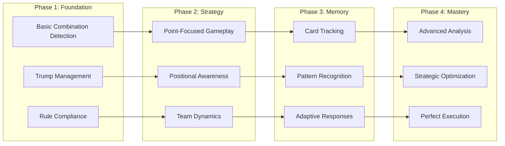
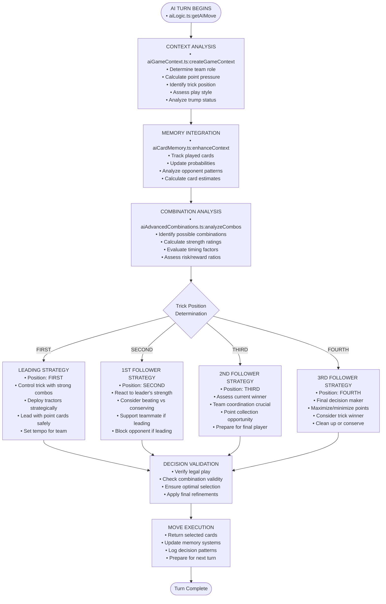

# AI Strategic Intelligence System

> *Advanced 4-phase AI intelligence that creates engaging and strategic gameplay through sophisticated decision-making algorithms*

## AI System Overview

The AI system operates in **4 distinct phases**, each building upon the previous to create increasingly sophisticated gameplay:



### **Phase 1**: Foundation Intelligence
- Basic combination detection and trump management
- Rule compliance and legal move validation
- Simple heuristics for card selection

### **Phase 2**: Strategic Context Awareness  
- Point-focused gameplay and pressure systems
- Positional awareness and trick dynamics
- Team coordination and role understanding

### **Phase 3**: Advanced Memory Systems
- Comprehensive card tracking and history
- Pattern recognition and opponent modeling
- Probability calculations and predictions

### **Phase 4**: Strategic Optimization
- Advanced combination analysis and timing
- Multi-dimensional risk/reward evaluation
- Perfect information utilization and endgame mastery

## AI Strategy Decision Flow



### Position-Based Strategy Details

#### LEADING STRATEGY (Position: FIRST)

**Objective**: Control the trick and set favorable conditions for team

| Priority | Strategy | Description |
|----------|----------|-------------|
| 1 | **Strong Combination Deployment** | Lead with tractors and powerful pairs to dominate |
| 2 | **Strategic Point Collection** | Play point cards when confident of winning trick |
| 3 | **Trump Management** | Decide when to deploy vs preserve trump combinations |
| 4 | **Tempo Setting** | Establish rhythm that benefits team strategy |
| 5 | **Defensive Initiative** | Lead low cards to block opponent point collection |

#### 1ST FOLLOWER STRATEGY (Position: SECOND)

**Objective**: React strategically to leader while considering remaining players

| Priority | Strategy | Description |
|----------|----------|-------------|
| 1 | **Leader Assessment** | Evaluate if leader's play is beatable and worth beating |
| 2 | **Team Support** | Support teammate leader by playing low, challenge opponent leader |
| 3 | **Point Opportunity** | Take winnable points while considering future plays |
| 4 | **Conservation Decision** | Preserve high cards if leader is unbeatable *(Issue #61 Fix)* |
| 5 | **Combination Matching** | Follow suit optimally while maintaining strategy |

#### 2ND FOLLOWER STRATEGY (Position: THIRD)

**Objective**: Maximize team benefit with two players remaining

| Priority | Strategy | Description |
|----------|----------|-------------|
| 1 | **Current Winner Analysis** | Assess who's winning and point value on table |
| 2 | **Team Coordination** | Critical position for team point collection |
| 3 | **Point Maximization** | Best position to capture significant points |
| 4 | **Strategic Positioning** | Set up advantageous situation for final player |
| 5 | **Risk Assessment** | Balance aggressive play vs conservative preservation |

#### 3RD FOLLOWER STRATEGY (Position: FOURTH)

**Objective**: Final decision maker with complete information

| Priority | Strategy | Description |
|----------|----------|-------------|
| 1 | **Complete Information** | All other plays visible, optimal decision possible |
| 2 | **Point Optimization** | Maximize points if winning, minimize if losing |
| 3 | **Trick Winner Consideration** | Take trick only if beneficial to team |
| 4 | **Conservative Cleanup** | Play minimal cards when trick is lost |
| 5 | **Endgame Planning** | Consider impact on remaining hand strength |


## Phase 1: Foundation Intelligence

### Core Capabilities
- **Combination Detection**: Identifies singles, pairs, and tractors from hand
- **Trump Management**: Understands trump hierarchy and strength
- **Basic Strategy**: Follows suit requirements and plays valid combinations
- **Rule Compliance**: Ensures all moves follow game rules

### Technical Implementation
- Uses `createGameContext()` for basic game state analysis
- Implements simple heuristics for card selection
- Focuses on legal moves and basic game flow

## Phase 2: Strategic Context (Implemented)

### Enhanced Features
- **Point-Focused Strategy**: Prioritizes high-value cards (5s, 10s, Kings)
- **Positional Awareness**: Adapts strategy based on trick position
- **Team Dynamics**: Understands attacking vs defending team roles
- **Pressure Response**: Adjusts aggression based on point requirements

### Strategic Algorithms

#### Point Pressure System
```typescript
enum PointPressure {
  LOW = 'low',      // < 40% of points needed
  MEDIUM = 'medium', // 40-70% of points needed  
  HIGH = 'high'     // > 70% of points needed
}
```

#### Positional Strategy
- **Leading (First)**: Plays strong combinations to control trick
- **Following**: Balances point collection with combination matching
- **Late Position**: Focuses on point maximization or blocking

#### Play Style Adaptation
```typescript
enum PlayStyle {
  Conservative = 'conservative', // Preserve high cards
  Balanced = 'balanced',        // Mix of offense/defense
  Aggressive = 'aggressive',    // Force points aggressively
  Desperate = 'desperate'       // All-out point grabbing
}
```

### Implementation Details
- **Context Creation**: `src/ai/aiGameContext.ts` analyzes current game state
- **Strategy Selection**: `src/ai/aiPointFocusedStrategy.ts` implements point-driven decisions
- **Combo Analysis**: `src/ai/aiAdvancedCombinations.ts` evaluates combination strength
- **Decision Engine**: `src/ai/aiLogic.ts` coordinates all strategic components

## Phase 3: Memory & Pattern Recognition (Implemented)

### Advanced Capabilities
- **Card Memory**: Tracks played cards and infers remaining distributions
- **Pattern Recognition**: Identifies opponent tendencies and strategies
- **Adaptive Responses**: Adjusts strategy based on observed patterns
- **Endgame Optimization**: Sophisticated endgame planning

### Memory Systems
- **Played Card Tracking**: Maintains history of all played cards
- **Distribution Inference**: Estimates remaining cards in opponent hands
- **Pattern Analysis**: Analyzes opponent playing patterns and behaviors
- **Probability Calculations**: Dynamic probability updates based on observed play

### Technical Implementation
- **Memory Module**: `src/ai/aiCardMemory.ts` handles comprehensive card tracking
- **Pattern Recognition**: Behavioral analysis and opponent modeling
- **Probability Engine**: Bayesian updates for remaining card distributions
- **Strategic Integration**: Memory-enhanced decision making throughout all AI phases

## Phase 4: Advanced Combination Analysis (Implemented)

### Strategic Optimization
- **Pattern-Based Selection**: Advanced combination pattern recognition and selection
- **Timing Optimization**: Strategic timing decisions (immediate, delayed, endgame)
- **Risk/Reward Analysis**: Sophisticated risk assessment with reward calculations
- **Multi-Dimensional Evaluation**: Considers effectiveness, timing, risk, and alternatives

### Advanced Features
- **Complex Combination Logic**: `src/ai/aiAdvancedCombinations.ts` implements sophisticated analysis
- **Strategic Pattern Recognition**: Identifies optimal combination patterns based on game context
- **Adaptive Strategy Selection**: Real-time strategy adjustment based on hand profile and position
- **Trump Combination Coordination**: Advanced trump tractor and pair timing optimization

### Technical Implementation
- **Combination Engine**: Advanced algorithms for combination evaluation and selection
- **Strategic Matrices**: Multi-dimensional analysis considering various strategic factors
- **Integration Framework**: Seamless integration with memory systems and context analysis
- **Performance Optimization**: Efficient algorithms maintaining real-time decision speeds

## AI Context System

### Game Context Creation
The `createGameContext()` function analyzes:
- Current team role (attacking/defending)
- Point collection status and requirements
- Remaining cards and game progression
- Trick position and strategic opportunities

### Context-Driven Decisions
All AI decisions are made through context analysis:
1. **Situation Assessment**: Analyze current game state
2. **Strategy Selection**: Choose appropriate play style
3. **Combination Evaluation**: Rank available plays
4. **Optimal Selection**: Execute best strategic choice

## Strategic Principles

### Point Management
- **High-Value Targeting**: Prioritize 5s, 10s, and Kings
- **Timing Optimization**: Play point cards when advantageous
- **Defensive Blocking**: Prevent opponents from collecting points
- **Endgame Planning**: Save critical cards for final tricks

### Combination Strategy
- **Leading Optimization**: Use strong combinations to control tricks
- **Following Efficiency**: Match combinations when beneficial
- **Tractor Preservation**: Save tractors for maximum impact
- **Single Card Timing**: Use singles strategically

### Team Coordination
- **Role Awareness**: Understand attacking vs defending responsibilities  
- **Point Distribution**: Coordinate point collection across team
- **Support Plays**: Make moves that benefit team strategy
- **Blocking Tactics**: Prevent opponent point collection

## Performance Characteristics

### Decision Speed
- **Real-time Analysis**: Context evaluation in ~100ms
- **Strategy Selection**: Play choice in ~200ms  
- **Smooth Gameplay**: Maintains natural game flow
- **Responsive AI**: Quick adaptation to game changes

### Strategic Depth
- **Multi-layered Analysis**: Considers multiple strategic factors
- **Balanced Decision Making**: Weighs short and long-term benefits
- **Adaptive Responses**: Adjusts to changing game conditions
- **Consistent Challenge**: Provides engaging difficulty level

## System Integration

### AI Module Architecture
The AI system consists of 5 specialized modules in `src/ai/`:

- **`aiLogic.ts`**: Main AI decision engine coordinating all phases
- **`aiGameContext.ts`**: Context analysis and strategic awareness
- **`aiPointFocusedStrategy.ts`**: Point collection and team coordination strategies
- **`aiCardMemory.ts`**: Comprehensive card tracking and probability systems
- **`aiAdvancedCombinations.ts`**: Advanced combination analysis and optimization

### Current Implementation Status
- ✅ **All 4 phases fully implemented** and working together seamlessly
- ✅ **Comprehensive test coverage** with 315 passing tests
- ✅ **Production ready** with sophisticated strategic decision-making
- ✅ **Real-time performance** maintaining smooth gameplay experience

## Testing and Validation

### AI Quality Assurance
- **Strategy Testing**: Validates decision-making algorithms across all phases
- **Performance Benchmarks**: Measures AI effectiveness and strategic depth
- **Edge Case Handling**: Tests unusual game scenarios and memory edge cases
- **Balance Verification**: Ensures fair and engaging gameplay with challenging AI

### Test Coverage
- **69 AI intelligence tests** covering all 4 phases comprehensively
- **Memory system testing** with extensive card tracking scenarios
- **Integration testing** ensuring seamless phase coordination
- **Performance testing** validating real-time decision speeds