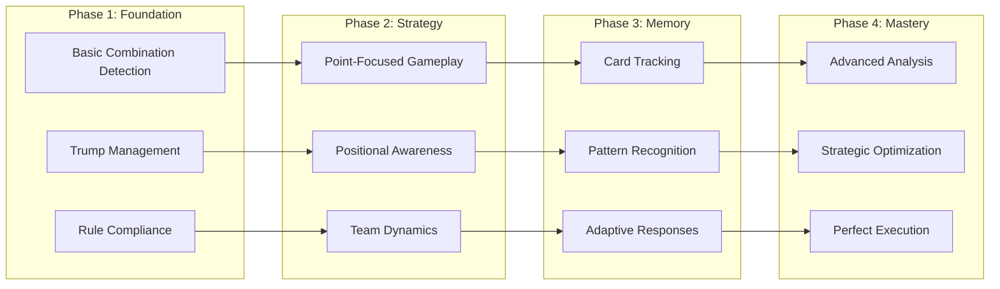

# AI Strategic Intelligence System

> *Advanced 4-phase AI intelligence that creates engaging and strategic gameplay through sophisticated decision-making algorithms*

**Related Documentation:**

- **[AI Decision Trees](AI_DECISION_TREE.md)** - Detailed decision flowcharts and strategic logic trees
- **[Game Rules](GAME_RULES.md)** - Complete game rules and strategy guide

## AI System Overview

The AI system operates in **4 distinct phases**, each building upon the previous to create increasingly sophisticated gameplay:



### **Phase 1**: Foundation Intelligence

- Basic combination detection and trump management
- Rule compliance and legal move validation
- Simple heuristics for card selection

### **Phase 2**: Strategic Context Awareness  

- Point-focused gameplay and pressure systems
- Positional awareness and trick dynamics
- Team coordination and role understanding
- Real-time trick winner analysis and response

### **Phase 3**: Advanced Memory Systems

- Comprehensive card tracking and history
- Pattern recognition and opponent modeling
- Probability calculations and predictions

### **Phase 4**: Strategic Optimization

- Advanced combination analysis and timing
- Multi-dimensional risk/reward evaluation
- Perfect information utilization and endgame mastery

## AI Strategy Decision Flow


### Position-Based Strategy Details

#### LEADING STRATEGY (Position: FIRST)

**Objective**: Control the trick and set favorable conditions for team

| Priority | Strategy | Description |
|----------|----------|-------------|
| 1 | **Strong Combination Deployment** | Lead with tractors and powerful pairs to dominate |
| 2 | **Strategic Point Collection** | Play point cards when confident of winning trick |
| 3 | **Trump Management** | Decide when to deploy vs preserve trump combinations |
| 4 | **Tempo Setting** | Establish rhythm that benefits team strategy |
| 5 | **Defensive Initiative** | Lead low cards to block opponent point collection |

#### 1ST FOLLOWER STRATEGY (Position: SECOND)

**Objective**: React strategically to leader while considering remaining players

| Priority | Strategy | Description |
|----------|----------|-------------|
| 1 | **Leader Assessment** | Evaluate if leader's play is beatable and worth beating |
| 2 | **Team Support** | Support teammate leader by playing low, challenge opponent leader |
| 3 | **Point Opportunity** | Take winnable points while considering future plays |
| 4 | **Conservation Decision** | Preserve high cards if leader is unbeatable *(Issue #61 Fix)* |
| 5 | **Combination Matching** | Follow suit optimally while maintaining strategy |

#### 2ND FOLLOWER STRATEGY (Position: THIRD)

**Objective**: Maximize team benefit with two players remaining

| Priority | Strategy | Description |
|----------|----------|-------------|
| 1 | **Current Winner Analysis** | Assess who's winning and point value on table |
| 2 | **Team Coordination** | Critical position for team point collection |
| 3 | **Point Maximization** | Best position to capture significant points |
| 4 | **Strategic Positioning** | Set up advantageous situation for final player |
| 5 | **Risk Assessment** | Balance aggressive play vs conservative preservation |

#### 3RD FOLLOWER STRATEGY (Position: FOURTH)

**Objective**: Final decision maker with complete information

| Priority | Strategy | Description |
|----------|----------|-------------|
| 1 | **Complete Information** | All other plays visible, optimal decision possible |
| 2 | **Point Optimization** | Maximize points if winning, minimize if losing |
| 3 | **Trick Winner Consideration** | Take trick only if beneficial to team |
| 4 | **Conservative Cleanup** | Play minimal cards when trick is lost |
| 5 | **Endgame Planning** | Consider impact on remaining hand strength |

## Restructured AI Priority Chain

The AI strategy has been completely restructured into a clean 4-priority decision chain that eliminates conflicts and ensures sophisticated yet predictable decision-making.

### Priority Chain Architecture


### Priority 1: Team Coordination

**Triggers when**: `trickWinner?.isTeammateWinning === true`

**Key Behaviors:**

- **Human Leads Ace**: AI teammates contribute point cards with hierarchy (10 > King > 5)
- **Teammate Winning Strong**: Play conservatively to preserve team resources
- **Point Collection Support**: Coordinate with teammate for optimal point gathering

**Implementation**: `handleTeammateWinning()` in `aiStrategy.ts`

### Priority 2: Opponent Blocking

**Triggers when**: `trickWinner?.isOpponentWinning === true`

**Strategic Thresholds:**

- **High-Value (≥10 points)**: Always attempt to beat opponent if possible
- **Moderate (5-9 points)**: Beat if strategically reasonable
- **Low-Value (0-4 points)**: Conserve high cards, avoid wasting point cards

**Enhanced Point Card Management:**

- When AI cannot beat opponent, prioritizes non-point cards over point cards
- Uses trump conservation hierarchy to select weakest available cards
- Preserves valuable trump rank cards over weak trump suit cards
- Low-value tricks (0-4 points) use conservation logic for optimal card selection
- **Example**: Plays 3♠ (conservation: 5) instead of 2♥ (conservation: 70) when opponent leads trump rank

**Implementation**: `handleOpponentWinning()` and `selectLowestValueNonPointCombo()` in `aiStrategy.ts`

### Priority 3: Trick Contention

**Triggers when**: `trickAnalysis.canWin && trickAnalysis.shouldContest`

**Contest Logic:**

- Only contests tricks worth ≥5 points (`shouldContest = currentTrick?.points >= 5`)
- Uses `selectOptimalWinningCombo()` to choose most effective winning play
- Balances immediate gains with long-term strategy

**Implementation**: `selectOptimalWinningCombo()` in `aiStrategy.ts`

### Priority 4: Strategic Disposal

**Triggers when**: All higher priorities fail to return a move

**Disposal Strategy:**

- Prefers non-Aces when trick can't be won
- Plays weakest available combinations
- Preserves high-value cards for future strategic opportunities

**Implementation**: `selectStrategicDisposal()` in `aiStrategy.ts`

### Benefits of Restructured System

1. **Eliminates Conflicts**: Clear priority order prevents logic contradictions
2. **Predictable Behavior**: Consistent decision-making across all scenarios  
3. **Enhanced Ace Conservation**: Smart preservation of high-value cards
4. **Strategic Point Card Management**: Avoids wasting point cards when opponent winning
5. **Trump Conservation**: Proper trump hierarchy usage preserving valuable cards
6. **Opponent Blocking**: Sophisticated response to opponent point collection
7. **Team Coordination**: Improved cooperation with human teammates

### Real-time Trick Winner Analysis

The restructured system leverages real-time `winningPlayerId` tracking for immediate strategic decisions:

```typescript
// Real-time analysis replaces expensive computations
const trickWinner = context.trickWinnerAnalysis;
if (trickWinner?.isOpponentWinning && trickWinner.trickPoints >= 10) {
  // Immediate aggressive response to high-value opponent threats
  return selectOptimalWinningCombo(/* optimal beating strategy */);
}
```

This approach provides:

- **Performance**: Direct property access vs complex calculations
- **Accuracy**: Real-time game state reflection
- **Responsiveness**: Immediate strategic adaptation

## Phase 1: Foundation Intelligence

### Core Capabilities

- **Combination Detection**: Identifies singles, pairs, and tractors from hand
- **Trump Management**: Understands trump hierarchy and strength
- **Trump Declaration**: Basic trump declaration during dealing phase
- **Basic Strategy**: Follows suit requirements and plays valid combinations
- **Rule Compliance**: Ensures all moves follow game rules

### Technical Implementation

- Uses `createGameContext()` for basic game state analysis
- Implements simple heuristics for card selection
- Basic trump declaration probability calculations
- Focuses on legal moves and basic game flow

## Phase 2: Strategic Context (Implemented)

### Enhanced Features

- **Point-Focused Strategy**: Prioritizes high-value cards (5s, 10s, Kings)
- **Advanced Trump Declaration**: Sophisticated dealing phase strategy with hand quality analysis
- **Positional Awareness**: Adapts strategy based on trick position
- **Team Dynamics**: Understands attacking vs defending team roles
- **Pressure Response**: Adjusts aggression based on point requirements
- **Real-time Trick Winner Analysis**: Uses `winningPlayerId` to make sophisticated decisions about conservative vs aggressive play

### Strategic Algorithms

#### Point Pressure System

```typescript
enum PointPressure {
  LOW = 'low',      // < 40% of points needed
  MEDIUM = 'medium', // 40-70% of points needed  
  HIGH = 'high'     // > 70% of points needed
}
```

#### Positional Strategy

- **Leading (First)**: Plays strong combinations to control trick
- **Following**: Balances point collection with combination matching
- **Late Position**: Focuses on point maximization or blocking

#### Play Style Adaptation

```typescript
enum PlayStyle {
  Conservative = 'conservative', // Preserve high cards
  Balanced = 'balanced',        // Mix of offense/defense
  Aggressive = 'aggressive',    // Force points aggressively
  Desperate = 'desperate'       // All-out point grabbing
}
```

### Implementation Details

- **Context Creation**: `src/ai/aiGameContext.ts` analyzes current game state using real-time trick winner tracking
- **Trump Declaration Strategy**: `src/ai/aiTrumpDeclarationStrategy.ts` implements sophisticated dealing phase AI
- **Real-Time Tracking**: Uses `trick.winningPlayerId` for immediate winner identification without calculations
- **RESTRUCTURED Priority Chain**: `selectOptimalFollowPlay()` implements clean 4-priority decision system
- **Strategy Selection**: `src/ai/aiPointFocusedStrategy.ts` provides specialized strategy functions  
- **Combo Analysis**: `src/ai/aiAdvancedCombinations.ts` evaluates combination strength
- **Decision Engine**: `src/ai/aiStrategy.ts` implements all strategic components with restructured flow

#### Restructured AI Priority Chain

```typescript
// PRIORITY 1: TEAM COORDINATION
if (trickWinner?.isTeammateWinning) {
  return this.handleTeammateWinning(comboAnalyses, context, trumpInfo);
}

// PRIORITY 2: OPPONENT BLOCKING  
if (trickWinner?.isOpponentWinning) {
  const response = this.handleOpponentWinning(...);
  if (response) return response;
}

// PRIORITY 3: TRICK CONTENTION
if (trickAnalysis.canWin && trickAnalysis.shouldContest) {
  return this.selectOptimalWinningCombo(...);
}

// PRIORITY 4: STRATEGIC DISPOSAL
return this.selectStrategicDisposal(...);
```

The restructured system provides:

- **Clear Priority Order**: No conflicting or overlapping logic paths
- **Team Coordination**: Dedicated handling for teammate winning scenarios
- **Opponent Response**: Strategic blocking and competitive play
- **Performance**: Direct `winningPlayerId` access eliminates redundant calculations
- **Maintainability**: Single decision chain eliminates rabbit holes and conflicts

## AI Trump Declaration System

### Sophisticated Dealing Phase Strategy

The AI includes a comprehensive trump declaration system that operates during the progressive dealing phase:

#### Core Components

- **Hand Quality Analysis**: Evaluates suit length, combinations, and trump potential
- **Timing Optimization**: Dynamic probability adjustments based on dealing progress
- **Override Strategy**: Intelligent decisions on when to challenge opponent declarations
- **Team Coordination**: Strategic positioning and declaration timing

#### Decision Algorithm

```typescript
// Base probability calculation
let declarationProbability = getBaseDeclarationProbability(declarationType);

// Adjust for dealing progress (peak at 60-70% dealt)
declarationProbability *= getDealingProgressMultiplier(dealingProgress);

// Adjust for current declarations (higher if none, strategic if overriding)
declarationProbability *= getCurrentDeclarationMultiplier(currentDeclaration);

// Adjust for hand quality (suit length and combinations)
declarationProbability *= getHandQualityMultiplier(hand, trumpRank);

// Add randomness for unpredictability
declarationProbability *= (0.8 + Math.random() * 0.4);

const shouldDeclare = Math.random() < declarationProbability;
```

#### Declaration Probability Factors

**Base Probabilities by Type**:
- **Big Joker Pair**: 95% (almost always declare)
- **Small Joker Pair**: 85% (very likely)
- **Regular Pair**: 70% (likely for strong declarations)
- **Single**: 30% (conservative, only with good hand)

**Hand Quality Multipliers**:
- **Excellent (9+ suit cards)**: 1.6x multiplier
- **Good (7-8 suit cards)**: 1.2-1.4x multiplier
- **Average (6 suit cards)**: 1.0x multiplier
- **Poor (3-4 suit cards)**: 0.4-0.7x multiplier
- **Very Poor (≤2 suit cards)**: 0.2x multiplier

**Timing Multipliers by Dealing Progress**:
- **Early (0-20%)**: 0.5x (very conservative - wait for more cards)
- **Early-Mid (20-40%)**: 1.1x (moderate timing)
- **Peak (40-70%)**: 1.3x (optimal window)
- **Late (70-90%)**: 1.1x (moderate urgency)
- **Very Late (90%+)**: 0.5x (conservative - limited benefit)

#### Strategic Benefits

- **Realistic Behavior**: AI declares at natural timing with strategic reasoning
- **Competitive Play**: Intelligent override decisions based on hand strength
- **Team Awareness**: Considers team positioning and coordination
- **Unpredictability**: Randomization prevents predictable AI patterns

### Implementation Files

- **`aiTrumpDeclarationStrategy.ts`**: Core declaration logic and probability calculations
- **`trumpDeclarationManager.ts`**: Game rule enforcement and state management
- **`useProgressiveDealing.ts`**: Integration with dealing system and UI

## AI Kitty Swap Strategy

### Advanced Strategic Approach with Suit Elimination

The AI employs a sophisticated kitty swap strategy that combines strategic suit elimination with intelligent trump management:

#### Core Strategic Principles

1. **Strategic Suit Elimination**: 
   - **Primary objective**: Empty 1-2 weak suits completely for optimal hand structure
   - **Preserve valuable cards**: Always protect Aces, Kings, tractors, and big pairs
   - **Target weak suits**: Focus on short suits with only low-value cards
   - **Hand optimization**: Create voids for strategic endgame advantage

2. **Refined Trump Management**:
   - **Usually avoid trump cards** in kitty (standard conservative approach)
   - **Strategic trump inclusion** when hands are exceptionally strong:
     - Very long trump suit (10+ cards) with strong combinations
     - Strong non-trump combinations that shouldn't be sacrificed
     - Insufficient non-trump cards for conservative approach

3. **Advanced Decision Framework**:
   - **Suit Elimination Strategy**: When beneficial elimination candidates exist
   - **Conservative Approach**: Standard weakest non-trump card selection
   - **Exceptional Trump Strategy**: Strategic trump inclusion for optimal hands

#### Comprehensive Hand Analysis

The AI performs sophisticated analysis to determine the optimal strategy:

**Suit Analysis Scoring System:**
- **Length Bonus**: Shorter suits get higher elimination scores (+50 for ≤3 cards)
- **Value Penalties**: Aces (-40), Kings (-25), Pairs (-20 each), Tractors (-35 each)
- **Weak Card Bonus**: Suits with only weak cards get +40 elimination score
- **Decision Criteria**: Eliminate if score > 20, length ≤ 6, and no tractors

**Exceptional Strength Evaluation:**
- **Criterion 1**: Very long trump suit (10+ cards) with multiple pairs (≥2)
- **Criterion 2**: Strong non-trump combinations with strength score ≥2.0:
  - Pair count (0.5 points each)
  - High cards (Aces: 0.3, Kings: 0.2)  
  - Tractor potential (2+ pairs: 0.5 bonus)
  - Long suits with good cards (6+ cards: 0.3)

#### Strategic Decision Flow

```typescript
// 1. Comprehensive hand analysis
const analysis = analyzeHandForKittySwap(hand, trumpInfo);

// 2. Strategic recommendation based on analysis
switch (analysis.strategicRecommendation) {
  case 'SUIT_ELIMINATION':
    return executeSuitEliminationStrategy(eliminationCandidates, nonTrumpCards);
    
  case 'CONSERVATIVE':
    return selectWeakestCards(nonTrumpCards, 8);
    
  case 'EXCEPTIONAL_TRUMP':
    const needed = 8 - nonTrumpCards.length;
    const weakestTrumps = selectWeakestTrumpCards(trumpCards, needed);
    return [...nonTrumpCards, ...weakestTrumps];
}
```

#### Suit Elimination Examples

**✅ Optimal Elimination Scenario:**
- **Hand**: 8 Spades (trump), 3 Hearts (A♥, K♥, Q♥), 3 Clubs (3♣, 4♣, 6♣), 2 Diamonds (3♦, 7♦), 9 mixed cards
- **Strategy**: Eliminate all Clubs and Diamonds (5 cards), select 3 weakest from mixed cards
- **Result**: Preserve valuable Hearts, eliminate weak suits completely, optimize hand structure

**✅ Conservative Scenario:**
- **Hand**: 8 Spades (trump), 17 mixed non-trump cards with good distribution
- **Strategy**: Select 8 weakest non-trump cards, preserve all trump and valuable cards
- **Result**: Standard conservative approach maintains hand balance

**✅ Exceptional Trump Scenario:**
- **Hand**: 18 Spades (trump), 7 non-trump cards
- **Strategy**: Use all 7 non-trump cards + 1 weakest trump (3♠)
- **Result**: Exceptionally long trump suit justifies minimal strategic trump sacrifice

#### Trump Card Selection Hierarchy

When trump inclusion is necessary:

**Weakest to Strongest (reverse conservation order):**
1. **Trump suit low cards** (3♠, 4♠, 5♠, ...) - Prioritized for kitty
2. **Trump rank in off-suits** (2♥, 2♣, 2♦) - Valuable but considered  
3. **Trump rank in trump suit** (2♠) - Highly valuable, avoid if possible
4. **Small Joker** - Never in kitty unless extreme circumstances
5. **Big Joker** - Never in kitty

#### Strategic Benefits

- **Hand Structure Optimization**: Creates strategic voids for endgame advantage
- **Value Preservation**: Protects Aces, Kings, tractors, and valuable pairs
- **Flexible Trump Management**: Balances conservation with strategic sacrifice
- **Sophisticated Analysis**: Multi-dimensional evaluation for optimal decisions

### Implementation Files

- **`aiKittySwapStrategy.ts`**: Advanced kitty swap strategy with suit elimination logic
- **`aiLogic.ts`**: Integration layer and public API
- **`useAITurns.ts`**: Hook integration for KittySwap phase with enhanced 1000ms thinking delay
- **`gameTimings.ts`**: Timing constants including AI_KITTY_SWAP_DELAY for deliberate UX

## Phase 3: Memory & Pattern Recognition (Implemented)

### Advanced Capabilities

- **Card Memory**: Tracks played cards and infers remaining distributions
- **Pattern Recognition**: Identifies opponent tendencies and strategies
- **Adaptive Responses**: Adjusts strategy based on observed patterns
- **Endgame Optimization**: Sophisticated endgame planning

### Memory Systems

- **Played Card Tracking**: Maintains history of all played cards
- **Distribution Inference**: Estimates remaining cards in opponent hands
- **Pattern Analysis**: Analyzes opponent playing patterns and behaviors
- **Probability Calculations**: Dynamic probability updates based on observed play

### Technical Implementation

- **Memory Module**: `src/ai/aiCardMemory.ts` handles comprehensive card tracking
- **Pattern Recognition**: Behavioral analysis and opponent modeling
- **Probability Engine**: Bayesian updates for remaining card distributions
- **Strategic Integration**: Memory-enhanced decision making throughout all AI phases

## Phase 4: Advanced Combination Analysis (Implemented)

### Strategic Optimization

- **Pattern-Based Selection**: Advanced combination pattern recognition and selection
- **Timing Optimization**: Strategic timing decisions (immediate, delayed, endgame)
- **Risk/Reward Analysis**: Sophisticated risk assessment with reward calculations
- **Multi-Dimensional Evaluation**: Considers effectiveness, timing, risk, and alternatives

### Advanced Features

- **Complex Combination Logic**: `src/ai/aiAdvancedCombinations.ts` implements sophisticated analysis
- **Strategic Pattern Recognition**: Identifies optimal combination patterns based on game context
- **Adaptive Strategy Selection**: Real-time strategy adjustment based on hand profile and position
- **Trump Combination Coordination**: Advanced trump tractor and pair timing optimization

### Technical Implementation

- **Combination Engine**: Advanced algorithms for combination evaluation and selection
- **Strategic Matrices**: Multi-dimensional analysis considering various strategic factors
- **Integration Framework**: Seamless integration with memory systems and context analysis
- **Performance Optimization**: Efficient algorithms maintaining real-time decision speeds

## AI Context System

### Game Context Creation

The `createGameContext()` function analyzes:

- Current team role (attacking/defending)
- Point collection status and requirements
- Remaining cards and game progression
- Trick position and strategic opportunities
- **Real-time trick winner status** via `analyzeTrickWinner()`
- Team dynamics and point collection opportunities

### Context-Driven Decisions

All AI decisions are made through context analysis:

1. **Situation Assessment**: Analyze current game state and trick winner status
2. **Trick Winner Evaluation**: Determine teammate/opponent/self winning dynamics
3. **Strategy Selection**: Choose appropriate play style based on trick situation
4. **Combination Evaluation**: Rank available plays considering trick winner analysis
5. **Optimal Selection**: Execute best strategic choice with conservative vs aggressive play

## Strategic Principles

### Point Management

- **High-Value Targeting**: Prioritize 5s, 10s, and Kings
- **Timing Optimization**: Play point cards when advantageous
- **Defensive Blocking**: Prevent opponents from collecting points
- **Endgame Planning**: Save critical cards for final tricks

### Combination Strategy

- **Leading Optimization**: Use strong combinations to control tricks
- **Following Efficiency**: Match combinations when beneficial
- **Tractor Preservation**: Save tractors for maximum impact
- **Single Card Timing**: Use singles strategically
- **Trump Group Conservation**: Preserve valuable trump cards using proper hierarchy

### Trump Group Management

The AI understands the complete trump hierarchy and conserves valuable trump cards:

**Trump Group Hierarchy (highest to lowest conservation value):**

1. **Big Joker** (100) - Most valuable, never waste
2. **Small Joker** (90) - Second most valuable
3. **Trump rank in trump suit** (80) - Highly valuable
4. **Trump rank in off-suits** (70) - Very valuable
5. **Trump suit cards**: A♠(60) > K♠(55) > Q♠(50) > J♠(45) > 10♠(40) > 9♠(35) > 8♠(30) > 7♠(25) > 6♠(20) > 5♠(15) > 4♠(10) > **3♠(5)** - Least valuable trump

**Strategic Application:**

- When forced to follow trump, AI plays the weakest available trump (3♠, 4♠, etc.)
- Avoids wasting valuable trump rank cards or high trump suit cards
- Point cards (5s, 10s, Kings) get additional conservation value if they're also trump
- **Example**: When opponent leads rank 2, AI plays 3♠ instead of another rank 2

### Team Coordination

- **Role Awareness**: Understand attacking vs defending responsibilities  
- **Point Distribution**: Coordinate point collection across team
- **Support Plays**: Make moves that benefit team strategy using trick winner analysis
- **Blocking Tactics**: Prevent opponent point collection with intelligent card usage
- **Real-time Adaptation**: Adjust strategy based on current trick winner status
- **Conservative Resource Management**: Avoid wasteful high card usage when appropriate *(Issue #61 Fix)*

## Trump Declaration Strategy

The AI employs a sophisticated trump declaration strategy during the dealing phase, evaluating multiple strategic factors to make intelligent decisions about when and what to declare.

### Declaration Decision Framework

The AI's trump declaration decision process follows a multi-factor evaluation system:

```typescript
declarationProbability = baseDeclarationProbability 
  × dealingProgressMultiplier 
  × currentDeclarationMultiplier 
  × handQualityMultiplier 
  × randomFactor
```

### Base Declaration Probabilities

**Declaration Type Eagerness:**

- **Singles**: 30% (conservative - only with strong hands)
- **Pairs**: 70% (likely - strong declarations)
- **Small Joker Pairs**: 85% (very likely - excellent declarations)
- **Big Joker Pairs**: 95% (almost always - strongest possible)

### Dealing Progress Strategy

**Timing Optimization:**

- **0-20% dealt**: 0.5x (very conservative - wait to see more cards)
- **20-40% dealt**: 1.1x (moderate timing)
- **40-70% dealt**: 1.3x (optimal timing)
- **70-90% dealt**: 1.1x (moderate urgency)
- **90%+ dealt**: 0.5x (conservative - limited benefit)

The AI recognizes that mid-dealing (40-70%) is the optimal window for trump declaration, balancing information gathering with strategic timing.

### Current Declaration Response

**Override Strategy:**

- **No current declaration**: 1.2x bonus (establish early control)
- **Cannot override**: 5% chance (almost never declare weaker)
- **+1 strength advantage**: 60% chance (competitive override)
- **+2 strength advantage**: 90% chance (very likely override)
- **+3+ strength advantage**: 100% chance (always override with big advantage)

### Hand Quality Assessment (Primary Factor)

The AI prioritizes **suit length and combinations** over individual card strength, correctly understanding that trump value comes from suit control rather than high cards.

#### Suit Length Evaluation (2-deck Tractor)

**24 trump suit cards ÷ 4 players = 6 average per player**

**Length-Based Multipliers:**

- **≤2 cards**: 0.2x penalty (way below average - very bad)
- **3-4 cards**: 0.4-0.7x penalty (below average - bad/poor)
- **5 cards**: 0.8x (below average)
- **6 cards**: 0.9x (slightly below average)
- **7 cards**: 1.0x (average - **baseline for declaration**)
- **8 cards**: 1.2x (above average - **good**)
- **≥9 cards**: 1.4x (well above average - **excellent**)

#### Combination Bonuses

**Pairs in Trump Suit:**

- **≥3 pairs**: 1.4x bonus (excellent - multiple pairs)
- **2 pairs**: 1.2x bonus (very good - two pairs)
- **1 pair**: 1.1x bonus (good - one pair)
- **0 pairs**: No penalty (length still matters most)

### Strategic Examples

**✅ Strong Declaration Scenarios:**

- 8 Spades with 2 pairs → 1.2x × 1.2x = 1.44x multiplier
- 7 Hearts with 1 pair → 1.0x × 1.1x = 1.1x multiplier
- 6 Clubs with no pairs → 0.9x (slightly below average holding)

**❌ Weak Declaration Scenarios:**

- 4 Spades with pairs → 0.7x (below average length overrides pairs)
- 3 Hearts regardless of quality → 0.4x (well below average)

### Key Strategic Principles

1. **Suit Length Priority**: Number of cards in potential trump suit is the primary factor
2. **Realistic Thresholds**: Based on statistical expectations (7 cards = average baseline)
3. **Combination Awareness**: Pairs provide bonus but don't override poor length
4. **Timing Sensitivity**: Mid-dealing phase offers optimal declaration window
5. **Override Logic**: Competitive but not wasteful override decisions

### Implementation Details

- **Module**: `src/ai/aiTrumpDeclarationStrategy.ts`
- **Decision Function**: `getAITrumpDeclarationDecision()`
- **Hand Analysis**: `getHandQualityMultiplier()` - focuses on suit length and pairs
- **Timing Logic**: `getDealingProgressMultiplier()` - optimizes declaration timing
- **Override Logic**: `getCurrentDeclarationMultiplier()` - competitive override strategy

This strategic approach ensures AI makes **realistic trump declarations** based on actual hand viability rather than random or overly aggressive behavior.

## Performance Characteristics

### Decision Speed

- **Real-time Analysis**: Context evaluation in ~100ms
- **Strategy Selection**: Play choice in ~200ms  
- **Phase-Specific Timing**: 
  - Regular moves: 600ms thinking delay
  - Kitty swap: 1000ms deliberation delay (enhanced UX)
- **Smooth Gameplay**: Maintains natural game flow
- **Responsive AI**: Quick adaptation to game changes

### Strategic Depth

- **Multi-layered Analysis**: Considers multiple strategic factors
- **Balanced Decision Making**: Weighs short and long-term benefits
- **Adaptive Responses**: Adjusts to changing game conditions
- **Consistent Challenge**: Provides engaging difficulty level

## System Integration

### AI Module Architecture

The AI system consists of 8 specialized modules in `src/ai/`:

- **`aiLogic.ts`**: Public AI API and game rule compliance
- **`aiStrategy.ts`**: Core AI decision making and strategy implementation
- **`aiGameContext.ts`**: Context analysis and strategic awareness
- **`aiPointFocusedStrategy.ts`**: Point collection, early game leading (with integrated Ace priority), and team coordination strategies
- **`aiCardMemory.ts`**: Comprehensive card tracking and probability systems
- **`aiAdvancedCombinations.ts`**: Advanced combination analysis and optimization
- **`aiKittySwapStrategy.ts`**: Advanced kitty swap strategy with sophisticated suit elimination and strategic analysis
- **`aiTrumpDeclarationStrategy.ts`**: Sophisticated trump declaration decision-making during dealing phase

### Current Implementation Status

- ✅ **All 4 phases fully implemented** and working together seamlessly
- ✅ **Real-time trick winner analysis** with `winningPlayerId` integration
- ✅ **Enhanced AI strategic decision-making** using current trick status
- ✅ **Issue #61 fix**: Conservative play to avoid wasteful high card usage
- ✅ **Enhanced opponent blocking**: Strategic point card management and trump conservation
- ✅ **Trump hierarchy logic**: Proper weak trump vs valuable trump selection
- ✅ **AI kitty swap strategy**: Refined approach balancing conservative play with strategic trump inclusion
- ✅ **Comprehensive test coverage** with extensive AI testing across all phases
- ✅ **Production ready** with sophisticated strategic decision-making
- ✅ **Real-time performance** maintaining smooth gameplay experience

## Card Comparison System

### Enhanced Game Rule Validation

The AI system uses a robust card comparison framework with strict validation to ensure game rule compliance:

#### Core Functions

**`compareCards(cardA, cardB, trumpInfo)`**

- **Purpose**: Direct comparison of individual cards within same suit or trump group
- **Validation**: Automatically prevents invalid cross-suit non-trump comparisons
- **Usage**: Card sorting, trump hierarchy evaluation, same-suit strength comparison

**`evaluateTrickPlay(cards, trick, trumpInfo, hand)`**

- **Purpose**: Context-aware trick evaluation for strategic decision-making
- **Features**: Cross-suit evaluation, legal play validation, trick winner determination
- **Usage**: AI strategy decisions, trick competition analysis, opponent blocking

#### AI Strategic Benefits

- **Rule Compliance**: Prevents invalid card comparisons that violate Shengji rules
- **Strategic Accuracy**: AI uses proper trick context for cross-suit evaluations
- **Error Prevention**: Clear validation errors guide correct function usage
- **Performance**: Context-appropriate functions optimize decision speed

#### Implementation in AI Phases

- **Phase 1-2**: Uses `compareCards` for basic trump hierarchy and same-suit sorting
- **Phase 3-4**: Leverages `evaluateTrickPlay` for sophisticated trick analysis and memory-enhanced decisions
- **All Phases**: Automatic validation ensures game rule compliance across all strategic levels

## Game Logic Enhancements

### Strategic Pair Conservation Enhancement

**Problem**: AI was wastefully using valuable cross-suit pairs (e.g., A♣-A♣) instead of playing strategic singles when out of the led suit.

**Root Cause**: The `identifyCombos` function was identifying cross-suit pairs as valid combinations when following pairs from different suits, leading to suboptimal AI decisions.

**Solution**: Implemented context-aware combination filtering in `getValidCombinations` with enhanced mixed combination generation:

#### Context-Aware Filtering
```typescript
// CRITICAL: When out of suit, reject same combo types from other suits
if (!playerHasMatchingCards && combo.type === leadingComboType) {
  // Player is out of suit/trump and this is a "proper" combo of the same type
  // This should not be considered valid - force mixed combinations instead
  return false;
}
```

#### Enhanced Mixed Combination Generation

- **Priority 1**: Use all cards of leading suit/trump (Tractor rule compliance)
- **Priority 2**: Prefer singletons over breaking pairs when filling remaining slots
- **Priority 3**: Break pairs only as last resort for required combination length

#### Comprehensive Edge Case Coverage

The enhancement handles all scenarios correctly:

1. **Out of Suit**: Context filtering prevents wasteful cross-suit pairs
2. **Has Suit Cards**: Traditional `isValidPlay` rules enforce proper suit-following
3. **Trump Combinations**: Trump pairs/tractors remain valid regardless of led suit
4. **Minimal Hands**: Works correctly even with very few cards

#### Test Results

```text
✅ AI selected: 3Diamonds, 4Spades  // Preserved valuable Ace pair
✅ Valid combos: 5                  // Multiple strategic options
✅ Cross-suit pairs filtered        // Proper pairs rejected when out of suit
✅ Mixed options available          // Strategic alternatives provided
```

**Benefits:**

- **Eliminates AI Wastefulness**: No more using A♣-A♣ pairs when out of Hearts
- **Maintains Rule Compliance**: All Tractor/Shengji rules preserved
- **Strategic Options**: Provides multiple mixed combinations for AI to choose from
- **Clean Architecture**: Single source of truth in game logic, not scattered AI workarounds

## Testing and Validation

### AI Quality Assurance

- **Strategy Testing**: Validates decision-making algorithms across all phases
- **Performance Benchmarks**: Measures AI effectiveness and strategic depth
- **Edge Case Handling**: Tests unusual game scenarios and memory edge cases
- **Balance Verification**: Ensures fair and engaging gameplay with challenging AI

### Test Coverage
- **AI kitty swap strategy testing** with 10 comprehensive test scenarios validating strategic decision-making, trump inclusion logic, suit elimination, and edge case handling
- **Trump declaration strategy testing** validating dealing phase decision-making with hand quality analysis, timing optimization, and override logic
- **Card comparison validation testing** ensuring proper function usage and error handling
- **Trick winner analysis testing** with comprehensive scenarios for teammate/opponent/self winning
- **Point card management testing** validating strategic disposal when opponent winning
- **Trump conservation testing** ensuring proper trump hierarchy usage
- **Memory system testing** with extensive card tracking scenarios
- **Integration testing** ensuring seamless phase coordination
- **Performance testing** validating real-time decision speeds
- **Conservative play validation** testing Issue #61 fix implementation
- **Strategic pair conservation testing** with 8 comprehensive test scenarios covering:
  - Out of suit pair following behavior
  - Strategic trump pair usage vs conservation
  - Teammate winning conservation behavior
  - Unbeatable opponent conservation
  - Mixed combination availability
  - Edge case: Has suit cards but cannot form pairs
  - Edge case: Minimal hand composition
  - Edge case: Trump pairs vs cross-suit pairs interaction

## Recent System Improvements

### Hook Architecture Consolidation (Latest)

**Problem**: The progressive dealing system was split across two interdependent hooks (`useSimpleDealing` and `useTrumpDeclarations`) that created circular dependencies and complex state management.

**Solution**: Consolidated into a single `useProgressiveDealing` hook that manages the entire dealing lifecycle:

#### Benefits Achieved:
- **Eliminated circular dependencies**: No more inter-hook function calls
- **Single responsibility**: One hook manages entire dealing lifecycle  
- **Cleaner state management**: Unified dealing and declaration state
- **Better performance**: Reduced hook complexity and re-renders
- **Easier maintenance**: Single file for all dealing-related logic

#### Key Features:
- **Progressive dealing**: Card-by-card distribution with configurable speed
- **Trump declaration detection**: Real-time opportunity detection for humans
- **AI declaration integration**: Ready for AI trump declaration during dealing
- **Pause/Resume control**: Unified dealing pause/resume for declarations
- **Bug fixes**: Resolved trump declaration component reappearing issue

#### Implementation Impact:
- **Reduced codebase complexity**: From 2 hooks (~270 lines) to 1 hook (~266 lines)
- **Fixed TypeScript issues**: Eliminated circular dependency compilation errors
- **Improved user experience**: Fixed expandable trump declaration disappearing/reappearing bug
- **Enhanced maintainability**: Single source of truth for dealing system

---

**See Also:**

- **[AI Decision Trees](AI_DECISION_TREE.md)** - Detailed flowcharts and decision logic for each AI strategy
- **[Game Rules](GAME_RULES.md)** - Complete game rules and strategic concepts
- **[CLAUDE.md](../CLAUDE.md)** - Development guidelines and implementation details
