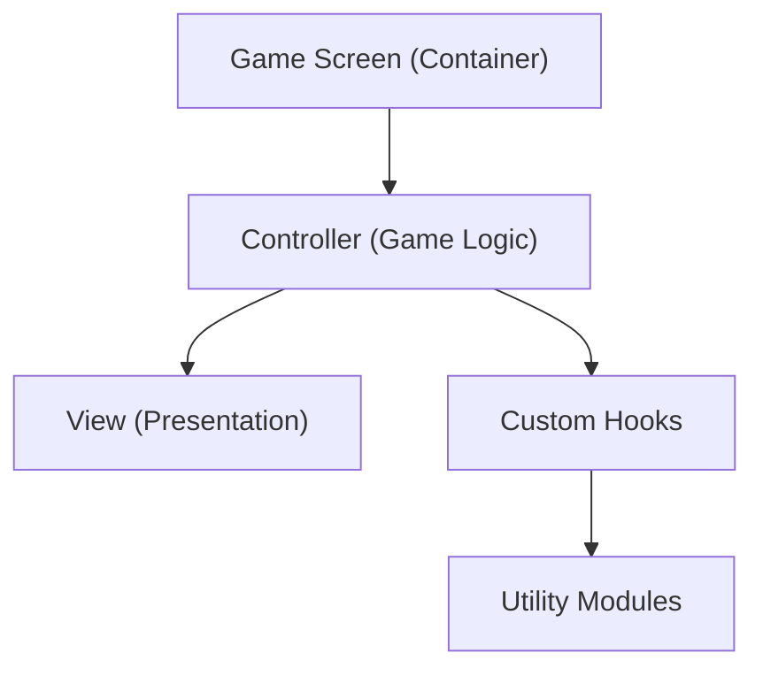
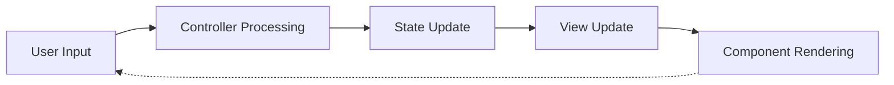
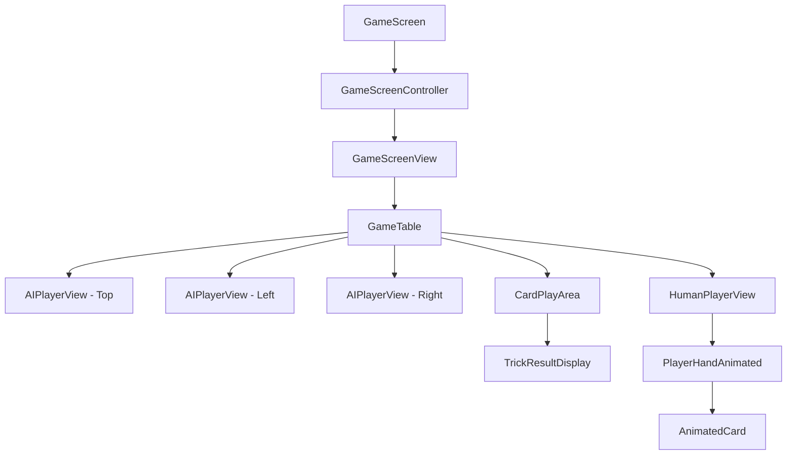

# Tractor Game Architecture

This document outlines the architectural design of the Tractor card game application, focusing on code organization, component structure, and data flow.

## Architectural Overview

The application follows a Controller/View separation pattern to separate game logic from UI presentation:



## Code Organization

### 1. Screen Components

- **GameScreen** (`src/screens/GameScreen.tsx`): Container component that serves as the entry point
- **GameScreenController** (`src/screens/GameScreenController.tsx`): Manages game logic and state
- **GameScreenView** (`src/screens/GameScreenView.tsx`): Handles the visual presentation of the game

### 2. UI Components

- **Player Views**:
  - `AIPlayerView.tsx`: Renders AI players in different positions
  - `HumanPlayerView.tsx`: Renders the human player's hand with interactive cards
  - `PlayerHand.tsx` and `PlayerHandAnimated.tsx`: Card positioning and animations
  
- **Game Elements**:
  - `AnimatedCard.tsx`: Card component with animation capabilities
  - `CardBack.tsx`: Visual representation of card backs
  - `CardPlayArea.tsx`: Central area where cards are played
  - `GameTable.tsx`: Overall table layout for positioning players
  - `TrumpDeclarationModal.tsx`: UI for trump suit selection
  - `TrickResultDisplay.tsx`: Shows the result of each trick
  - `GameOverScreen.tsx`: End-of-game screen with results
  
- **Status Elements**:
  - `GameStatus.tsx`: Shows current game state information
  - `ThinkingIndicator.tsx`: Visual indicator for AI "thinking"

### 3. Custom Hooks

- **Animation Management**: `useAnimations.ts` - Manages card animations
- **Game State**: `useGameState.ts` - Core game state management and updates
- **AI Management**: `useAITurns.ts` - Controls AI player turns and actions
- **Trick Processing**: `useTrickResults.ts` - Handles trick completion and scoring

### 4. Utility Modules

- **Game Logic**: `gameLogic.ts` - Core game mechanics and rule implementation
- **AI Logic**: `aiLogic.ts` - AI player decision making
- **Play Management**: `gamePlayManager.ts` - Handles play validation and processing
- **Round Management**: `gameRoundManager.ts` - Manages round initialization and completion
- **Trump Management**: `trumpManager.ts` - Trump card declaration and management

### 5. Type Definitions

- **Game Types** (`src/types/game.ts`): Core type definitions for game entities
  - Card, Player, Combo, and GameState interfaces
  - Enum definitions for Suit, Rank, and GamePhase

## Data Flow

The application follows a unidirectional data flow pattern:



1. **User Input**: Player selects cards or actions
2. **Controller Processing**: GameScreenController processes inputs with utility modules
3. **State Update**: State changes are managed through custom hooks
4. **View Update**: GameScreenView rerenders based on new state
5. **Component Rendering**: Individual components receive props and render UI

## Component Hierarchy



## Key Patterns

### Controller/View Separation

The Controller handles:
- Game state management
- User action processing
- AI player logic
- Card validation and processing

The View handles:
- UI rendering
- Animation coordination
- User interaction capture
- Layout organization

### Custom Hook Composition

Custom hooks are composed to manage specific aspects of the game:

```typescript
// In GameScreenController.tsx
const { gameState, updateGameState } = useGameState(initialState);
const { animationValues, runAnimations } = useAnimations();
const { processTrickResult } = useTrickResults(gameState, updateGameState);
const { handleAITurn } = useAITurns(gameState, updateGameState, animationValues);
```

### UI Component Composition

UI components are composed to build the complete game interface:

```tsx
// In GameScreenView.tsx
return (
  <GameTable
    topPlayer={<AIPlayerView position="top" player={players[2]} ... />}
    leftPlayer={<AIPlayerView position="left" player={players[1]} ... />}
    rightPlayer={<AIPlayerView position="right" player={players[3]} ... />}
    bottomPlayer={<HumanPlayerView player={players[0]} ... />}
    centerContent={
      <>
        <CardPlayArea
          currentTrick={currentTrick}
          trumpCard={trumpCard}
          ...
        />
        {showTrickResult && (
          <TrickResultDisplay
            lastCompletedTrick={lastCompletedTrick}
            ...
          />
        )}
      </>
    }
  />
);
```

## Animation System

The game uses React Native's Animated API for fluid card interactions:

1. **Animation Values**: Managed through the useAnimations hook
2. **Choreography**: Sequence of animations coordinated for natural motion
3. **Interpolation**: Translates animation progress to visual properties
4. **Performance**: Uses native driver where possible for smooth performance

## Performance Considerations

- **Component Memoization**: Key components use React.memo to prevent unnecessary rerenders
- **Animation Optimization**: Hardware acceleration via renderToHardwareTextureAndroid
- **State Management**: Careful state updates to minimize cascading rerenders
- **Asset Management**: Optimized images and simplified card designs
- **View Flattening**: Minimized view hierarchy depth for better performance