# Following V2 Design Document

**Pursuit Algorithm Implementation for Position Strategy**

*Related Documentation: [Game Rules](GAME_RULES.md) | [AI System](AI_SYSTEM.md) | [Multi-Combo Architecture](MULTI_COMBO_SYSTEM_ARCHITECTURE.md)*

---

## Overview

This document outlines the design for the **Following V2** implementation, a complete rewrite of the position-based AI strategy using a pursuit algorithm approach. This replaces the scattered position-specific logic with a clean, logical decision tree.

### Problem Statement

The current position strategy implementation has several issues:
- **Scattered logic**: Position-specific code spread across multiple modules
- **Test failures**: AI making incorrect strategic decisions
- **Complex dependencies**: Hard to trace decision paths
- **Maintenance burden**: Duplicate code and unclear responsibilities

### Solution Approach

**Pursuit Algorithm**: A systematic approach that classifies scenarios first, then routes to appropriate decisions:

1. **Analyze suit availability** → Classify scenario
2. **Route to decision path** → Based on classification
3. **Apply shared decision logic** → With memory integration
4. **Return optimal cards** → Clean, traceable decisions

---

## Core Algorithm Flow

```mermaid
flowchart TD
    Start([🎯 Following Play Request]) --> Analyze[🔍 Analyze Suit Availability<br/>leadingCards vs playerHand]
    
    Analyze --> Classify{📋 Classify Scenario}
    
    Classify -->|Has matching combo types| ValidCombos[✅ Valid Combos<br/>Can form required combinations]
    Classify -->|Has cards but wrong types| EnoughRemaining[📏 Enough Remaining<br/>Sufficient cards, wrong structure]
    Classify -->|No cards in suit| Void[🚫 Void<br/>No cards in leading suit]
    Classify -->|Some cards but not enough| Insufficient[⚠️ Insufficient<br/>Partial cards available]
    
    ValidCombos --> ValidDecision[🎯 Valid Combos Decision<br/>canBeat/should-beat logic]
    EnoughRemaining --> SameSuitDecision[🎯 Same-Suit Decision<br/>contribute/dispose in suit]
    Void --> TrumpDecision[🃏 Trump Decision<br/>can/should trump analysis]
    Insufficient --> FillDecision[📏 Fill Strategy<br/>use remaining + cross-suit]
    
    ValidDecision --> Memory[💾 Memory Integration]
    SameSuitDecision --> Memory
    TrumpDecision --> Memory
    FillDecision --> Memory
    
    Memory --> Result[✅ Return Optimal Cards]
```



---

## Architecture Design

### Folder Structure

```
src/ai/followingV2/              # Temporary workspace (v2 folder only)
├── core/                        # Core framework components
│   ├── suitAvailabilityAnalysis.ts    # Scenario classification
│   ├── routingLogic.ts                # Decision path routing
│   └── memoryIntegration.ts           # Memory system utilities
├── decisions/                   # Decision components (Future phases)
│   ├── validCombosDecision.ts         # Valid combo selection
│   ├── sameSuitDecision.ts            # Same-suit decisions
│   ├── crossSuitDecision.ts           # Cross-suit decisions
│   ├── trumpDecision.ts               # Trump decisions
│   └── fillStrategy.ts                # Fill strategy logic
└── positionStrategy.ts          # Main entry point
```

### Design Principles

1. **Single Responsibility**: Each module has one clear purpose
2. **Clean Dependencies**: Clear import relationships, no circular dependencies
3. **Memory Integration**: Full use of existing `context.memoryContext`
4. **Testability**: Each component can be unit tested independently
5. **Maintainability**: Self-documenting code with clear decision paths

---

## Phase 1 Implementation Plan

### Scope: Core Framework Only

**Goal**: Create the foundational routing structure without diving into complex decision logic.

### Components to Implement

#### 1. `core/suitAvailabilityAnalysis.ts`

**Purpose**: Classify the relationship between leading cards and player hand

**Input**:
- `leadingCards: Card[]` - Cards that were led
- `playerHand: Card[]` - Current player's available cards
- `trumpInfo: TrumpInfo` - Trump suit and rank information

**Output**:
```typescript
interface SuitAvailabilityResult {
  scenario: 'valid_combos' | 'enough_remaining' | 'void' | 'insufficient';
  leadingSuit: Suit;
  leadingComboType: ComboType;
  requiredLength: number;
  
  // Scenario-specific data
  validCombos?: Combo[];           // For 'valid_combos'
  remainingCards?: Card[];         // For 'enough_remaining'/'insufficient'
  availableCount?: number;         // For all scenarios
  
  // Analysis metadata
  reasoning: string[];
  memoryEnhanced?: boolean;
}
```

**Logic**:
1. **Determine leading suit** and combo type requirements
2. **Filter player cards** by leading suit (non-trump)
3. **Analyze combo formation** capability
4. **Classify scenario** based on availability and capability

#### 2. `core/routingLogic.ts`

**Purpose**: Route to appropriate decision path based on scenario classification

**Input**:
- `analysis: SuitAvailabilityResult` - Scenario classification
- `context: GameContext` - Game state and memory context
- `trumpInfo: TrumpInfo` - Trump information

**Output**: `Card[]` - Selected cards to play

**Logic** (Phase 1 - Use existing functions):
```typescript
switch (analysis.scenario) {
  case 'valid_combos':
    return selectOptimalWinningCombo(analysis.validCombos, context, trumpInfo);
    
  case 'enough_remaining':
    return selectPointContribution(analysis.remainingCards, context);
    
  case 'void':
    return handleVoidScenario(playerHand, context, trumpInfo);
    
  case 'insufficient':
    return selectStrategicDisposal(analysis.remainingCards, context);
}
```

#### 3. `core/memoryIntegration.ts`

**Purpose**: Utilities for accessing and analyzing memory context

**Functions**:
```typescript
// Opponent void status checking
export function checkOpponentVoidStatus(
  suit: Suit, 
  context: GameContext
): { allVoid: boolean; voidPlayers: PlayerId[] }

// Trump exhaustion analysis
export function analyzeTrumpExhaustion(
  context: GameContext
): { level: number; recommendation: 'preserve' | 'use' | 'aggressive' }

// Point timing analysis
export function analyzePointTiming(
  context: GameContext,
  trickPoints: number
): { shouldContribute: boolean; priority: 'high' | 'medium' | 'low' }

// Memory-enhanced combo analysis
export function enhanceComboWithMemory(
  combo: Combo,
  context: GameContext
): ComboAnalysis & { isGuaranteedWinner?: boolean }
```

#### 4. `positionStrategy.ts`

**Purpose**: Main entry point implementing the pursuit algorithm

**Function Signature**:
```typescript
export function selectPositionAwareFollowingPlay(
  comboAnalyses: { combo: Combo; analysis: ComboAnalysis }[],
  context: GameContext,
  positionStrategy: PositionStrategy,
  trumpInfo: TrumpInfo,
  gameState: GameState,
  currentPlayerId: PlayerId,
): Card[]
```

**Algorithm Flow**:
1. **Extract leading cards** from game state
2. **Get player hand** from current player
3. **Analyze suit availability** → classify scenario
4. **Route to decision** → based on classification
5. **Apply memory enhancements** → integrate memory context
6. **Return optimal cards** → with logging

---

## Integration Strategy

### Phase 1 Integration

1. **Create parallel implementation** in `followingV2/`
2. **Add feature toggle** in main `followingStrategy.ts`
3. **Test against failing tests** to validate fixes
4. **Use existing decision functions** as placeholders

### Integration Points

#### Main Following Strategy Integration
```typescript
// In followingStrategy.ts
const USE_V2_POSITION_STRATEGY = process.env.NODE_ENV === 'test' || gameState.useV2Strategy;

if (shouldUsePositionSpecificStrategy(context, trickWinner)) {
  if (USE_V2_POSITION_STRATEGY) {
    // Use new pursuit algorithm
    const { selectPositionAwareFollowingPlay } = await import('./followingV2/positionStrategy');
    return selectPositionAwareFollowingPlay(comboAnalyses, context, positionStrategy, trumpInfo, gameState, currentPlayerId);
  } else {
    // Use existing implementation
    return selectPositionAwareFollowingPlay(comboAnalyses, context, positionStrategy, trumpInfo, gameState, currentPlayerId);
  }
}
```

### Memory System Integration

**Existing Memory Access**:
```typescript
// Available via context.memoryContext
const memory = context.memoryContext?.cardMemory;
const voidAnalysis = context.memoryContext?.voidExploitation;
const pointTiming = context.memoryContext?.pointTiming;
const trumpExhaustion = context.memoryContext?.trumpExhaustion;
```

**Enhanced Memory Utilities**:
- Use existing `createCardMemory()` function
- Leverage `isBiggestRemainingInSuit()` for guaranteed winners
- Integrate with void detection system
- Connect with trump exhaustion analysis

---

## Testing Strategy

### Phase 1 Testing Goals

1. **Fix failing tests**: Address current test failures
   - `thirdPlayerTakeover.test.ts` - wrong trump selection
   - Joker conservation issues
   - Point contribution logic
   - Fourth player support vs competition

2. **Validate scenario classification**: Ensure scenarios are correctly identified
3. **Test memory integration**: Verify memory utilities work correctly
4. **Confirm routing logic**: Validate decisions are routed properly

### Test Cases to Create

```typescript
describe('Phase 1: Core Framework', () => {
  describe('suitAvailabilityAnalysis', () => {
    it('should classify valid_combos scenario correctly');
    it('should classify enough_remaining scenario correctly');
    it('should classify void scenario correctly');
    it('should classify insufficient scenario correctly');
  });
  
  describe('routingLogic', () => {
    it('should route to valid combos decision');
    it('should route to same-suit decision');
    it('should route to trump decision');
    it('should route to fill strategy');
  });
  
  describe('memoryIntegration', () => {
    it('should detect opponent void status correctly');
    it('should analyze trump exhaustion accurately');
    it('should provide point timing recommendations');
  });
});
```

---

## Success Criteria

### Phase 1 Success Metrics

1. **All existing tests pass** with new implementation
2. **Scenario classification accuracy** - correct scenario identification
3. **Memory integration working** - proper access to memory context
4. **Clean logging output** - traceable decision paths
5. **Performance maintained** - no significant slowdown

### Long-term Success Goals

1. **Code maintainability** - easier to understand and modify
2. **Test reliability** - consistent AI behavior
3. **Strategic improvement** - better game decisions
4. **Architecture clarity** - clear separation of concerns

---

## Future Phases Preview

### Phase 2: Valid Combos Decision
- Deep-dive into combo selection logic
- Enhanced canBeat/should-beat analysis
- Memory-enhanced combo evaluation

### Phase 3: Same-Suit Decisions
- Point contribution optimization
- Strategic disposal in same suit
- Memory-enhanced timing decisions

### Phase 4: Trump Decisions
- Can trump analysis with combo type matching
- Should trump decision with memory integration
- Trump conservation strategies

### Phase 5: Fill Strategy
- Insufficient cards handling
- Cross-suit contribution/disposal
- Optimal card selection for fills

---

## Risk Mitigation

### Development Risks

1. **Breaking existing functionality**
   - **Mitigation**: Parallel development in v2 folder
   - **Rollback**: Easy to revert to original implementation

2. **Performance degradation**
   - **Mitigation**: Performance testing at each phase
   - **Monitoring**: Benchmark against current implementation

3. **Test compatibility issues**
   - **Mitigation**: Validate against existing test suite
   - **Approach**: Fix failing tests, maintain passing ones

### Deployment Risks

1. **Integration complexity**
   - **Mitigation**: Feature toggle for gradual rollout
   - **Testing**: Extensive A/B testing capability

2. **Memory system integration**
   - **Mitigation**: Use existing memory interfaces
   - **Validation**: Comprehensive memory integration tests

---

## Conclusion

The Following V2 design provides a clean, maintainable foundation for the AI position strategy. Phase 1 focuses on creating a solid framework that can be incrementally enhanced in future phases.

**Key Benefits**:
- **Clean architecture** - logical decision flow
- **Memory integration** - leverages existing memory system
- **Testable design** - each component can be tested independently
- **Incremental development** - build complexity gradually
- **Safe migration** - parallel development with easy rollback

This design sets the foundation for a more reliable, maintainable, and effective AI strategy system.