# Following V2 Design Document

**Enhanced Following Strategy - COMPLETED**

*Related Documentation: [Game Rules](GAME_RULES.md) | [AI System](AI_SYSTEM.md) | [Multi-Combo Architecture](MULTI_COMBO_SYSTEM_ARCHITECTURE.md)*

---

## Overview

Following V2 is a complete rewrite of the AI following strategy that replaces scattered position-specific logic with a clean, modular architecture.

### Design Goals

- **Modular Architecture**: Single-responsibility modules instead of monolithic logic
- **Clean Decision Flow**: Systematic scenario classification → routing → specialized decisions
- **Memory Integration**: Leverage existing memory system for enhanced decisions
- **Maintainable Code**: Clear dependencies and testable components

---

## Architecture

### Core Algorithm

1. **Classify Scenario**: Analyze relationship between leading cards and player hand
2. **Route Decision**: Direct to appropriate specialized module
3. **Make Decision**: Apply scenario-specific logic with memory integration
4. **Return Cards**: Optimal selection with performance tracking

### Design Flow

```mermaid
flowchart TD
    Start([🎯 Following Play Request]) --> Analyze[🔍 Analyze Suit Availability<br/>leadingCards vs playerHand]
    
    Analyze --> Classify{📋 Classify Scenario}
    
    Classify -->|Has matching combo types| ValidCombos[✅ Valid Combos<br/>Can form required combinations]
    Classify -->|Has cards but wrong types| EnoughRemaining[📏 Enough Remaining<br/>Sufficient cards, wrong structure]
    Classify -->|No cards in suit| Void[🚫 Void<br/>No cards in leading suit]
    Classify -->|Some cards but not enough| Insufficient[⚠️ Insufficient<br/>Partial cards available]
    
    ValidCombos --> ValidDecision[🎯 Valid Combos Decision<br/>Trump/non-trump specialized logic]
    EnoughRemaining --> SameSuitDecision[🎯 Same-Suit Decision<br/>Structure formation + strategic fill]
    Void --> VoidDecision[🃏 Void Decision<br/>Trump evaluation + cross-suit fallback]
    Insufficient --> CrossSuitDecision[📏 Cross-Suit Decision<br/>Use remaining + strategic fill]
    
    ValidDecision --> Memory[💾 Memory Integration<br/>Enhanced with card tracking]
    SameSuitDecision --> Memory
    VoidDecision --> Memory
    CrossSuitDecision --> Memory
    
    Memory --> Result[✅ Return Optimal Cards<br/>With performance tracking]
```



### Module Structure

```
src/ai/followingV2/
├── suitAvailabilityAnalysis.ts    # Scenario classification (4 types)
├── routingLogic.ts                # Routes scenarios to decision modules
├── validCombosDecision.ts         # Perfect combo matches
├── sameSuitDecision.ts            # Wrong structure, same suit
├── crossSuitDecision.ts           # Insufficient cards, cross-suit fill
├── voidDecision.ts                # No cards in suit, trump evaluation
├── strategicSelection.ts          # Unified selection utilities
├── teammateAnalysis.ts            # Memory-enhanced teammate logic
└── followingStrategy.ts           # Main entry point
```

### Scenario Types

- **valid_combos**: Can form required combo types perfectly
- **enough_remaining**: Have cards but wrong structure 
- **insufficient**: Not enough cards, need cross-suit fill
- **void**: No cards in leading suit, evaluate trump options

---

## Key Features

- **Memory Integration**: Uses existing `context.memoryContext` for enhanced analysis
- **Performance Tracking**: Built-in statistics and monitoring
- **Clean Error Handling**: Graceful fallbacks and validation
- **Multi-combo Support**: Seamless integration with existing multi-combo system

---

## Status: DEPLOYED ✅

The V2 system is fully implemented and currently running in production.