# Multi-Combo Algorithms Documentation

**Comprehensive Multi-Combo Leading and Following Logic**

*Related Documentation: [Game Rules](GAME_RULES.md) | [AI System](AI_SYSTEM.md) | [CLAUDE.md](../CLAUDE.md)*

---

## Overview

This document details the algorithms for multi-combo leading (matching) and following in the Tractor card game. These algorithms ensure proper game rule compliance and strategic decision-making for complex multi-combo scenarios.

---

## Multi-Combo Leading Systems

Multi-combo leading involves two distinct scenarios with different algorithms:

### **Scenario 1: Human Validation Tool**

Validates if human-selected cards form a valid multi-combo lead.

```mermaid
flowchart TD
    Start([🎯 Human Selected Cards]) --> IsStraight{🎯 Is it a straight combo?<br/>Single/Pair/Tractor}
    
    IsStraight -->|Yes| RegularCombo[✅ Use regular combo validation]
    IsStraight -->|No| NonTrump{🚫 All cards non-trump?}
    
    NonTrump -->|No| InvalidTrump[❌ Invalid:<br/>Trump multi-combos not allowed]
    NonTrump -->|Yes| SameSuit{♠ All cards same suit?}
    
    SameSuit -->|No| InvalidSuit[❌ Invalid:<br/>Multi-combo must be same suit]
    SameSuit -->|Yes| CheckEachCombo[🔍 Check each component combo]
    
    CheckEachCombo --> Unbeatable{🏆 Is each combo unbeatable?<br/>Use shared detection}
    
    Unbeatable -->|Yes| ValidMultiCombo[✅ Valid Multi-Combo]
    Unbeatable -->|No| InvalidBeatable[❌ Invalid:<br/>Some combos can be beaten]
```



### **Scenario 2: AI Selection Strategy**

AI checks existing combos for unbeatable ones and bundles them together.

```mermaid
flowchart TD
    Start([🎯 AI Leading Turn]) --> GetCombos[🎯 identifyCombos<br/>Get all straight combos]
    
    GetCombos --> FilterNonTrump[🚫 Filter out all trump combos]
    FilterNonTrump --> CheckPerSuit[📋 For each suit Hearts, Diamonds, Clubs, Spades]
    
    CheckPerSuit --> VoidCheck{🚫 Are all other 3 players<br/>void in this suit?}
    VoidCheck -->|Yes| AllUnbeatable[✅ ALL cards in suit unbeatable]
    VoidCheck -->|No| TestIndividual[🏆 Test each combo individually<br/>for unbeatability]
    
    AllUnbeatable --> GroupBySuit[📊 Count total unbeatable cards per suit]
    TestIndividual --> GroupBySuit
    
    GroupBySuit --> HasUnbeatable{🎯 Found any unbeatable combos?}
    
    HasUnbeatable -->|No| RegularStrategy[🎲 Use regular leading strategy]
    HasUnbeatable -->|Yes| SelectLongest[📏 Select suit with most<br/>unbeatable cards total count]
    
    SelectLongest --> BundleMultiCombo[✅ Bundle ALL unbeatable combos<br/>from longest suit → Lead multi-combo]
```



### **Shared Unbeatable Detection Logic**

Both scenarios use the same core detection (implemented in `multiComboValidation.ts`):

**Input**: Single combo (card, pair, or tractor)  
**Output**: Boolean (unbeatable or not)

**Logic**:
1. **Singles**: A♠ unbeatable if other A♠ already played
2. **Pairs**: K♠K♠ unbeatable if any A♠ already played  
3. **Tractors**: A♠A♠-K♠K♠ always unbeatable (highest possible)
4. **Memory Integration**: Uses card tracking to determine what's been played

---

## Multi-Combo Following Algorithm

The multi-combo following algorithm determines how to respond to a multi-combo lead.

### Algorithm Flow Diagram

```mermaid
flowchart TD
    Start([🎯 Multi-Combo Following]) --> SameSuit[🔍 Section A: Same Suit Following]
    
    SameSuit --> A1{💳 Do I have remaining<br/>cards in led suit?}
    A1 -->|No| Trump[🔍 Section B: Trump Following]
    A1 -->|Yes| A2{📏 Do I have enough cards<br/>≥ leading combo length?}
    
    A2 -->|No| A2Action[🎯 Use all remaining cards<br/>+ cross-suit fill]
    A2 -->|Yes| A3{👥 Leading has pairs/tractors?<br/>Do I have enough pairs?}
    
    A3 -->|No| A5Action[🎯 Same-suit disposal/<br/>contribution]
    A3 -->|Yes| A4{🚂 Leading has tractors?<br/>Do I have matching tractors?}
    
    A4 -->|No| A5Action
    A4 -->|Yes| A4Action[✅ Play matching<br/>multi-combo!]
    
    A2Action --> End1[📤 Execute Response]
    A5Action --> End1
    A4Action --> End1
    
    Trump --> B1{🃏 Do I have trump cards?}
    B1 -->|No| CrossSuit[🎯 Cross-suit disposal/<br/>contribution]
    B1 -->|Yes| B2{📏 Do I have enough trump<br/>≥ leading combo length?}
    
    B2 -->|No| CrossSuit
    B2 -->|Yes| B3{👥 Leading has pairs/tractors?<br/>Do I have enough trump pairs?}
    
    B3 -->|No| CrossSuit
    B3 -->|Yes| B4{🚂 Leading has tractors?<br/>Do I have matching trump tractors?}
    
    B4 -->|No| CrossSuit
    B4 -->|Yes| B5{🎯 Strategic Decision}
    
    B5 --> B5a[🗑️ Cross-suit disposal]
    B5 --> B5b[🃏 Trump it]
    B5 --> B5c[💪 Beat existing trump]
    
    CrossSuit --> End2[📤 Execute Cross-suit]
    B5a --> End2
    B5b --> End3[📤 Execute Trump Response]
    B5c --> End3
```



### Detailed Algorithm Steps

#### **Section A: Same Suit Following**

**A1. Suit Availability Check:**
```typescript
const sameSuitCards = playerHand.filter(card => 
    card.suit === leadingSuit && !isTrump(card, trumpInfo)
);
if (sameSuitCards.length === 0) {
    goto SectionB; // No same-suit cards, try trump
}
```

**A2. Length Adequacy Check:**
```typescript
if (sameSuitCards.length < leadingCards.length) {
    return useAllRemainingAndFill(sameSuitCards, leadingCards.length);
}
```

**A3. Pairs Requirement Check:**
```typescript
const leadingPairCount = countPairsInCombo(leadingCards);
const availablePairCount = countPairsInCards(sameSuitCards);
if (leadingPairCount > 0 && availablePairCount < leadingPairCount) {
    return sameSuitDisposalOrContribution(sameSuitCards, leadingCards.length);
}
```

**A4. Tractors Requirement Check:**
```typescript
const leadingTractors = findTractorsInCombo(leadingCards);
const availableTractors = findTractorsInCards(sameSuitCards);
if (!canMatchTractorStructure(leadingTractors, availableTractors)) {
    return sameSuitDisposalOrContribution(sameSuitCards, leadingCards.length);
}
return playMatchingMultiCombo(sameSuitCards, leadingCards);
```

#### **Section B: Trump Following**

**B1. Trump Availability Check:**
```typescript
const trumpCards = playerHand.filter(card => isTrump(card, trumpInfo));
if (trumpCards.length === 0) {
    return crossSuitDisposalOrContribution(playerHand, leadingCards.length);
}
```

**B2. Trump Length Check:**
```typescript
if (trumpCards.length < leadingCards.length) {
    return crossSuitDisposalOrContribution(playerHand, leadingCards.length);
}
```

**B3. Trump Pairs Check:**
```typescript
const leadingPairCount = countPairsInCombo(leadingCards);
const trumpPairCount = countPairsInCards(trumpCards);
if (leadingPairCount > 0 && trumpPairCount < leadingPairCount) {
    return crossSuitDisposalOrContribution(playerHand, leadingCards.length);
}
```

**B4. Trump Tractors Check:**
```typescript
const leadingTractors = findTractorsInCombo(leadingCards);
const trumpTractors = findTractorsInCards(trumpCards);
if (!canMatchTractorStructure(leadingTractors, trumpTractors)) {
    return crossSuitDisposalOrContribution(playerHand, leadingCards.length);
}
```

**B5. Strategic Decision:**
```typescript
// Consider multiple factors:
// 1. Can I beat current winning trump?
// 2. Should I waste trump cards?
// 3. Team strategy (teammate winning vs opponent winning)

if (shouldTrumpIt(context)) {
    return playTrumpMultiCombo(trumpCards, leadingCards);
} else if (shouldBeatExistingTrump(context)) {
    return playBetterTrumpCombo(trumpCards, currentWinningTrump);
} else {
    return crossSuitDisposalOrContribution(playerHand, leadingCards.length);
}
```

---

## Algorithm Comparison

### **Current Implementation vs New Algorithm**

| **Aspect** | **Current Implementation** | **New Algorithm** |
|------------|---------------------------|-------------------|
| **Structure** | Complex strategy selection | Clear step-by-step flow |
| **Debugging** | Hard to trace failures | Easy to identify failure points |
| **Maintainability** | Multiple interdependent functions | Simple, independent steps |
| **Performance** | Multiple combo generations | Progressive filtering |
| **Readability** | Technical implementation focus | Human-intuitive logic |

### **Key Improvements**

1. **Progressive Filtering**: Each step eliminates impossible scenarios early
2. **Clear Failure Points**: Easy to identify why a multi-combo cannot be followed
3. **Strategic Clarity**: Explicit decision points for trump usage
4. **Rule Compliance**: Direct mapping to Tractor/Shengji game rules
5. **Testability**: Each step can be unit tested independently

---

## Implementation Examples

### **Leading Algorithm Example**

```typescript
// Example: Can lead K♠K♠ + Q♠ + 8♠?
function canLeadMultiCombo(
    cards: [K♠, K♠, Q♠, 8♠],
    playedCards: [A♠, A♠, J♠],
    otherPlayers: [Bot1, Bot2, Bot3]
): boolean {
    // Step 1: Have cards in Spades? ✅
    // Step 2: All others void in Spades? ❌
    // Step 3: Each combo unbeatable?
    //   - K♠K♠: A♠A♠ played → ✅ unbeatable
    //   - Q♠: A♠A♠ + K♠K♠ played → ✅ unbeatable  
    //   - 8♠: Only 7♠, 6♠, 5♠, 4♠, 3♠ remain → ✅ unbeatable
    return true; // Can lead multi-combo
}
```

### **Following Algorithm Example**

```typescript
// Example: Following K♠K♠ + Q♠ with hand [J♠, J♠, 10♠, 9♠, 2♥, 2♥]
function followMultiCombo(
    leadingCards: [K♠, K♠, Q♠],
    playerHand: [J♠, J♠, 10♠, 9♠, 2♥, 2♥]
): FollowingResult {
    // Section A: Same Suit
    // A1: Have Spades? ✅ [J♠, J♠, 10♠, 9♠]
    // A2: Enough cards? ✅ 4 ≥ 3
    // A3: Need pairs? ✅ Leading has 1 pair, I have 1 pair
    // A4: Need tractors? ❌ Leading has no tractors
    // → Play [J♠, J♠, 10♠] (pair + single matching structure)
    
    return {
        cards: [J♠, J♠, 10♠],
        strategy: "same_suit_match",
        canBeat: false
    };
}
```

---

## Future Enhancements

### **Phase 3: Advanced Multi-Combo Features**

1. **Cross-Suit Multi-Combos**: Handle trump rank combinations across suits
2. **Dynamic Void Detection**: Real-time void analysis during gameplay
3. **Memory-Enhanced Decisions**: Use card tracking for better unbeatable detection
4. **AI Strategy Integration**: Connect multi-combo logic with AI decision trees

### **Performance Optimizations**

1. **Combo Caching**: Cache combo analysis results for repeated patterns
2. **Early Termination**: Stop analysis when first invalid combo found
3. **Parallel Processing**: Analyze multiple combos simultaneously
4. **Memory Efficiency**: Optimize card filtering and combination generation

---

## Summary

The new multi-combo algorithms provide:

**Leading Algorithm Benefits:**
- ✅ Clear void detection and unbeatable analysis
- ✅ Explicit rule compliance checking
- ✅ Easy to understand and maintain

**Following Algorithm Benefits:**  
- ✅ Systematic same-suit → trump → cross-suit progression
- ✅ Progressive filtering eliminates impossible scenarios early
- ✅ Strategic decision points for optimal play

Both algorithms align with human intuition and game rules while providing robust technical implementation for the AI system.

---

**See Also:**

- **[Game Rules](GAME_RULES.md)** - Complete Tractor/Shengji rules and multi-combo regulations
- **[AI System](AI_SYSTEM.md)** - AI decision-making and strategic integration
- **[CLAUDE.md](../CLAUDE.md)** - Development guidelines and project architecture