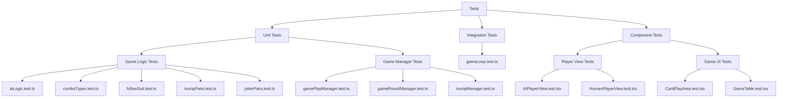
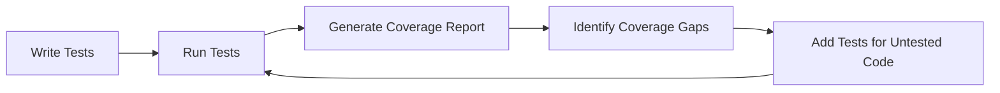
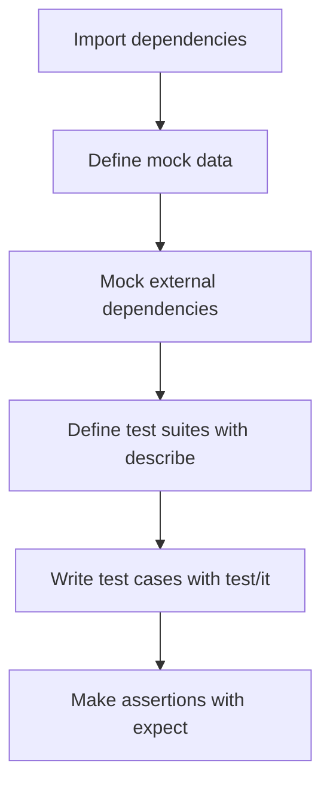

# Testing Strategy

This document outlines the testing approach for the Tractor card game application, explaining the testing methodology, test structure, and coverage goals.

## Testing Framework

The project uses:
- **Jest**: As the main test runner and assertion library
- **React Testing Library**: For component testing and DOM interaction
- **React Native Testing Library**: For React Native specific component testing

## Test Categories



### Unit Tests

These tests focus on testing individual functions and modules in isolation:

- **Game Logic**: Tests for the core game mechanics, card combinations, and rule implementation
  - `aiLogic.test.ts`: Tests for AI decision-making logic
  - `comboTypes.test.ts`: Tests for card combination validation
  - `followSuit.test.ts`: Tests for suit following rules
  - `trumpPairs.test.ts` and `jokerPairs.test.ts`: Tests for special card pair rules

- **Game Managers**: Tests for the extracted utility modules that manage game aspects
  - `gamePlayManager.test.ts`: Tests for play validation, processing, and AI move handling
  - `gameRoundManager.test.ts`: Tests for round initialization and completion
  - `trumpManager.test.ts`: Tests for trump card declaration and management

### Integration Tests

- `gameLoop.test.ts`: Tests the complete game flow including multiple turns and rounds

### Component Tests

These tests verify that UI components render correctly and respond appropriately to user interactions:

- **Player Views**:
  - `AIPlayerView.test.tsx`: Tests rendering of AI players in different positions
  - `HumanPlayerView.test.tsx`: Tests human player hand rendering and card selection
  
- **Game UI**:
  - `CardPlayArea.test.tsx`: Tests the card play area renders correctly
  - `GameTable.test.tsx`: Tests the game table layout renders all positions correctly

## Test Coverage Process



## Mocking Strategy

The tests use several mocking strategies:

1. **Function Mocks**: Using Jest's `jest.fn()` and `jest.mock()` to isolate components
2. **Mock Game State**: Creating test fixtures that represent different game states
3. **Mock Components**: Using simplified components for testing complex component hierarchies
4. **Animated Value Mocks**: Special handling for React Native's Animated API

## Test Coverage

Our coverage goals:

- **Core Game Logic**: 95%+ line coverage
- **Utility Modules**: 90%+ line coverage
- **UI Components**: 85%+ line coverage

Current coverage results:
- `gamePlayManager.ts`: 97.95% line coverage
- `gameRoundManager.ts`: 92.45% line coverage
- `trumpManager.ts`: 100% line coverage
- `AIPlayerView.tsx`: 100% line coverage
- `HumanPlayerView.tsx`: 100% line coverage
- `GameTable.tsx`: 100% line coverage

## Running Tests

```bash
# Run all tests
npm test

# Run tests with coverage report
npm test -- --coverage

# Run specific test file
npm test -- CardPlayArea.test.tsx

# Watch mode (for development)
npm test -- --watch
```

## Test File Structure

Each test file follows a similar structure:



Example:

```typescript
import { render, fireEvent } from '@testing-library/react-native';
import { MyComponent } from '../src/components/MyComponent';

// Mock data
const mockProps = { ... };

// Mock dependencies
jest.mock('../src/utils/externalDependency', () => ({
  someFunction: jest.fn(),
}));

describe('MyComponent', () => {
  test('renders correctly', () => {
    const { getByText } = render(<MyComponent {...mockProps} />);
    expect(getByText('Expected Text')).toBeTruthy();
  });
  
  test('handles user interaction', () => {
    const onPressMock = jest.fn();
    const { getByTestId } = render(<MyComponent {...mockProps} onPress={onPressMock} />);
    
    fireEvent.press(getByTestId('button'));
    expect(onPressMock).toHaveBeenCalledTimes(1);
  });
});
```

## Best Practices

1. **Test Isolation**: Each test should run independently of others
2. **Meaningful Assertions**: Test behavior, not implementation details
3. **Use Test IDs**: Add `testID` props to components for reliable selection
4. **Mock Minimal Dependencies**: Only mock what's necessary for the test
5. **Descriptive Test Names**: Test names should describe the expected behavior
6. **Arrange-Act-Assert**: Structure tests in three phases: setup, action, verification
7. **Test Edge Cases**: Include tests for error states and boundary conditions